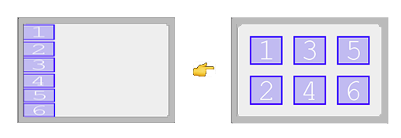
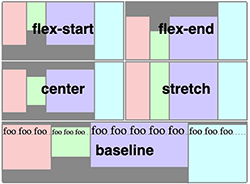
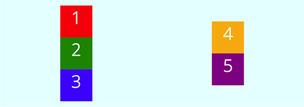
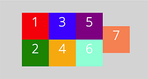
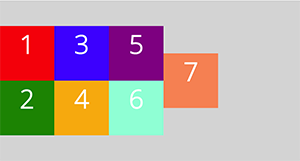
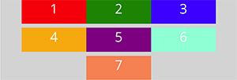
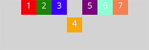
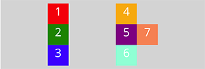
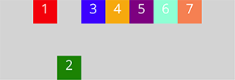

# [CSS - Flexbox](https://developer.mozilla.org/en-US/docs/Web/CSS/CSS_Flexible_Box_Layout)
- Flexbix is a one-dimensional layout method for laying out items in rows or columns.

- it is a **series of properties** that we use to layout items on our page in a box of content: a way of **distributing space** inside a container.

- Flexbox allows us to distribute space dynamically across elements of an unknown size, hence the term *flex*.

<br>

[Axes](https://developer.mozilla.org/en-US/docs/Web/CSS/CSS_Flexible_Box_Layout/Basic_Concepts_of_Flexbox#the_two_axes_of_flexbox) :     
 there are 2 axes:  the **main axis** and the **cross axis**.   
 
   - **main axis:**  defined by the **flex-direction property**     
      By default it goes from left to right. 
      
   - **cross axis:** runs perpendicular to the main axis. 
    
   - Everything we do with flexbox refers back to the *main and cross axes*.

<br>

**Flexbox properties:**  
1. **[display: flex](https://github.com/Klosmi/html-basics/blob/master/CSS-FlexBox.md#1-display-flex-)**
2. **[flex-direction](https://github.com/Klosmi/html-basics/blob/master/CSS-FlexBox.md#2-flex-direction-)**
3. **[justify-content](https://github.com/Klosmi/html-basics/blob/master/CSS-FlexBox.md#3-justify-content-)**
4. **[flex-wrap](https://github.com/Klosmi/html-basics/blob/master/CSS-FlexBox.md#4-flex-wrap-)**
5. **[align-items](https://github.com/Klosmi/html-basics/blob/master/CSS-FlexBox.md#5-align-items-)**
6. **[align-content](https://github.com/Klosmi/html-basics/blob/master/CSS-FlexBox.md#6-align-content-)**
7. **[align-self](https://github.com/Klosmi/html-basics/blob/master/CSS-FlexBox.md#7-align-self-)**

<br>

#### 1. **`display: flex;`** :    
it defines a flex container.   
The container can be inline or block depending on the given value. It enables a flex context for all its direct children.  
All other *flexbox* properties rely on the `display: flex` property.

<br>

#### 2. **[flex-direction](https://developer.mozilla.org/en-US/docs/Web/CSS/flex-direction)** :   
  *(the main axis is defined by this property)*   
  this CSS property sets how flex items are placed in the flex container defining the main axis and the direction (normal or reversed).    
  - 4 directions: **row ・ row-reverse ・ column ・ column-reverse**

  -  `flex-direction: row;` **left-to-right** horizontally! (this is by default)

  - `flex-direction: row-reverse;` **right-to-left** horizontally!

  - `flex-direction: column;` **top-to-bottom** vertically!

  - `flex-direction: column-reverse;` **bottom-to-top** vertically!

    - eg.: We have some `div`s, with flexbox we arrange these `div`s horizontally from top to bottom.
      ```
      #container {
        display: flex;
        flex-direction: column;
      } 

      #container div{
        width: 50px;
        height: 50px;
      }
      ```
  
  <br>
  
 #### 3. **[justify-content](https://developer.mozilla.org/en-US/docs/Web/CSS/justify-content)** :  
   this poperty determines how the actual elements (the content) is **distributed across the main axis**.

   (So, it defines how the browser distributes space between and around content items along the main-axis of a flex container, and the inline axis of a grid container.) 

   Main [values](https://developer.mozilla.org/en-US/docs/Web/CSS/justify-content#values) : 

   - `justify-content: flex-start;` the default.   
     If the **main axis goes from left to right**, the **start is on the left**. 

   - `justify-content: flex-end;`   
      It takes the content and move it to the **end of the main axis**.    

      The items are packed flush to each other toward the edge of the alignment container depending on the flex container's main-end side.

   - `justify-content: center;`   
      It centers our content along the main axis. 

   - `justify-content: space-between;`   
       Space between takes all of the extra space and distribute it between the elements, but not on the outside edges.   
       So it gives space between elements, but not between the element and the container.


   - `justify-content: space-around;` 
      It gives each element the same amount of space around it.  

      **So the items are evenly distributed within the alignment container along the main axis.** The spacing between each pair of adjacent items is the same. The empty space before the first and after the last item equals half of the space between each pair of adjacent items.

      It looks a bit **uneven** between the container and the item, and item between item.


   - `justify-content: space-evenly;`   
     it spaces evenly and space evenly just ensures that the **space is even between every element and between the elements and the container**.

     So the **items are evenly distributed within the alignment container along the main axis.** The spacing between each pair of adjacent items, the main-start edge and the    first item, and the main-end edge and the last item, are all exactly the same. 


      - eg.: We have some `div`s, with flexbox, lets say we arrange these `div`s vertically from top to bottom with even space between the `div` items and the container.
        ```
          #container {
            display: flex;
            flex-direction: column;
            justify-content: space-evenly;
          } 

          #container div{
            width: 50px;
            height: 50px;
          }
        ```
        <br>

#### 4. **[flex-wrap](https://developer.mozilla.org/en-US/docs/Web/CSS/flex-wrap)** :   
  this property sets whether flex items are forced onto one line or can wrap onto multiple lines. If wrapping is allowed, it sets the direction that lines are stacked.

   So it determines whether the elements are going to wrap along the main axis onto a new line if it's horizontal or a new column if it's a vertical main axis.

  - **`flex-wrap: nowrap;`** : 
    doesn't wrap (the default)
    
  - **`flex-wrap: wrap-reverse;`** :
    Behaves the same as wrap but cross-start and cross-end are permuted, rearranged (if `wrap` goes top-to-bottom, `wrap-reverse` goes bottom-to-top).    
    **So this is how we can change the direction of the cross-axis❗️**    

  - **`flex-wrap: wrap;`** : 
    The flex items break into multiple lines.    
    The cross-start is either equivalent to start or before depending flex-direction value and the cross-end is the opposite of the specified cross-start.
    - eg.:
      We have let say 6 `div`s, with flexbox *(1, 2, 3, 4, 5, 6)*. The `div`s are top-to-bottom, but because the `container`'s height is only 500px, the 6 `div`s' heights are all squished down to fit in the `container`.
      But, using `flex-wrap: wrap;` the `div`s go to top-to-bottom in a new column, as many columns are necessary and they are not squished.

        ```
        #container {
          hegiht: 500px;
          display: flex;
          flex-direction: column;
          justify-content: space-evenly;
          flex-wrap: wrap;
        } 

        #container div{
          width: 300px;
          height: 300px;
        }
        ``` 
        

<br>

#### 5. **[align-items](https://developer.mozilla.org/en-US/docs/Web/CSS/align-items)** :   
it distributes the items along the cross axis.   
So it controls the alignment of items on the **Cross Axis**.

- [values](https://developer.mozilla.org/en-US/docs/Web/CSS/align-items#values) :   
   - `align-items: flex-start;`    
      Align items along the beginning of the cross axis.   
      *(That is the default)*
  
      If main axis (in a row) goes from left to right and the default cross is top-to-bottom. The items are **aligned to the top vertically** *(in the case of main axis is set to row)*.

      <br>

   - `align-items: flex-end;`    
      Align items to the bottom of my container.
  
      If main axis (in a row) goes from left to right and the default cross is top-to-bottom. The items are **aligned to the bottom vertically** *(in the case of main axis is set to row)*.

      - eg.:
        We have let say 6 `div`s, with flexbox *(1, 2, 3, 4, 5, 6)*. The main axis is in a row and goes from left to right (here set to center).
        Using `falign-items: flex-end;` the 6 `div`s align to the bottom vertically.

          ```
          #container {
            hegiht: 500px;
            display: flex;
            flex-direction: row;
            justify-content: center;
            align-items: flex-end;
          } 

          #container div{
            width: 300px;
            height: 300px;
          }
          ``` 
   - `align-items: center;`    
      Align items to the center of my container.
  
      If main axis (in a row) goes from left to right and the default cross is top-to-bottom. The items are **aligned to the center vertically** *(in the case of main axis is set to row)*.

      - eg.:
          To set items center horizontally and vertically (even if the items' height is different).

          ```
            #container {
              hegiht: 500px;
              display: flex;
              flex-direction: row;
              justify-content: center;
              align-items: center;
            } 

            #container div{
              width: 300px;
              height: 300px;
            }
          ``` 
    <br>

   - `align-items: baseline;`    
      Align items to the the baseline of the letters.   
      Think of a line through the bottom of each letter, so that is where they're aligned on.
  
      All flex items are aligned such that their flex container baselines align. 

      - eg.:
          To set items to the baseline of the container.

          ```
            #container {
              hegiht: 500px;
              display: flex;
              flex-direction: row;
              justify-content: center;
              align-items: baseline;
            } 

            #container div{
              width: 300px;
              height: 300px;
            }
          ``` 
           *from [css tricks](https://css-tricks.com/almanac/properties/a/align-items/)*
           
  - a complicated example to understand axis:

    - eg.:   
      The main axis: top-to-bottom (*column)*,   
      The cross axis: left-to-right (*because of the column*),    
      The `wrap` is on.    
      The align-items: set to center *(on the cross-axis)*. 

      ```
        #container {
          hegiht: 500px;
          display: flex;
          flex-direction: column;
          justify-content: center;
          align-items: center;
          flex-wrap: wrap;
        } 

        #container div{
          width: 300px;
          height: 300px;
        }
      ``` 
         
      
      <br>

#### 6. **[align-content](https://developer.mozilla.org/en-US/docs/Web/CSS/align-content)** :   
  sets the distribution of space between and around content items along a flexbox's **cross-axis**, but only when we have multiple rows or columns.   

    So if we have columns, `align-content` controls the space between the columns. If we have rows, the  `align-content` controls the space between the rows.

- [values](https://developer.mozilla.org/en-US/docs/Web/CSS/align-content#values)

  - `align-conten: center;` :  
  the items are packed flush to each other in the center of the alignment container along the cross axis. 
    -  eg.:
      The items meet in the center.    
      It only works if we have `flex-wrap: wrap;`, otherwise we have only one column, so that is why it does nothing.
      ```
    #container {
        background-color: lightgrey;
        width: 90%;
        height: 500px;
        margin: 0 auto;
        display: flex;
        flex-direction: column;
        justify-content: center;
        align-items: flex-end;
        flex-wrap: wrap;
        align-content: center;
    }

    #container div{
        width: 170px;
        height: 170px;
        text-align: center;
    }
    ```
    *Controlling the space between th columns.*
    <br>

    

    <br>

  - `align-conten: flex-start;` :  
  the items are packed flush to each other against the edge of the alignment container depending on the flex container's cross-start side. 

    -  eg.: using columns
      ```
    #container {
                display: flex;
        flex-direction: column;
        justify-content: center;
        align-items: flex-end;
        flex-wrap: wrap;
        align-content: flex-start;
    }

    #container div{
        width: 170px;
        height: 170px;
        text-align: center;
    }
    ```
    <br>

    

    <br>

  - `align-conten: space-between;` :    
  the items are evenly distributed within the alignment container along the cross axis. 

    -  eg.: using rows
      ```
    #container {
        display: flex;
        flex-direction: row;
        justify-content: center;
        align-items: flex-end;
        flex-wrap: wrap;
        align-content: space-between;
    }

    #container div{
        width: 400px;
        height: 150px;
        text-align: center;
    }
    ```
    <br>

    

    <br>

 #### 7. **[align-self](https://developer.mozilla.org/en-US/docs/Web/CSS/align-self)** :    
 it is a property we add to a single (or more) element, so we add to **individual items in the flex container**.

    We don't apply to the flex container itself, but to **individual elements**. Thus we can change the alignment along the cross axis for a single element using this property.   

     So, it overrides a flex item's align-items value. In Flexbox, it aligns the item on the cross axis.


  - [values](https://developer.mozilla.org/en-US/docs/Web/CSS/align-self#values) :
    
    - `align-self: center`:   
        the flex item's margin box is centered within the line on the cross-axis. 

      - eg.:
      
        In a row, a `line-item: flex-start`, so everything is aligned to the top, except the `align-self: center` on 1 item  (no.4).
        ```   
        #container {
          display: flex;
          flex-direction: row;
          justify-content: center;
          align-items: flex-start;
          flex-wrap: wrap;
        }

          #container div{
              width: 150px;
              height: 150px;
              text-align: center;
        }

          div:nth-of-type(4) {
              align-self: center;
        }
        ```
        *This is how we can position one thing at a time within the flex container.*
        <br>
        
        
        
        <br>

    - `align-self: flex-start`:   
        the cross-start margin edge of the flex item is flushed with the cross-start edge of the line.


      - eg.:
      
        In a column, a `line-item: flex-end`, so everything is aligned to the right, except the `align-self: flex-start` on 1 item  (no.7).
        ```   
        #container {
          display: flex;
          flex-direction: column;
          justify-content: center;
          align-items: flex-end;
          flex-wrap: wrap;
        }

          #container div{
              width: 150px;
              height: 150px;
              text-align: center;
        }

          div:nth-of-type(7) {
              align-self: flex-start;
        }
        ```
        
        
        
        <br>

    - `align-self: flex-end`:   
        the cross-end margin edge of the flex item is flushed with the cross-end edge of the line.

      - eg.:
      
        In a row, a `line-item: flex-start`, so everything is aligned to the top, except the `align-self: flex-end` on 1 item  (no.2).
        ```   
        #container {
          display: flex;
          flex-direction: row;
          justify-content: center;
          align-items: flex-start;
          flex-wrap: wrap;
        }

          #container div{
              width: 150px;
              height: 150px;
              text-align: center;
        }

          div:nth-of-type(2) {
              align-self: flex-end;
        }
        ```
        *This is how we can position one thing at a time within the flex container.*
        <br>
        
        
