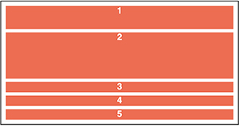
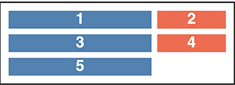
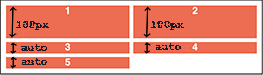
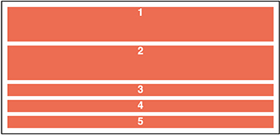
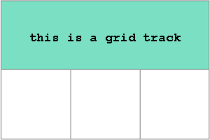
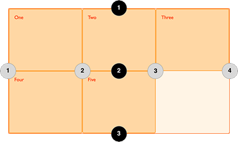
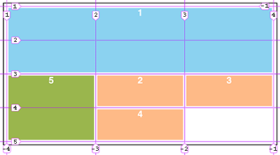
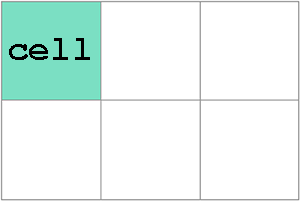
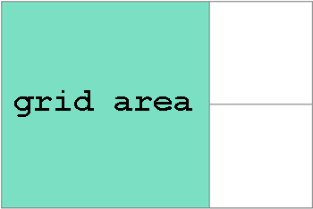
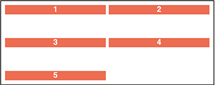

# [Grid](https://developer.mozilla.org/en-US/docs/Learn/CSS/CSS_layout/Grids) :
CSS Grid Layout is a 2-dimensional layout system. It lets you lay content out in __rows__ and __columns__.

So a grid is a collection of horizontal(**row**) and vertical(**column**) lines creating a pattern against which we can line up our design elements.

- similar to Flex, but while Flex-box is 1 dimensional, Grid is 2 dimensional.

In other words: grid items (*contents*) are distributed along the *main axis* and *cross axis*.([source](https://www.freecodecamp.org/news/css-grid-tutorial-with-cheatsheet/)).

> 💡 A simple question to ask yourself when deciding between grid or flexbox is:   
> -  do I only need to control the layout by row **or** column 👉 **use a flexbox** 
> -  do I need to control the layout by row **and** column 👉 **use a grid**

<br> 

- __grid-container__ (the parent) properties:

  - __[defining a grid](https://developer.mozilla.org/en-US/docs/Learn/CSS/CSS_layout/Grids#defining_a_grid)__:   
    __`display: grid;`__   
    Call it on the parent element (just like in Flex-box).
    All direct children of grid containers become grid items.   
    By declaring `display: grid;`, it gives a one column grid, so your items will continue to display one below the other as they do in normal flow.    
    **We create a grid container by declaring display: grid or display: inline-grid on an element**. As soon as we do this, **all direct children** of that element **become grid items**.

  <br>

  - __[grid-template-rows](https://developer.mozilla.org/en-US/docs/Web/CSS/grid-template-rows)__ :   
  defines the line names and track sizing functions of the grid rows.

    - a row track is created for each value specified for grid-template-rows. Track size values can be any non-negative, length value (px, %, em, etc.)  

   - eg.:
      *`<div>` 1 and 2 have fixed heights of 50px and 100px. Because only 2 row tracks (`<div>`)s were defined: 80px 150px, heights of `<div>` 3 & 4 & 5 are defined by the contents of each.*   
      HTML
      ```
      <div id="parent">
        <div>1</div>
        <div>2</div>
        <div>3</div>
        <div>4</div>
        <div>5</div>
      </div>
      ```
      CSS
      ```
      #parent {
      display: grid;
      grid-template-rows: 80px 150px;
      }
      ```
      


  - __[grid-template-columns](https://developer.mozilla.org/en-US/docs/Web/CSS/grid-template-columns)__ :   
  defines the line names and track sizing functions of the grid columns.   
  So when you call this, you declare (explicitly) how many columns you want. (And implicitly it gives you rows)

  - units:
    - px, pt, em, rem, %, fr (fraction unit), auto

    - a __fr__ (fraction unit) diveds the free space in the grid into equally distribute the space.   
    Margins and paddings are automatically built in.  
    __fr__ units are flexible

  - 💡 __fr__ distributes available space, not all space. So, if one of your tracks has something large inside it, there will be less free space to share.

    - eg.:   
    *I have a `<div id="parent">` and 5 children `<div>`s.*   
      HTML
    ```
    <div id="parent">
      <div>1</div>
      <div>2</div>
      <div>3</div>
      <div>4</div>
      <div>5</div>
    </div>
    ```
    CSS
    ```
    #parent {
      display: grid;
      grid-template-columns: 2fr 1fr;   //first col. takes twices as much space as the second col.
    }
    ```
   


- __grid items__ (children element) properties:

- __[the minmax() function](https://developer.mozilla.org/en-US/docs/Learn/CSS/CSS_layout/Grids#the_minmax_function)__ :    
   it lets us set a minimum and maximum size for a track.
    `minmax(minimum-value, maximum-value)`

  eg.:
  * first row track: `<div>` 1 is set to have a minimum height of 100px, but its maximum size of auto will allow the row track to grow the content taller than 100px.*   
  CSS
    ```
    #parent {
      display: grid;
      grid-template-rows: minmax(100px, auto);
      grid-template-columns: 1fr 1fr;
    }
    ```
  
 
  * first column track `<div>`1 & `<div>`4 has a minimum size of auto, but its maximum size of 20% will prevent it from getting no wider than 20% of the grid container width.*   
  CSS
    ```
    #parent {
      display: grid;
      grid-template-columns: minmax(auto, 20%) 1fr 1fr;
    }
    ```
  

<br>

- [Repeating Grid Tracks](https://developer.mozilla.org/en-US/docs/Web/CSS/repeat()) :   
define __repeating grid tracks__ using the `repeat()` notation. This is useful for grids with items with equal sizes or many items.   
This function can be used in the CSS Grid properties __grid-template-columns__ and __grid-template-rows__.

  - `repeat()` accepts 2 arguments:   
  The first represents the __number of times the defined tracks should repeat__.   
  The second is the __track definition__.  
  - eg.:

    ```
      grid-template-rows: repeat(3, 100px);
    ```
      
    ```
      grid-template-columns: repeat(3, 1fr);
    ``` 
        

- __the model__:
  - __[explicit grid](https://developer.mozilla.org/en-US/docs/Web/CSS/CSS_Grid_Layout/Basic_Concepts_of_Grid_Layout#the_implicit_and_explicit_grid)__:    
    a grid layout you explicitly call.   
    So the explicit grid is the one that you create using grid-template-columns or grid-template-rows.

  - __[implicit grid](https://developer.mozilla.org/en-US/docs/Web/CSS/CSS_Grid_Layout/Basic_Concepts_of_Grid_Layout#the_implicit_and_explicit_grid)__:    
    a grid layout that is automatically created (rows and columns) for extra elements that don't fit into the explicit grid.     
    So, if you place something outside of the defined grid *(or due to the amount of content, more grid tracks are needed)* then the grid creates rows and columns in the implicit grid. These tracks will be auto-sized by default, resulting in their size being based on the content that is inside them.

    By default, tracks created in the implicit grid are __auto__

<br>

- __[Grid track](https://developer.mozilla.org/en-US/docs/Web/CSS/CSS_Grid_Layout/Basic_Concepts_of_Grid_Layout#grid_tracks)__ :    
grid track is the space between any two lines on the grid. (Grid-template-columns and grid-template-rows properties define grid tracks.)   
  


 <br>

- __[Grid lines](https://developer.mozilla.org/en-US/docs/Web/CSS/CSS_Grid_Layout/Basic_Concepts_of_Grid_Layout#grid_lines)__ :   
**when we define a grid we define the grid tracks, not the lines**.   
Grid gives us __numbered lines to use when positioning items❗️__   
**☟**
- __[Positioning Items by *grid line numbers*](https://developer.mozilla.org/en-US/docs/Web/CSS/CSS_Grid_Layout/Line-based_Placement_with_CSS_Grid)__ *(= Line-based placement)* :    
Lines are numbered according to the writing mode of the document - left to right or right to left.   
    
  (*Each line, starting from the start of the track and in the direction of the grid, is numbered incrementally starting from 1 (so 1, 2, 3, etc.).*

  We can use *line-based placement* to **control where element items sit on the grid**. 
       
      
  (source: [MDN](https://developer.mozilla.org/en-US/docs/Web/CSS/CSS_Grid_Layout/Basic_Concepts_of_Grid_Layout#grid_lines))   
  When we place an item, __we target the line__ – rather than the [track](https://developer.mozilla.org/en-US/docs/Glossary/Grid_Tracks) by using these properties:
    - [grid-column-start](https://developer.mozilla.org/en-US/docs/Web/CSS/grid-column-start)
    - [grid-column-end](https://developer.mozilla.org/en-US/docs/Web/CSS/grid-column-end)
    - [grid-row-start](https://developer.mozilla.org/en-US/docs/Web/CSS/grid-row-start)
    - [grid-row-end](https://developer.mozilla.org/en-US/docs/Web/CSS/grid-row-end)

    - eg.:    
      HTML:
      ```
      <div id="parent">
        <div>1</div>
        <div>2</div>
        <div>3</div>
        <div>4</div>
        <div>5</div>
      </div>
      ```
      CSS:    
      the **`<div>1</div>`** item 🔵 `#parent div:first-child` is placed against column line 1, and *spans* to column line 4, and it **starts** at row line 1 and **ends** at row line 3 (so spanning two row tracks).   
      the **`<div>5</div>`** item 🟢 `#parent div:last-child` **starts** on grid column line 1, and *spans* 1 track (that is by default) → *no need to define it, or define the end*. Also, it *spans* 2 row-tracks *from row line 3* to *row line 5*.    

      ```
      #parent {
      display: grid;
      grid-template-columns: repeat(3, 1fr);
      grid-auto-rows: 100px;

      #parent div:first-child {
        grid-column-start: 1;
        grid-column-end: 4;
        grid-row-start: 1;
        grid-row-end: 3;
      }
      #parent div:last-child {
        grid-column-start: 1;
        grid-row-start: 3;
        grid-row-end: 5;
      }
      ```
         
      With [Firefox Grid inspector](https://developer.mozilla.org/en-US/docs/Tools/Page_Inspector/How_to/Examine_grid_layouts) we can see the line numbers:   

         
      
      <br>
        💡 If an item spans only one row or column, grid-row/column-end is not necessary.

      <br>

    - __[Line-positioning shorthands](https://developer.mozilla.org/en-US/docs/Web/CSS/CSS_Grid_Layout/Basic_Concepts_of_Grid_Layout#line-positioning_shorthands)__ :
    **`grid-row` is shorthand** for `grid-row-start` and `grid-row-end`.
    **`grid-column` is shorthand** for `grid-column-start` and `grid-column-end`.

      shorthand for row: `grid-row: 1 / 3;`
      shorthand for column: `grid-column: 1 / 4;`

      If **one value** is provided, it specifies **grid-row/column-start**.

      If **two values** are specified, the first value corresponds to **grid-row/column-start** and the second **grid-row/column-end**, and must be separated by a forward slash ` / `.

    - eg.:   
      CSS
      ```
      #parent div:first-child {
      background-color: steelblue;
      grid-column: 1 / 4;
      grid-row: 1 / 3;
      }

      #parent div:last-child {
        background-color: darkolivegreen;
        grid-column: 1 ;
        grid-row: 3 / 5;
      }
      ```
      

<br>

- [Grid cells](https://developer.mozilla.org/en-US/docs/Web/CSS/CSS_Grid_Layout/Basic_Concepts_of_Grid_Layout#grid_cells) :   
  -  is the smallest unit on a grid.     
    

- [Grid areas](https://developer.mozilla.org/en-US/docs/Web/CSS/CSS_Grid_Layout/Basic_Concepts_of_Grid_Layout#grid_areas) :   
  -  items can span one or more cells both by row or by column, and this creates a grid area. 
  - it isn’t possible to create an L-shaped area for example (because grid areas must be rectangular)
    

- [Grid Gaps (gutters)](https://developer.mozilla.org/en-US/docs/Web/CSS/gap) :   
  create gaps (gutters) between rows and columns. It is a shorthand for row-gap and column-gap.   
  (Grid gaps are only created in between columns and rows, and not along the edge of the grid containe.)
    - eg.:   
      create gaps between rows
      ```
      grid-row-gap: 70px;
      ```
      

      <br>

      create gaps between columns
      ```
      grid-column-gap: 100px;
      ```
      


- __vocabulary__:
  - __grid lines__:
    - __row grid line__ : horizontal row line
    - __column grid line__ : vertical column line
  - __grid tracks__:
    - the area between two lines (can be between rows and can be between columns)
  - __grid cells__ (or grid items):
    - individual cells in the grid (has 4 sides made by 2 rows and 2 columns)

<br>


