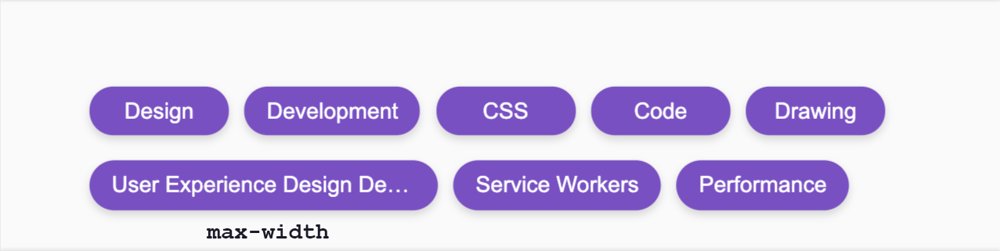

# How to center an element on a page 🤓

###### In HTML we have a `<button>`
  ```
  <body>
    <button>Hello</button>
  </body>
  ```
###### In CSS the centering
  ```
body {
    display: flex;
    align-items: center;
    justify-content: center;
    min-height: 100vh;
}
  ```
<br>

# Basic navbar 🤓

###### In HTML the navbar `<nav>` constructed from 3 items: `<a>` + `<ul>` + `<a>`
  ```
<nav>
    <a href="#home">Home</a>
      <ul>

        <li>
            <a href="#Home">Career</a>
        </li>
        <li>
            <a href="#Home">About us</a>
        </li>
        <li>
            <a href="#Home">Contact</a>
        </li>

      </ul>
    <a href="#signup">Sign Up</a>
 </nav>
  ```
###### In CSS: we use flexbox and @media queries to arrange the navbar depending on screen sizes
 1. *note: a good move to give the `<ul>` and `<li>` a  `display: inline;`*.  
 2. *note: `<nav>` use flexbox's `justify-content: space-between;` → the 2 `<a>`s move both sides of the page and the 3 `<li>`s in the center.*
 3. *note: to give more space to the `<li>` elements, I can give a `flex-grow: 1` (shorthand `flex: 1`) and define its width, eg. `max-width: 50%` so it doesn't grow all the away  and take up all the space. Then give a `justify-content: space-evenly;`.*
 4. *note: below 768px screen size, the `nav` item has a `flex-direction: column`, so the items will be vertical.*
 5. *note: 💡 we used **nested flexbox**. `<nav>` parent element is a flex-container, inside the `<ul>` is the nested flex-container.*


  ```
h1 {
    font-size: 6em;
    text-align: center;
}

nav {
    font-size: 1.5em;
    display: flex;
    justify-content: space-between;
}

ul,li {
    display: inline;
    margin: 0;
    padding: 0;
}

ul {
    flex: 1;
    max-width: 50%;
    display: flex;      // this is here because it is a nseted flex box!
    justify-content: space-evenly;
}

@media (max-width: 768px) {
    h1 {
      font-size: 4em;
    }
    nav, nav ul {
        flex-direction: column;     // items go vertical
        align-items: center;  //cross-axis because the column
    }
  } 

  @media (max-width: 576px) {
    h1 {
      font-size: 3em;
    }
  } 
  ```
  
<br>

# Basic button 🤓
###### In HTML we have a `<a href="#">`
  ```
<a href="#/" class="download-button">Download</a>
  ```
###### In CSS we give the style. Note: *__`display: inline-block`__*
  ```
.download-button {
	border: 1px solid blue;
	border-radius: 10px;
	color: #yellow;
	display: inline-block;  /* 💡💡💡 */
	padding: 15px 35px;
	text-decoration: none;
	margin: 25px 0;
	transition: background-color 200ms ease-in-out;
}

.download-button:hover, .download-button:focus {
 background-color: #lightblue;
}
  ```

<br>

# What is [mobile frist](https://developer.mozilla.org/en-US/docs/Web/Progressive_web_apps/Responsive/Mobile_first)? 📱
It means to create the mobile layout as the default first and then the larger screen sizes, which usually change to be row based instead of column based.

<br>

# What is [max-width](https://developer.mozilla.org/en-US/docs/Web/CSS/max-width) and [min-width](https://developer.mozilla.org/en-US/docs/Web/CSS/min-width) / [max-height](https://developer.mozilla.org/en-US/docs/Web/CSS/max-height) and [min-height](https://developer.mozilla.org/en-US/docs/Web/CSS/min-height)? 📐

- **When you set the height property on an element, the element will occupy the mentioned space irrespective of the content.** In this case, if the content is more than the mentioned height, than it overflows. With min-height property we can set a minimum height for the element to occupy the space if the content in the element is less than that and the height of the element will increase when the content increases.

	When setting the value of max-height, its benefit lies in preventing the used value for height property from becoming more than the specified value for max-height. Note that the default value for max-height is none.

**[max-width](https://ishadeed.com/article/min-max-css/#max-width)** sets the maximum width of an element. The element can not be larger than the value specified by `max-width`.    
**[max-height](https://ishadeed.com/article/min-max-css/#max-height)** sets the maximum height of an element. The element can not be larger than the value specified by `max-height`.
 
 
**[min-width](https://ishadeed.com/article/min-max-css/#min-width)**
 sets the minimum width of an element. The element can not be smaller than the value specified by `min-width`.    
**[min-height](https://ishadeed.com/article/min-max-css/#min-height)**
 sets the minimum height of an element. The element can not be smaller than the value specified by `min-height`.   

 
 **[Use Cases For Min And Max Properties](https://ishadeed.com/article/min-max-css/#use-cases-for-min-and-max-properties)**.  
-  example for **'min-width'** with tags-list   
	- eg. `min-width: 100px;` *even if the tag is empty it should not be smaller than 100px.*
.  
- example for **`max-width`** with tags-list 
	- eg. `max-width: 250px;` *if the text is longer than the tag, it will be truncated.*


<br>

# Links collection 🔗

**[reset CSS](https://meyerweb.com/eric/tools/css/reset/) 👉 it is to normalize how browser styles work across different browsers.**.  
**[pricing table html css code](https://codepen.io/travisw/pen/EvbKwd)** 👉 a nice example of responsivity


---

   [👈 go back](https://github.com/Klosmi/html-basics#html-and-css--basics)
