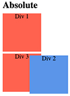

# [(Other) Useful CSS properties](https://developer.mozilla.org/en-US/docs/Web/CSS/Reference) :    
these are a few CSS properties which are nice to know, but not crucial for the basic knowledge.

**[Alpha Channel + Opacity](https://github.com/Klosmi/html-basics/blob/master/CSS-extra-properties.md#alpha-channel--opacity)   
[Position](https://github.com/Klosmi/html-basics/blob/master/CSS-extra-properties.md#position)   
[Transition](https://github.com/Klosmi/html-basics/blob/master/CSS-extra-properties.md#transition)   
[Transform](https://github.com/Klosmi/html-basics/blob/master/CSS-extra-properties.md#transform)  
[Background](https://github.com/Klosmi/html-basics/blob/master/CSS-extra-properties.md#background)**

---
## [Alpha Channel](https://developer.mozilla.org/en-US/docs/Web/CSS/opacity) + [Opacity](https://developer.mozilla.org/en-US/docs/Web/CSS/opacity)
  
  <br>

 [RGB**A**](https://developer.mozilla.org/en-US/docs/Web/CSS/color_value/rgba()) - **Alpha Channel**:  : 

  The `rgba()` [functional notation](https://developer.mozilla.org/en-US/docs/Web/CSS/CSS_Functions) expresses a color according to its red, green, and blue components. An optional alpha component represents the color's transparency.    

  **The 'a' from the 'rgba' is the alpha, which governs the transparency of the color**.  

  - it is a value from 0 to 1.
    - eg.:
      ###### *The HTML*
      ```
        <section>
          <div id="rgba">
              Lorem ipsum dolor sit amet.
              <button>Button</button>
          </div>
      ``` 
      ###### *The CSS:  we give background-color to the `<div>`*
      ```
      #rgba {
        background-color: rgba(255,255,255,0.7) /* → 0.7 is the alpha channel, here it's partially transparent. */
      }
      ```
      Only the background color will be partially transparent. The text and `<button>` are not. Only the element which have the `RGBA` value will be impacted.


    - you can add `Alpha Channel` to hexadecimal colors : add two digits at the and of the hexadecimal color from 00 to FF.
      - `00` full transparency is.
      - `FF` is no transparency at all.
        - eg.:
          ###### *CSS, hexadecimal color eg.: `#60f7ab` + `4f` alpha channel.*
          ```
            #hex {
              background-color: #60f7ab4f     /* → #60f7ab  + 4f */
            }
          ```

      <br>

  **[Opacity](https://developer.mozilla.org/en-US/docs/Web/CSS/opacity#values)** :   
  The opacity CSS property **sets the opacity of an element**. Opacity is **the degree to which content behind an element is hidden**, and is the **opposite of transparency**.

  Opacity is not a part of a color or a channel like rgb**a**.   
  Opacity is a property we set on an element which governs the entire element's "transparency" (although it is not transparency), **including its contents and any descendants**.   
  - eg.: 
    ###### *The HTML*
    ```
      <section>
        <div id="opacity">
            Lorem ipsum dolor sit amet.
            <button>Button</button>
        </div>
    ```
    ###### *The CSS*
    ```
      #opacity {
        background-color: yellow;
        opacity: 0.5;     /* → the background-color has 0.5 opacity */
      }
    ```
    Thet text in the `#opacity` `<div>` and the `<button>` will be "transparent" too not just the background color. **The entire element within that `<div>` will be impacted by the `opacity`.**

<br>

[👆back to top](https://github.com/Klosmi/html-basics/blob/master/CSS-extra-properties.md#other-useful-css-properties-)

<br>

---

## [Position](https://developer.mozilla.org/en-US/docs/Web/CSS/position) 
  The position CSS property sets how an element is positioned in a document. The `top`, `right`, `bottom`, and `left` properties determine the final location of positioned elements.

  Postion [Values](https://developer.mozilla.org/en-US/docs/Web/CSS/position#values):   

  - `static` : **this is the default value**.   
    The element is positioned according to the normal flow of the document.   
     The `top`, `right`, `bottom`, `left`, and `z-index` properties **have no effect**. *(If you try using eg. the `top`, nothing will happen.)*
      -   eg.: 
          ###### *The CSS, `<section>` `id="#static"`*
          ```
          #static {
            position: static;
          }
          ```

  - `relative` : it is going to keep the element in the normal flow of the document, but we can offset it relative to itslef by using the `top`, `right`, `bottom`, `left`.   
  *The element is positioned relatively to where it would be, if I didn't offset it.*
      -   eg.: 
          ###### *The CSS, `<section>` `id="#relative"`*
          ```
          #relative {
            position: relative;
            top: 50px;      /* → offset my element from its current position - pushing it down */
            left: 70px;     /* → offset, it pushes to the right.
          }
          ```

  - `absolute` : the element is **removed from the normal document flow**, and **no space is created for the element**. And **it is positioned relative to its closest positioned ancestor if any**; otherwise, it is placed relative to the initial containing block (basically to the `body`).
  

      -   eg.: 
          ###### *The HTML, `<section>` `id="#absolute"`, `<div> `id="#second"`*
          ```
          <section id="absolute">
            <h2>Absolute</h2>
            <div></div>
            <div id="second"></div>
            <div></div>
          </section>
          ```
          ###### *The CSS, `<div> `id="#second"`*
          ```
          #second {   
            position: absolute;
          }
          ```
          From the three elements, which are next to each other (horizontally), I can see only two, because the third element got behind the `#second`. It is like the space collapsed and they're stacked.     
          Why? Because the `#second` element **doesn't take up any space in the document, it is removed from the normal flow**.
          <br>   
          But: 
          ###### *The CSS, `<section>` `id="#absolute"` (the parent element), `<div> `id="#second"`(the child element)*
          ```
          #absolute {  
            position: relative;
          }

          #second {  
            position: absolute;
            left: 70px;
          }
          ```
          Now `#second` does not take up any space. And it is now positioned relative to its parent(`#absolute`), which also is positioned (*to realtive btw*).   
          
          
  <br>

  - `fixed` : the element is removed from the normal document flow, and no space is created for the element in the page layout.
  **It is positioned relative to the initial containing block.**

    When an element is positioned fixed, it's going to stay "there". Its position is relative to the containing block always. 
    *(It is like absolute, **except** it has nothing to do with any parent elements.)*

      -   eg.: 
          ###### *The HTML, `<section>` `id="#fixed"`, `<div> `id="#second"`*
          ```
          <section id="fixed">
            <h2>fixed</h2>
            <div></div>
            <div id="second"></div>
            <div></div>
          </section>
          ```
          ###### *The CSS, `<div> `id="#second"`*
          ```
          #second {   
            position: fixed;
          }
          ```
          From the three elements, which are next to each other (horizontally), I can see only two, because the third element got behind the `#second`.   
          Why? Because the `#second` element **doesn't take up any space in the document, it is removed from the normal flow**.
          <br>   
          But: 
          ###### *__Here there is no parent element.__ The `<div> `id="#second"*
          ```
          #second {  
            position: fixed;
            top: 0;      /*→ it moves up to the containing block */
            left: 400px;
          }
          ```
          When something is positioned `fixed` it is gonna **stay** there. It is positioned **relative to its containing block**, always.
  <br>

- `sticky` : it sticks. 
  The element is positioned according to the normal flow of the document, and **then offset relative to its nearest scrolling ancestor and containing block** (nearest block-level ancestor). The offset does not affect the position of any other elements. 

  In other words: it starts not fixed and then later it get fixed. So the element begins not fixed to the top. It will scroll along with content until it hits the top and then it stays there.

  It's kinda mixture of position `relative` and `fixed`.

  - eg.: 
    ###### *The HTML `<div> `class="second"`*
      ```
      <section id="sticky">
        <h2>Sticky</h2>
        <div></div>
        <div class="second"></div>
        <div></div>
      </section>
      ```
      ###### *The CSS, `<div> `class="second"`*
      ```
      #sticky {
        height: 600px;  /*→ .second's nearest block-level ancestor */
      }

      #sticky .second{   
        position: sticky;
        top: 0;
      }
     ```
    The sticky item’s container (here is `<section id="sticky">`) is the only area in which the sticky item can stick.  
    In other words, the container is the scope of the sticky item, and the item can’t get out of its sticky container. So **it only sticks within its container**(here the  `<section class="sticky">`).   

    The above example (the sticky portperty) only works if we use classes!   

    (This [video](https://www.youtube.com/watch?v=9xygOHSuzQ8) explaines it quite well.)

💡 Note, that normally the 'second' id's should actually be **classes**. **You should only have one unique id per page.** If it needs to replicate, then a class is the correct choice!

<br>

[👆back to top](https://github.com/Klosmi/html-basics/blob/master/CSS-extra-properties.md#other-useful-css-properties-)

<br>

---

## [Transition](https://developer.mozilla.org/en-US/docs/Web/CSS/transition) 
  Transitions enable you to define the transition between two states of an element. 

-  **`transition` is a shorthand property** for :   
  &nbsp; &nbsp;[`transition-property`](https://developer.mozilla.org/en-US/docs/Web/CSS/transition-property) (none, all, etc.),    
  &nbsp; &nbsp;[`transition-duration`](https://developer.mozilla.org/en-US/docs/Web/CSS/transition-duration) (3s),    
 s &nbsp;[`transition-timing-function`](https://developer.mozilla.org/en-US/docs/Web/CSS/transition-timing-function) (eas-in, eas-out, etc.),    
  &nbsp; &nbsp;[`transition-delay`](https://developer.mozilla.org/en-US/docs/Web/CSS/transition-delay) (1s, 250ms).


<br>

- **Syntax of `transition` property:**   
  1. [property name](https://developer.mozilla.org/en-US/docs/Web/CSS/transition-property) → specify a specific property name, so **which `transition` effect** to use.  

  2. [duration](https://developer.mozilla.org/en-US/docs/Web/CSS/transition-duration) → sets the **length of time a transition animation** should take to complete. So how long it takes.

  3. [timing function](https://developer.mozilla.org/en-US/docs/Web/CSS/transition-timing-function) → sets how **intermediate values are calculated** for CSS properties being affected by a transition effect.

  4. [delay](https://developer.mozilla.org/en-US/docs/Web/CSS/transition-delay) → specifies the duration to **wait before starting** a property's transition effect **when its value changes**.  

- duration:
  - eg.:
    ###### *HTML*
    ```
    <div class="circle"></div>
    ```
    ###### *CSS: a hover transition **duration***
    ```
    .circle {
      width: 300px;
      height: 300px;
      background-color: green;
      transition: 3s;
    }

    .circle:hover {
        background-color: blue;
        border-radius: 50%;
    }
    ```
    When you hover, the background color and shape changes in 3s as they would all be animated.

    <br>

- **singling out property names**:
  -  eg.:  singling the `background-color` transition
    ###### *HTML*
    ```
    <div class="circle"></div>
    ```
    ###### *CSS: only the backgroun-color changes with a hover transition **duration***
    ```
    .circle {
      width: 300px;
      height: 300px;
      background-color: green;
      transition: background-color 3s;  /* → single-out background-color */
    }

    .circle:hover {
        background-color: blue;
        border-radius: 50%;
    }
    ```
    By singling-out the `background-color`, it will changes with a 3s animation **ONLY** the `background-color`, the rest doesn't use the 3s animation.

    <br>

- **all properties**: 
  - eg.:  
    ###### *CSS: all properties change with a hover transition **duration***
    ```
    .circle {
      width: 300px;
      height: 300px;
      background-color: green;
      transition: all 3s;  /* → all properties */
    }

    .circle:hover {
        background-color: blue;
        border-radius: 50%;
    }
    ```
    All the properties changes with 3s animation.
    
    <br>

- **delay** : 
  - eg.: 
    ###### *CSS: specify 1s delay
    ```
    .circle {
      width: 300px;
      height: 300px;
      background-color: green;
      transition: all 3s 1s;  /* → 1s delay */
    }

    .circle:hover {
        background-color: blue;
        border-radius: 50%;
    }
    ```
    All the properties change with 3s duration and 1s delay animation. So when we hover over, it's going to take `1s` **before that transition even begins**. It goes both direction.
    
    <br>

- **specify different transitions at once:**
  - eg.: 
    ###### *CSS: specify 1s delay `for background-color`, and 2s for `border-radius`
    ```
    .circle {
      width: 300px;
      height: 300px;
      background-color: green;
      transition: background-color 1s, border-radius 2s;  /* → 1s background-color, 2s border-radius delay */
    }

    .circle:hover {
        background-color: blue;
        border-radius: 50%;
    }
    ```
    specify 1s delay `for background-color`, and 2s for `border-radius`. We can see the background-color finishes before the border radius finishes.

- **timing-function**: the whole [syntax of timing-functions](https://developer.mozilla.org/en-US/docs/Web/CSS/transition-timing-function#syntax) !
  - linear; → *never speeds up or slow down*
  - eas-in; → *start slow, speeds up* ・ ease-out; ・ ease-in-out;
  - steps (6, end); → *6 steps*
  - cubic-bezier(.29, 1.01 1, -0.68); → *goes forward and backwards*

  - how it works:   
    there are four things what we can specify:  
      - property that we want to animate,     
      - duration that can be in seconds, milliseconds (500ms),
      - timing-function, like ease-in.
      - delay (the default is no delay)
      eg.: 
        ```
        transition: background color 1s ease-in, border-radius 500ms;
        ```

   - eg.: 
      ###### *CSS: we have four `<div>` squares, each of them has a **separate**, different `timing-function` transition.
      ```
      section div {
          height: 100px;
          width: 100px;
          background-color: blue;
          margin: 30px 0;
          transition: margin-left 2s;
        } 

      section:hover div {     /*  → on hover all the "<div> squares" activated */
          margin-left:500px;  /* → on hover the "<div> squares" go till 500px*/
        }

      div:nth-of-type(1){
          transition-timing-function: ease-in;
        }     /* → starts up a bit slow */

      div:nth-of-type(2){
          transition-timing-function: ease-out;
        }     /* → starts up quickly then slows down */

      div:nth-of-type(3){
          transition-timing-function: cubic-bezier(0.7, 0, 0.84, 0);
        }     /* → starts very slow */

      div:nth-of-type(4){
          transition-timing-function:  cubic-bezier(0.85, 0, 0.15, 1);
        } 
      ```
      All the four `<div>` squares get a `transition: margin-left 2s;`, **but** each one has a **separate** `timing-function` transition, and they get to the same spot at the end at the **exact same time**.

    💡 for different [timing-function or easings](https://easings.net/)❗️


    💡 Advice: it is better to **single out those properties which you want to make the transition**❗️ *(So, don't just do `transition all` because when you will makesome changes to your code later, makes your work harder.)*

    <br>
    
[👆back to top](https://github.com/Klosmi/html-basics/blob/master/CSS-extra-properties.md#other-useful-css-properties-)

<br>

---

## [Transform](https://developer.mozilla.org/en-US/docs/Web/CSS/transform) 
  The transform CSS property lets you **rotate, scale, skew, or translate an element**.

  [`<transform-function>`](https://developer.mozilla.org/en-US/docs/Web/CSS/transform-function)  :    
  the `<transform-function>` CSS data type represents a **transformation that affects an element's appearance**. Transformation **functions can rotate, resize, distort, or move an element in 2D or 3D space**. It is used in the **transform property.**

  - [**rotate**](https://developer.mozilla.org/en-US/docs/Web/CSS/transform-function/rotate()) :    
    the rotate function rotates an element around a fixed point on the 2D plane (without deforming it).

    - `rotate()` accepts different [units](https://developer.mozilla.org/en-US/docs/Web/CSS/angle#units):
      ###### [`<angle>`](https://developer.mozilla.org/en-US/docs/Web/CSS/angle):    
        - `deg` (*degrees*) 
            → `transform: rotate(45deg);`
        - `rad` (*radians*) 
            → `transform: rotate(3.1416rad);`
        - `grad` (*gradiant*) 
            → `transform: rotate(-50grad);`
        - `grad` (*turn*) 
            → `transform: rotate(1.75turn);`

  - eg.:
    I have a bunch of title elements (`<h2>`) and two section. Here I select the first `<section>`.
    ###### *CSS: selecting the __the first sections first h2__*
    ```
    section:first-of-type h2:nth-of-type(1) {
      transform: rotate(45deg);  /* → 45 degrees rotation  */ 
    }
    ```

    - different [variants of rotating](https://developer.mozilla.org/en-US/docs/Web/CSS/transform-function#rotation), here are some:

      - [rotate3d](https://developer.mozilla.org/en-US/docs/Web/CSS/transform-function/rotate3d()):   
        The rotate3d() CSS function defines a transformation that rotates an element around a fixed axis in 3D space, without deforming it.
          - eg.:
            ```
            transform: rotate3d(1, 1, 1, 45deg);
            ```
            A rotate3d(x, y, z, a) = 
              - x:  **x-coordinate**, between 0 - 1
              - y:  **y-coordinate**, between 0 - 1
              - z:  **z-coordinate**, between 0 - 1 
              - a:  **angle** of the rotation.   
                A **➕ angle** denotes a **clockwise rotation**, a **➖ angle** a **counter-clockwise** one.


      - [rotateX](https://developer.mozilla.org/en-US/docs/Web/CSS/transform-function/rotateX()) & [rotateY](https://developer.mozilla.org/en-US/docs/Web/CSS/transform-function/rotateY()) & [rotateZ()](https://developer.mozilla.org/en-US/docs/Web/CSS/transform-function/rotateZ()):    
        The `rotateX()` CSS function defines a transformation that rotates an element around the abscissa (horizontal axis) without deforming it. 
          - eg.:
            ```
            transform: rotateX(45deg);
            ```

        The `rotateY()` ransformation that rotates an element around the ordinate (vertical axis) without deforming it. 
          - eg.:
            ```
            transform: rotateY(-0.2turn);
            ```

        The `rotateZ()` defines a transformation that rotates an element around the z-axis without deforming it.
        - eg.:
            ```
            transform: rotateZ(3.142rad);
            ```
  <br>

  - [**transform-origin**](https://developer.mozilla.org/en-US/docs/Web/CSS/transform-origin):    
      the `transform-origin` CSS property sets the origin for an element's transformations.
      - center ・ top left ・ 50px 50px ・ bottom right 60px;   

      - eg.: 

          ```
          transform-origin: top right 30px;
          ```

          ###### *CSS: selecting the __the first sections first h2__*
          ```
          section:first-of-type h2:nth-of-type(1) {
            transform-origin: top right;
            transform: rotate(45deg);  /* → 45 degrees rotation  */ 
          }
          ```
        transforming the element from the `bottom right` by `rotate: 45deg`

   <br>

  - [**scale**](https://developer.mozilla.org/en-US/docs/Web/CSS/transform-function/scale())  :    
     The `scale()` function defines a **transformation that resizes an element on the 2D plane**. Because the amount of scaling is defined by a vector, it can resize the horizontal and vertical dimensions at different scales.

     **So, it can change the size of an element.** We can grow it or shrink it.

     - [scale values](https://developer.mozilla.org/en-US/docs/Web/CSS/transform-function/scale()#values) are coordinates:  
        - **sx and sy**, where *sx* number represents the abscissa of the scaling vector, and *sy* number represents the ordinate of the scaling vector.
          `scale(sx, sy)` or `scale(sx)`

      <br>

     - different [variants of scaling](https://developer.mozilla.org/en-US/docs/Web/CSS/transform-function#scaling_resizing):
          - [`scale()`](https://developer.mozilla.org/en-US/docs/Web/CSS/transform-function/scale()): *scales an element up or down on the 2D plane.*

          - [`scale3d()`](https://developer.mozilla.org/en-US/docs/Web/CSS/transform-function/scale3d()): *scales an element up or down in 3D space.  

            - [`scaleX()`](https://developer.mozilla.org/en-US/docs/Web/CSS/transform-function/scaleX()) & [`scaleY(https://developer.mozilla.org/en-US/docs/Web/CSS/transform-function/scaleY())`]() & [`scaleZ()`](https://developer.mozilla.org/en-US/docs/Web/CSS/transform-function/scaleZ()):   

              - `scaleX()` scales an element up or down horizontally.

              - `scale(y)` scales an element up or down vertically.

              -  `scaleZ()` scales an element up or down along the z-axis.

        <br>

        - eg.:
          *"regular"* `scale()`
          ###### *CSS: selecting the __the first section's second h2__*
          ```
          section:first-of-type h2:nth-of-type(2) {
            transform: sacle(0.5);  /* → scales down half the size  */ 
          }
          ```
          It scales down both on the X and Y axis, shrinking by a factor of half (half as large).

          ###### *CSS: selecting the __the first section's second h2__, with two values*
          ```
          section:first-of-type h2:nth-of-type(2) {
            transform: sacle(2, 1);  /* → scales the width double, height stays the same(1)  */ 
          }
          ```
          The height of the element stays the same, but the width is scaled by 2.

          ###### *CSS: selecting the __the first section's second h2__, double the height*
          ```
          section:first-of-type h2:nth-of-type(2) {
            transform: sacleY(2);  /* → double the height = scale (1, 2)  */ 
          }
          ```
          Double the height of the element. You can do it with `scaleY()` or with `scale(1, 2)`.

  <br>

  - [**translate or translation (= moving)**](https://developer.mozilla.org/en-US/docs/Web/CSS/transform-function/translate()) :     
    the `translate()` function can take one element and move it around so we can move it to the right, move it up, move it down or do both at the same time.

      - different [variants of translate](https://developer.mozilla.org/en-US/docs/Web/CSS/transform-function#translation_moving:)
        - [`translate()`](https://developer.mozilla.org/en-US/docs/Web/CSS/transform-function/translate()) : translates an element on the 2D plane.
        - [`translate3d()`](https://developer.mozilla.org/en-US/docs/Web/CSS/transform-function/translate3d()) : translates an element in 3D space.
        - [`translateX()`](https://developer.mozilla.org/en-US/docs/Web/CSS/transform-function/translateX) & [`translateY()`](https://developer.mozilla.org/en-US/docs/Web/CSS/transform-function/translateY()) & [`translateZ()`](https://developer.mozilla.org/en-US/docs/Web/CSS/transform-function/translateZ()): 
        `translateX()` translates an element horizontally.
        `translateY()` translates an element vertically.
        `translateZ()` translates an element along the z-axis.

    - eg.:   
      to move something horizontally: use `translateX()`. Values, are **length** or **%**.  *([Length can be any unit](https://developer.mozilla.org/en-US/docs/Web/CSS/length#units))*

      ###### *CSS: selecting the __the first section'third h2__*
      ```
      section:h2:nth-of-type(3) {
        transform: translateX(200px);  /* → moved to the right 200px  */ 
        transform: translateX(-200px);  /* → moved to the left 200px  */ 
      }
      ```
      <br>

      the *"regular"* `translate()` takes two values, an **X** and a **Y**   
      ###### *CSS: selecting the __the first section'third h2__*
      ```
      section:h2:nth-of-type(3) {
        transform: translateX(-200px, 100px );  /* → moved to the left 200px, 100px down  */ 
      }
      ```
      Move the element left with 200px and down with 100px.

  <br>

 - [**skew** (= distortion)](https://developer.mozilla.org/en-US/docs/Web/CSS/transform-function/skew()) :     
    the `skew()` function defines a transformation that **skews an element on the 2D plane**.

    - different [variants of skew](https://developer.mozilla.org/en-US/docs/Web/CSS/transform-function#skewing_distortion) :   
      - [`skew()`](https://developer.mozilla.org/en-US/docs/Web/CSS/transform-function/skew()) : skews an element on the 2D plane.
      - [`skewX()`](https://developer.mozilla.org/en-US/docs/Web/CSS/transform-function/skewX()) &  [`skewY()`](https://developer.mozilla.org/en-US/docs/Web/CSS/transform-function/skewY()):   
      `skewX()` skews an element in the horizontal direction.
      `skewY()` skews an element in the vertical direction.

    - [skew values](https://developer.mozilla.org/en-US/docs/Web/CSS/transform-function/skew()#values):
      - [`<angle>`](https://developer.mozilla.org/en-US/docs/Web/CSS/angle) [or see above 👆](https://github.com/Klosmi/html-basics/blob/master/CSS-extra-properties.md#angle)  : `deg`, `rad`, `grad`, `turn`


  - eg.:
   *"regular"* `skew()`:     

      I have a bunch of title elements (`<h2>`) and two section. Here I select the second `<section>`.
      ###### *CSS: selecting the __the second section's first h2__*
      ```
      section:h2:nth-of-type(2) h2:nth-of-type(1) {
        transform: skew(30deg);  /* → skewing 30deg 'kinda like a left italic look'  */ 
      }
      ```
      <br>

      We can pass on two values as well, for the **X** and **Y**.
      ###### *CSS: selecting the __the second section's second h2__*
      ```
      section:h2:nth-of-type(2) h2:nth-of-type(2) {
        transform: skew(10deg, 30deg);  /* → skewX 10deg, skewY 30deg */
      }
      ```
    
    <br>
    <br>

-  We can **combine** all these **transform functions** :
      so eg.  we can rotate and scale, skew, translate (move) etc. at the same time.

      - eg.:
      ###### *CSS: selecting the __the second section's third h2__*
      ```
      section:h2:nth-of-type(2) h2:nth-of-type(3) {
        transform: rotate(85deg) scale(1.5);  /*  → rotate 85deg scale up 1.5 */
      } 
      ```
      <br>

      ###### *CSS: selecting the __the second section's fourth h2__*
      ```
      section:h2:nth-of-type(2) h2:nth-of-type(4) {
        transform: transalteX(-150px) rotate(0.5turn) scaleY(1.5);  /*  → moved to the left 150px, tirn upside-down, scaled up 1.5 */
      } 
      ```
      <br>

      scale the whole section down:
      ###### *CSS: selecting the __the third section*
      ```
      section:h2:nth-of-type(3)  {
        transform: scale(0.5);  /*  → scaled downt the whola section 0.5 */
      } 
      ```
      Every element of the `<section>` is affected, they scaled down.

      <br>

      💡 Important: about transform *(as well)* that everything you do is going to apply to not only the parent element, but also its **contents**.
      
      <br>
      
[👆back to top](https://github.com/Klosmi/html-basics/blob/master/CSS-extra-properties.md#other-useful-css-properties-)

  <br>
  
--- 

## [Background](https://developer.mozilla.org/en-US/docs/Web/CSS/background) 
The background (shorthand CSS) property sets all **background style properties at once**, such as **color**, **image**, **origin** and **size**, or **repeat method**.

[More about the `background` property below 👇](https://github.com/Klosmi/html-basics/blob/master/CSS-extra-properties.md#the-background-shorthand-property)

- [`background` values on this link](https://developer.mozilla.org/en-US/docs/Web/CSS/background#values)   
Some of the most common values:
  - [`background-image`](https://developer.mozilla.org/en-US/docs/Web/CSS/background-image) :   
   This property sets **one or more** background images **on an element**.
   - eg.:
      ###### HTML: `<section>` and an `<h1>`
      ```
      <section>
            <h1>i am heading</h1>
        </section>
      ```
      ###### CSS: give a `background-image` to `<section>`
      ```
      section {
          width: 80%;
          background-image: url("https://images.unsplash.com/photo-1564442038901-4f9a19d3d456?ixlib=rb-1.2.1&ixid=eyJhcHBfaWQiOjEyMDd9&auto=format&fit=crop&w=1227&q=80");
          margin: 0 auto;         /* → center the element */
      }
      ```
      Using `background-image: url("https://...")`

    <br>

- [`background-size`](https://developer.mozilla.org/en-US/docs/Web/CSS/background-size) :   
  this property sets the size of the element's background image.    
  The image can be left to its natural size, stretched, or constrained to fit the available space.
  <br>

  [`background-size` property's values](https://developer.mozilla.org/en-US/docs/Web/CSS/background-size#values):
   - **contain**
    Scales the image as large as possible **without cropping or stretching**.  
    - eg.:
      ###### CSS: give a `background-image` → `contain`
      ```
      section {
          width: 80%;
          background-image: url("https://images.unsplash.com/....);
          background-size: contain;     /* → contain */
          margin: 0 auto;         /* → center the element */
      }
      ```
      If the image doesn't fill the entore element, it **repeats** it. 
  
     <br>

   - **cover**
    Scales the image as large as possible to fill the container **without stretching** the image **but it will crop it**.
    -  eg.:
        ###### CSS: give a `background-image` → `cover`
        ```f
        section {
            width: 80%;
            background-image: url("https://images.unsplash.com/....);
            background-size: cover;     /* → cover */
            margin: 0 auto;         /* → center the element */
        }
        ```
        Cover tries to fill the container **without stretching**, so here it shrinks down the image, **depending on the element size**, to fill the element. It cuts off the parts which don't fit.
      

    - `cover` is the preferred option.

        <br>

   - **auto**
    Scales the background image in the corresponding direction such that its intrinsic proportions are maintained.

    <br>

- [`background-repeat`](https://developer.mozilla.org/en-US/docs/Web/CSS/background-repeat) :   
   this property sets how background images are repeated. A background image can be repeated along the horizontal and vertical axes, or not repeated at all.   

   💡  **We can use it with the `background-size: contain;`**

    <br>

  - [`background-repeat` values on this link](https://developer.mozilla.org/en-US/docs/Web/CSS/background-repeat#values)
      | Single value | Two-value equivalent |
      |--------------|----------------------|
      | repeat-x     | repeat no-repeat     |
      | repeat-y     | no-repeat repeat     |
      | repeat       | repeat repeat        |
      | space        | space space          |
      | round        | round round          |
      | no-repeat    | no-repeat no-repeat  |
    
    <br>

    Short explanation ([for full explanation visit the link](https://developer.mozilla.org/en-US/docs/Web/CSS/background-repeat#values)): 

    **repeat**: The image is repeated as much as needed to cover the whole background image painting area. The last image will be clipped if it doesn't fit.    

    **space**: The image is repeated as much as possible without clipping. The first and last images are pinned to either side of the element, and whitespace is distributed evenly between the images.   

    **round**: As the allowed space increases in size, the repeated images will stretch (leaving no gaps) until there is room (space left >= half of the image width) for another one to be added.   
          
    **no-repeat**: The image is not repeated (and hence the background image painting area will not necessarily be entirely covered.                                                                 
    <br>
 - [`background-position`](https://developer.mozilla.org/en-US/docs/Web/CSS/background-position) :   
  This property we can decide where that background can actually start.     
  So it sets the initial position for each background image. 
  

    - [**`background-position`** values on this link](https://developer.mozilla.org/en-US/docs/Web/CSS/background-position#values) :
      <br>
      Keyword values:   
      `background-position: top;`  
      `background-position: bottom;`  
      `background-position: left;`  
      `background-position: right;`  
      `background-position: center;`  
      `background-position: 25% 75%;`
      
      Multiple images:   
      `background-position: 0 0, center;`

      Global values:   
      `background-position: inherit;`   
      `background-position: initial;`   
      `background-position: unset;`  

   -  eg.:
        ###### CSS: give a `background-image` → `position`
        ```
        section {
            width: 80%;
            background-image: url("https://images.unsplash.com/....);
            background-size: cover;           /* → cover */
            background-position: bottom;      /* → position: bottom */
            margin: 0 auto;                   /* → center the element */
        }
        ```
         **It starts from the bottom part of the image.** *(So the bottom of the background image is going upwards, → we can see it.)*

  <br>


 ###### **The `background` shorthand property:**
  We can set the properties at once and/or combine them in one line.   
  *[back to top 👆](https://github.com/Klosmi/html-basics/blob/master/CSS-extra-properties.md#background)*
  <br>

  💡 The order of the properties *generally* doesn't matter. **Except**: if you are using `background-size` (like: cover, etc.)❗️:   
   > The <bg-size> value may only be included immediately after <position>, separated with the **'/'** character, like this: "center/80%".    
   *(Take attention to the **/** slash character)*

   - eg.:
      #### CSS: give a `background` shorthand property and a `background-size`property
      ```
      section {
          width: 80%;
          background: url("https://images.unsplash.com/....) center/cover;        /* → set the image + center +/+ cover  */
          margin: 0 auto;       /* → center the element */
      }
      ```
      We used the `background` shorthand property, and we can mix the order, however using the `background-size` property, it will only work if we use the **/** character *(eg.:`center/cover`)*.   
      We can also put this `background-size` property before the `url`, it just only have to follow the `center/cover` order.
  
  <br>

  - Using a `<background-color>`:   
    **`background: green;`**

  - Using a `<bg-image>` and `<repeat-style>`:   
    **`background: url("test.jpg") repeat-y;`**

  - Using a `<box>` and `<background-color>`:   
    **`background: border-box red;`**

  - A single image, `centered` and `scaled`:   
    **`background: no-repeat center/80% url("../img/image.png");`**
  
  <br>

-  eg.:
    ###### CSS: give a `background` shorthand property
    ```
    section {
        width: 80%;
        background: url("https://images.unsplash.com/....) no-repeat; /* → set the image + no-repeat  */
        margin: 0 auto;                   /* → center the element */
    }
    ```
      We used the `background` shorthand property, and we can mix the order, if we put the `url` after the `no-repeat` it still works. *(Spacial case when using `background-size~ properties → see above.)*

      <br>
 - **Using miltiple backgrounds** :  
    eg.:
    ###### CSS: give a `background` shorthand property multiple background
    ```
    section {
        width: 80%;
        background: center / 40% no-repeat url("../../media/examples/firefox-logo.svg"),
        #eee 40% url("../../media/examples/lizard.png");        /* → center + size 40% + no-repeat + url +,+  background-color + size 40% + set another image url */
        margin: 0 auto;                   /* → center the element */
    }
    ```
      We used the `background` shorthand property.   
      We defined the position and `background-size` to `40%`.  
      We defined a background-color (`#eee`), size `40%`.
      We added added background-imge(s) with `url("image") , url("another_image")`.
  
  <br>

  [👆back to top](https://github.com/Klosmi/html-basics/blob/master/CSS-extra-properties.md#other-useful-css-properties-)

 <br>
  
 ---

## Some extras:
- [`calc`](https://developer.mozilla.org/en-US/docs/Web/CSS/calc()) :   
   The calc() CSS function lets you **perform calculations when specifying CSS property values**. It can be used anywhere a `<length>`, `<frequency>`, `<angle>`, `<time>`, `<percentage>`, `<number>`, or `<integer>` is allowed. 

   - eg.: we want to have `10%` margin on each left-and-right side of the - let say - 3 `img` elements *(3 x 2 = 6)*. 

      ###### CSS
      ```
      img {
        margin: calc(10%/6);
      }
      ```
  <br>  
  <br>
Use and reference to the **MDN** docs.
s 
    
---
  
  [👆back to top](https://github.com/Klosmi/html-basics/blob/master/CSS-extra-properties.md#other-useful-css-properties-)
    
 **OR**
  
   [👈 go back](https://github.com/Klosmi/html-basics#html-and-css--basics)


