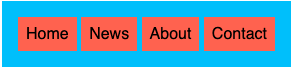
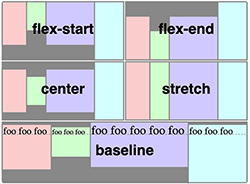
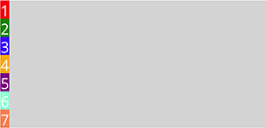
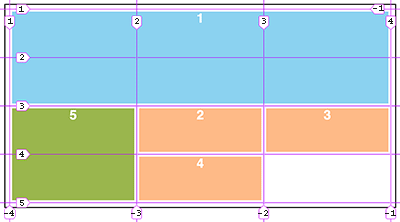

# Inline vs Block
- **By default, inline elements do not force a new line to begin in the document flow** 

- **Block elements, on the other hand, typically cause a line break to occur (although, as usual, this can be changed using CSS)**
- *How an element fits in with the flow of content.*
- *we can change the behaviour with CSS*

---

## [element anatomy](https://developer.mozilla.org/en-US/docs/Learn/HTML/Introduction_to_HTML/Getting_started#anatomy_of_an_html_element)
   
  


##  **Block levelel element:**
**Something wants to exist on its own line, its own *"block"*.**
- we can inspect it
- `<h1>` all headings
- `<p>`


### **`<div>`**
- It's a block level element (eg. it takes up the whole block).
- What is [`<div>`](https://developer.mozilla.org/en-US/docs/Web/HTML/Element/div)?
- The HTML Content Division element (`<div>`) is the generic container for flow content. It has no effect on the content or layout until styled in some way using CSS (e.g. styling is directly applied to it, or some kind of layout model like Flexbox is applied to its parent element).
- `<div>` is a content division or divider element.
- it's used to group elements
- a generic container
---
##  **Inline element:**

**Take out the minimum amount of space**
- `<a>` anchor tag --> share the space
- ``
- [`<span>`](https://developer.mozilla.org/en-US/docs/Web/HTML/Element/span) : a generic container, but it is an inline element (*same idea as `div`, but it's inline*).
- wrap around a text, to single out, so to use style it with CSS for instance.

---

[👈 go back](https://github.com/Klosmi/html-basics#html-and-css--basics)

<br>

# [Semantic Markup](https://developer.mozilla.org/en-US/docs/Glossary/Semantics#semantics_in_html) 🚀 *(meaningful markup)*
- *semantic: **relating to meaning***. So it answers to *what purpose or role that HTML element have?*  
- *relates to the content that the html contains*
- useful: 
  - [web crawlers](https://en.wikipedia.org/wiki/Web_crawler) can immediately read it
  - [accessibelity](https://www.w3.org/WAI/fundamentals/accessibility-intro/), eg. people who're useing screenreaders
- [stripe.com](https://stripe.com/) a good example (*use the devtool to inspect*) 

## <u>elements</u>:

- [`<main>`](https://developer.mozilla.org/en-US/docs/Web/HTML/Element/main) : 
  - **The main content of the page!** *The dominant content of the document.*  
  - It should **exclude any content of the page which will be repeated on the page**. So sidebars, navigation links, copyright information, site logos, and search forms shouldn't be included.
  - `<main>` doesn't affect the DOM's concept *(unlike `<body>` or `<h1>` and such)* of the structure of the page. It's strictly informative.

- [`<nav>`](https://developer.mozilla.org/en-US/docs/Web/HTML/Element/nav) : 
  - **represent anything on the page that provides navigation links**. 
  - fill the `<nav>` with links (breadcrumbs, navbars).  
   💡 *you can have several navs in a page.*
  - can be links to other part on the same page
  - can be links to completely different resources

- [`<section>`](https://developer.mozilla.org/en-US/docs/Web/HTML/Element/section) :  
  -  very generic
  -  it is to group things together (it can be inside of an article, it can be outside of an article)
  -  it represents a *generic* **standalone** section of a document, which **doesn't have a more specific semantic element to represent it**.  
  `<section>` is still far better than a `<div>`, where a `<div>` is just a generic container *(you can  use a `<div>` for anything)*. 
  - a `<section>` supposed to be a section of content, a standalone *section* of your website.
  - it's one option dividing up your markup
  - if you would give a border or other CSS, maybe use a `<div>` rather than `<section>`.
  - eg.:   
    *A `section` can wrap around several `article`s, where each `article` has a meaning alone.*
    ```
    <main>
    
      <h1>Welcome to my website</h1>
        
        <section>
          <h2>Products</h2>
          
          <article>
            <h3>First product</h3>
            <p>Some random text or description</p>
          </article>
          
          <article>
            <h3>Second product</h3>
            <p>Some random text or description</p>
          </article>
        </section>
        
    </main>
    ```
    
- [`<article>`](https://developer.mozilla.org/en-US/docs/Web/HTML/Element/article) :
  - `<article>` element represents a self-contained composition in a document.
  - you can have multiple articles and sub-articles on a page
  - `<article>` **supposed to be any self-contained composition**
  - **anything that should be independently distributable or reusable** *(so if you take out a part from a page and put it into another website, and it still makes sence, than it should be wrapedd into an article)* 
  - just an other element to group content together:
  - there should be a heading *(`<h1>` `<h2>`)* that explaines what the `<article>` is about. (eg. a film review, which can have inside a bunch of sections and sub-articles)
  - eg.:   
    *Here `section`s are inside an `article` (they don't have a meaning alone where `article` still understandable alone). The `article` is about a soup recipe, and each `section` can describe deifferent parts of the recipe.* 
    ```
    <main>     
        <article>
          <h1>Onion soup</h1>
          
          <section>
            <h2>Ingredients</h2>
            <ul>
              <li>2 piences of onions</li>
              <li>pinch of salt</li>
              <li>1/2 l of stew</li>
            </ul
          </section>
          
          <section>
            <h2>Preparation</h2>
            <ul>
              <li>Cut the onions into slices</li>
              <li>Put them into the stew</li>
              <li>Salt it</li>
            </ul
          </section>
          
        </article>
    </main>
    ```

- [`<aside>`](https://developer.mozilla.org/en-US/docs/Web/HTML/Element/aside) :
  - it is something that is indirectly related to the document, not essential. *(like: sidebars, call-out boxes)*
  - represents a portion of a document whose content is only indirectly related to the document's main content.

- [`<header>`](https://developer.mozilla.org/en-US/docs/Web/HTML/Element/header) : 
  - any sort of  introductory content, often include a group of **introductory** and/or navigational content  
  *It can include more than just a navbar.* It can inlcude several `<section>`
  - **the header of the page**
- [`<footer>`](https://developer.mozilla.org/en-US/docs/Web/HTML/Element/footer) :
  -  represents a footer for its nearest sectioning content or sectioning root element.
  - often include several `<div>` and `<nav>` that are **nested** just like the `<header>` does.

> 💡 You can have an `<article>` element with a header and a footer inside of it. So you can have more than one footer on a  page.
- [`<time>`](https://developer.mozilla.org/en-US/docs/Web/HTML/Element/time) : 
  - it is an **inline element**, you wrap it around
  - represents a specific period in time.
  - it may include the datetime attribute to translate dates into **machine-readable format**, allowing for **better search engine results** or custom features such as reminders.

- [`<figure>`](https://developer.mozilla.org/en-US/docs/Web/HTML/Element/figure)
  - represents a self-contained piece of content, with and with an optional caption. 
  - the caption is specified using the [`<figcaption>`](https://developer.mozilla.org/en-US/docs/Web/HTML/Element/figcaption) element. 
  - it calls out a special meaning, usually an illustration, a diagram. Something you want to call attention to and may often have a caption alongside it.

- [`<abbr>`](https://developer.mozilla.org/en-US/docs/Web/HTML/Element/abbr)
  - represents an abbreviation or acronym
  - the optional title attribute can provide an expansion or description for the abbreviation. If present, title must contain this full description and nothing else.
  - The **title attribute has a specific semantic meaning when used with the `<abbr>`** element: **it must contain a full human-readable description** or expansion of the abbreviation. *This text is often presented by browsers as a **tooltip** when the mouse cursor is hovered over the element.*

- [`<data>`](https://developer.mozilla.org/en-US/docs/Web/HTML/Element/data)
  - links a given piece of content with a machine-readable translation.
  - if the content is **time- or date-related**, the [`<time>`](https://developer.mozilla.org/en-US/docs/Web/HTML/Element/time) element must be used.

### There is a lot of flexibility, not super rigid. The point is the general intent of the semantics of each of these elements. 

<br>

## Links   
- [Explanation with some examples](https://www.semrush.com/blog/semantic-html5-guide/#header7)
- [Some best practice advice from 2019, but still valid](https://www.elegantthemes.com/blog/wordpress/semantic-html-best-practices-for-2019)

---

[👈 go back](https://github.com/Klosmi/html-basics#html-and-css--basics)

<br>

# [HTML unrelated elements](https://developer.mozilla.org/en-US/docs/Web/HTML/Element)
- **`<hr>`** : horizontal rule element (*no closing tag*)
- **`<br>`** : break, or line-break element
- **`<sub>`** : subscript element (*text which is rendered below the baseline*)
- **`<sup>`** : superscript element (*text which is elevated of the baseline*)

---
# [HTML entities](https://developer.mozilla.org/en-US/docs/Glossary/Entity) (all the symbols are [here](https://dev.w3.org/html5/html-author/charref))
*some characters/symbols are significant to the syntax of html, they are the reserved characters*
- **`<`** : `&lt;` *less than*
- **`>`** : `&gt;` *greater than* 
- **`&`** : `&amp;` *browser thinks ampersandi is the start of an entity code* 
- **`"`**  : `&quot;`
- **`#`**  : `&num;`  
etc.   
---
[👈 go back](https://github.com/Klosmi/html-basics#html-and-css--basics)

<br>

# [TABLES](https://developer.mozilla.org/en-US/docs/Web/HTML/Element/table)
> `<table>` represents **tabular data** *(Only use it for tabular data ‼️)*.   
<u>Tabular data</u>: information presented in a two-dimensional table comprised of **rows and columns of cells containing data**.

&nbsp;

## Elements:
- [`<table>`](https://developer.mozilla.org/en-US/docs/Web/HTML/Element/table) : it is the table element 

- [`<td>`](https://developer.mozilla.org/en-US/docs/Web/HTML/Element/td) : stand for <u>t</u>able <u>d</u>ata (cell). **It represents a single <u>*cell*</u> of a table that contains data.**

- [`<tr>`](https://developer.mozilla.org/en-US/docs/Web/HTML/Element/tr) : stand for <u>t</u>able <u>r</u>ow.  
**It defines a row of cells in a table.**

- [`<th>`](https://developer.mozilla.org/en-US/docs/Web/HTML/Element/th) : stand for <u>t</u>able <u>h</u>eader.  
**It defines a cell as header.**  
*The exact nature of this group is defined by the scope and headers attributes.*

- [`<thead>`](https://developer.mozilla.org/en-US/docs/Web/HTML/Element/thead) : stand for <u>t</u>able <u>head</u>.  
**It defines a set of rows defining the *head* of the <u>*columns*</u> of the table**  

- [`<tbody>`](https://developer.mozilla.org/en-US/docs/Web/HTML/Element/tbody) : stand for <u>t</u>able <u>body</u>.  
**it encapsulates a set of table rows (`<tr>` elements), indicating that they comprise the body of the table (`<table>`).**  
*The `<tbody>` element, along with its cousins `<thead>` and `<tfoot>`, <u>provide useful semantic information</u> that can be used when rendering for either screen or printer as well as for accessibility purposes.*
&nbsp;

---

&nbsp;

## Attributes:
- [`rowspan`](https://developer.mozilla.org/en-US/docs/Web/HTML/Element/td#attr-rowspan) : this attribute contains value that indicates for how many <u>**rows**</u> the cell extends.  
*Its default value is 1; if its value is set to 0, it extends until the end of the table section that the cell belongs to.*

- [`colspan`](https://developer.mozilla.org/en-US/docs/Web/HTML/Element/td#attr-colspan) : this attribute contains value that indicates for indicates for how many <u>**columns**</u> the cell extends..  
*Its default value is 1. Values higher than 1000 will be considered as incorrect and will be set to the default value (1).*

---

[👈 go back](https://github.com/Klosmi/html-basics#html-and-css--basics)

<br>

# [FORMS](https://developer.mozilla.org/en-US/docs/Web/HTML/Element/form)
- a `<form>` element represents a document section containing interactive controls for submitting information.   

- the `<form>` element itself is a container that doesn't have any visual impact. It is the thing that group together all of the content which are put inside.

- we fill `<form>` with inputs, checkboxes, buttons, etc. and we group them together with the `<form>`.

- the `<from>` element represents a document section containing  interactive controls for submitting information.

- the `<form>` element dictates where the `<form>` data should go when the form is submitted:   
  when you submit a `<from>` an HTTP request will be sent.  
  We control where the request goes to with the *`action`* attribute, and we control which type of HTTP method should be used with the *`method`* attribute. 

 - <u>**`<form>` attributes**</u>:

    - [`action`](https://developer.mozilla.org/en-US/docs/Web/HTML/Element/form#attr-action) attribute  :specifies **where** the form data should be sent when the `<form>`is submitted.

    - [`method`](https://developer.mozilla.org/en-US/docs/Web/HTML/Element/form#attr-method) attribute : specifies which HTTP method should be used. (GET and POST)   
    
      - eg.: a search form's code looks something like this
        ```
          <form action="https://www.reddit.com/search" method="get">
            <input type="text" placeholder="Search" name="q">
            <button>Search in Reddit</button>
          </form>                                  
        ```

<br>
  
## The (form) `input elements`:
#### **[`<input>`](https://developer.mozilla.org/en-US/docs/Web/HTML/Element/input)** :
  - is used to create a variety of different form controls.
  - there are 20+ possible types of inputs (like date pickers, color picker, password input, text input, checkboxes, etc.)
  - [`<input>` attributes](https://developer.mozilla.org/en-US/docs/Web/HTML/Element/input#attributes):
    - the [<u>***type***</u>](https://developer.mozilla.org/en-US/docs/Web/HTML/Element/input#attr-type) attribute 🚀 is the most important attribute, it is where the magic happens:
    changing type dramatically alters the input's behaviour and appearance.  
    - [placeholder](https://developer.mozilla.org/en-US/docs/Web/HTML/Element/input#htmlattrdefplaceholder) attribute specifies the placeholder text for an `<input>`. It is the text you that shows up before you type anything (while it is empty).
      - eg.: a text input type looks like this:
        ```                                                                                     
         <form action="/whatever">
           <input type="text" placeholder="Type something here!">                      
         </form>
        ```   
                             
 
<br>

#### **[`<label>`](https://developer.mozilla.org/en-US/docs/Web/HTML/Element/label)** : represents a caption for an item in a user interface. 
- really important in terms of **accessibility**!!! The label element **associates** a direct connection between some `input` or some `form control` and a `text`. The screen reader also reads out when the user is focused on the form input.

- To associate the `<label>` with an `<input>` element, you need to give the `<input>` an `id` attribute. The `<label>` needs a `for` attribute whose value is the same as the input's `id`.

- Alternatively, you can nest the `<input>` directly inside the `<label>`, in which case the <u>**for**</u> and id attributes are not needed because the association is implicit.

- <u>__`<label>` attributes__</u>:

    - [**`for`**](https://developer.mozilla.org/en-US/docs/Web/HTML/Element/label#attr-for) : basically it answers the question of what the `<label>` is for?  
    - The first element in the document with an `id` matching the value of the `for` attribute, that is the labeled control for this label element.  
    - __If you nest the `<input>` inside of the label, you don't need to use the `for` attribute (and the `id`)❗️__ However it is a less common standard (styling is less easy).   
        - eg.: this is a nested `input` in the `<label>`. Shorter, but harder to style because they're implicitly linked. Less common to use it.
            ```
            <label>
              Enter a number:
              <input type="number" placeholder="Enter a number!">               
            </label>
            ```
                                                                
    - **`id`** : <u>**is in the `<input>`!!!**</u> the value (what name we give to the *id*) should be the same of the **for** attribute's value. So we set the *id*'s value to the *for*'s value.💡 

      - eg.: the `label`'s `for="username"` need to match with the `input`'s `id="username"`.
        ```
        <form action="/whatever">
          <label for="username">Enter a username:</label>
          <input id="username" type="text" placeholder="Type your username">
        </form>
        ```
                                                                          

<br>

#### **[`<button>`](https://developer.mozilla.org/en-US/docs/Web/HTML/Element/button)**  
A `<button>` represents a clickable button, used to submit forms or anywhere in a document for accessible, standard button functionality.   
Also, `<button>` not necesseraly has to be inside of a form (eg. a "sign up" button, links).     
*(However, if it is inside the `<form>`, as `<button>Submit me!</button>` or `<button type="submit">Submit me!</button>`, it automaitcally submits the form.      
But if you want a button which does not submit the form - but it is inside the form -, you can set the type to button, like:   
`<button type="button">No submit</button>`, it won't submit the form.)*

  - `<button>` has a closing tag `</button>`.
  - the text inside of the `<button></button>` is used to label the button.
  - a `<button>` **inside in a form** has a default behaviour: to submit.

  - <u>**`<button>` attributes**</u>:
    - [**type**](https://developer.mozilla.org/en-US/docs/Web/HTML/Element/button#attr-type) :`<button type="button">`*Button*`</button>` 👉     
   **The `type` over write** the default `submit` attribute when the `<button>` is in a form!!! 
    - *default `<button type="submit">Submit</button>`*  
    (Well, you don't even have to write the `type="submit"` if you want to keep it default.)

    - an other way to make a sumbit button:
        **`<input type="submit">`** **BUT** you can only change the text if you use another `<input>` attribute **`value`**. Eg.:    
                ```
                 <input type="submit" value="Click me!">
                ```

    - [**value**](https://developer.mozilla.org/en-US/docs/Web/HTML/Element/input#htmlattrdefvalue) : The input control's value.  
    When specified in the HTML, this is the initial value, and from than on it can be altered or retrieved at any time using JavaScript to access it.

    - **[name](https://developer.mozilla.org/en-US/docs/Web/HTML/Element/button#attr-name)** : The name of the button, submitted as a pair with the button’s `value` as part of the form data.  
    `name` is a way of referring to the `value` when the data is sent to the server, so it is just a way of referring to the `value` when the data is sent to the server. The server looks for that 
    `name`. *(If the name is `name="user"`), than the server looks for the name "user"*.   
      - `name` is just a *"name"* (ususally very short, like `name="q"`)  
      -  The `<form>` will be labeled under the `name` attribute when it is sent to the server.   
        - eg.: I write my username: Joe, the result will be: file:///hello?username=Joe
          ``` 
           <form action=/hello">                                                           
            <label for="username">Enter a username: </label>
            <input id="username" type="text" placeholder="username" name="username">
            <button type="submit">Submit</button>
           </form> 
          ```
           *`username = Joe`, so that is the name that will be used to send the data to the server, it is a __pair: name ➕ value__.  (value is what you write in the input)*  
           
                                                                      
#### [**checkbox**](https://developer.mozilla.org/en-US/docs/Web/HTML/Element/input/checkbox) : `<input type="checkbox">`   
A check box allowing single values to be selected/deselected.	
  - you can specify if the checkbox is `checked` or  not.      
    eg.:   
      ```
      <form action="/anything">
        <input type="checkbox" name="agree_conditions" id="agree" checked>
        <label for="agree">I agree</label>
      </form>
      ```  
                          

#### [**radiobutton**](https://developer.mozilla.org/en-US/docs/Web/HTML/Element/input/radio) : `<input type="radio">`   
  The `radiobutton` allowing only one single value to be selected out of multiple choices with the same `name` value.  
  In  a group of `radiobuttons` you can only select one (so they are connected).
    - They are associated by the **same `name`**, so they are pointing to the same thing.

    - `value` attribute selects what to send through when the form was submitted. So which `radiobutton` was selected and sent when clicking on the submit button.   
       eg.: *the `value` is not going to be displayed to a user, it is what is sent through when the form is submitted (which radiobutton was selected).*   

       ```
        <form action="/anything">                                                                                                           
          <label for="xs">Extra small</label>
          <input type="radio" name="size" id="xs" value="xs">
          <label for="s">Small</label>
          <input type="radio" name="size" id="s" value="lol">
          <label for="m">Medium</label>
          <input type="radio" name="size" id="m" value="med">
        </form> 
       ```                                                                                                      
  
                                                            
#### **[`<select>`](https://developer.mozilla.org/en-US/docs/Web/HTML/Element/select)** : 
    ```
      <select name="pets" id="pet-select">
        <option value="">--Please choose an option--</option>
        <option value="dog">Dog</option>
        <option value="cat">Cat</option>
        <option value="hamster">Cute little hamster</option>
    </select>  
    ```
                            

  The `<select>` element represents a control that provides a menu of options.  
  It is essentially a dropdown menu   

    - Two elements working together: `<select>` and the `<option>` elements. The `<select>` is the parent it groups together a bunch of `options`.  

    - `<option value="hamster">Cute little hamster</option>` the value attribute will be sent through when it is submitted *(here the `value="hamster"`)*.   
   
    - it can be preselected with the attribute `selected`.
                                                                                                                                                      
    - you can [change the default appearance](https://www.youtube.com/watch?v=bB14uo0Tu5A) with CSS like in this video

<br>
                 
<u>[many other `<input>` elements can be found here.](https://developer.mozilla.org/en-US/docs/Web/HTML/Element/input)
So here's a little selection, which might be useful: </u>

#### [**range**](https://developer.mozilla.org/en-US/docs/Web/HTML/Element/input/range) : `<input type="range">`   
  - we can control the "min" and "max" values (eg. `min="0" max="100"`)   
   eg.: *the starting value is value="25". Range is between 0 and 100. It goes up by 2.*                                                                 
    ```
    <form action="/anything"> 
     <label for="fuel">Liter of fuel</label>
     <input id="fuel" type="range" min="0" max="100" step="2" value="25" name="fuel_level"
    </form>  
    ```                                                                                      
    
                                                                                          

#### [**number**](https://developer.mozilla.org/en-US/docs/Web/HTML/Element/input/number) : <input type="number" min="10" max="1000"  placeholder="num">  elements of type number are used to let the user enter a number.   
  eg.:
   ```
     <form action="/anything"> 
      <label for="tentacles">Enter a number:</label>
      <input type="number" id="tentacles" name="tentacles" placeholder="enter a number" min="10" max="100">
     </form>                                                                                      
   ```                                                                                          
  
                                                                                              
#### [**textarea**](https://developer.mozilla.org/en-US/docs/Web/HTML/Element/textarea) : `<textarea id="story" name="story" rows="1" cols="40"> This is a textarea...
</textarea>` 
  - It is a multiline text input. (You can type a paragraph)
  - **❗️It is NOT an input element❗️** *(there is not `<input>`* 

  eg.:
    ```
    <label for="request">Write any text</label>
    <textarea id="request" cols="30" rows="10" name="requests" placeholder="Write something here."></textarea>                                       
    ```

                              

<br>

  ---

# [FORM Validations](https://developer.mozilla.org/en-US/docs/Learn/Forms/Form_validation#what_is_form_validation)
  Validation refers to adding constraints or validating user input / user data.  
   *(eg. requiring that some fields can not be empty, or the length of the password)*

  - clients side validation
  - server side validation *(after the submit button the server verifies if the data meets the expectations)*

  ## Basics of the built in validations
  #### [required](https://developer.mozilla.org/en-US/docs/Web/HTML/Attributes/required) 👉  HTML attribute  
    Adding the `required` attribute to any input will indicate that the user must specify a value for the input before the owning form can be submitted.

    - we can specify the length of an `<input type=text>` with `minlength="4"` and `maxlength="30"` (+ add `required`).

    - for numeric values length specification use `min` and `max`

<br>
                              
 #### [pattern](https://developer.mozilla.org/en-US/docs/Web/HTML/Attributes/pattern) 👉 HTML attribute  
                                                                                                  
  The pattern attribute specifies a regular expression __([regex](https://developer.mozilla.org/en-US/docs/Web/JavaScript/Guide/Regular_Expressions/Cheatsheet))__ the form control's value should match.       
    eg.:   
     `^[A-Z0-9._%+-]+@[A-Z0-9.-]+\.[A-Z]{2,63}$`   
                                                                
 - we can use already built in pattern matching:         
    - [`<inpute type="email" required>`](https://developer.mozilla.org/en-US/docs/Web/HTML/Element/input/email) it asks a valid email *(It is only checking if there is an `@` sign or not, so it's not 100% efficient).*   
    - [`<inpute type="url" required>`](https://developer.mozilla.org/en-US/docs/Web/HTML/Element/input/url)     
    it's looking for this pattern: *`urlscheme://restofurl`* *(http or https://somethingelse)*
                            
---
                            
 [👈 go back](https://github.com/Klosmi/html-basics#html-and-css--basics)

<br>

# [CSS](https://developer.mozilla.org/en-US/docs/Web/CSS)
- we use CSS **rules**
-  is a stylesheet language used to describe the presentation of a document written in HTML or XML. CSS describes how elements should be rendered on screen...
-  the CSS basic pattern/template looks like this: 
    ```
    selector { 
      property: value; 
    }
     ```
     here's a much more complex, but the same pattern, same logic:  
      *(selector – property – value)*  
     ```
     input[type="text"]:nth-of-type(2n) {
       border: 5px solid green;
     }
     ```
    ##### *This means the following: all inputs where type is set to text, and every second one is selected, and give them a border which is 5px solid and green color.*

- ### [MDN's CSS reference](https://developer.mozilla.org/en-US/docs/Web/CSS/Reference) is a great documentation & resource
---
## How to include the styles?
  - <u>inline styles</u>: when writing the style directly inline on each element.  

 - <u>`<style>`</u> element: when you write your styles inside of a `<style>` element.  You write it in the `<head>` section.
   ##### *Makes it impossible to share styles between documents.*  

 - <u>External stylesheet</u>: when you write your styles in a separate `.css` file. include them using the `<link>` element in the `<head>` of the html doc.
    ```
    <head>
      <title>CSS demo page</title>
      <link rel="stylesheet" href="assets/style/styles.css">
    </head>
    ```
---
## [CSS color properties](https://developer.mozilla.org/en-US/docs/Web/CSS/color)
  - [`background-color`](https://developer.mozilla.org/en-US/docs/Web/CSS/background-color) and [`background`](https://developer.mozilla.org/en-US/docs/Web/CSS/background) technically are different. The `background` property does more than just changing the *background* *color*, we can set also a background image, a gradient, etc.
  - `named colours` are supported with every browser
  - [`rgb(255, 255, 255)`](https://developer.mozilla.org/en-US/docs/Web/CSS/color_value/rgb) *red, green, blue*
  - **Hex** = hexadecimal (also red-green-blue, 0-255) = base 16.   
    Every spot has 16 choices: **0-9**, **A**=10, **B**=11, **C**=12, **D**=13, **E**=14, **F**=15  
    `#ff|ff|ff = r|g|b`    
    eg.: yellow is `#ffff00` or `#55ff00` = `#5f0`

- [hsl](https://developer.mozilla.org/en-US/docs/Web/CSS/color_value/hsl) : functional notation expresses a given color according to its hue, saturation, and lightness components. An optional alpha component represents the color's transparency.  
  eg.: `hsl(100, 100%, 50%)` =  `#55ff00`

- #### [*color picker*](https://htmlcolorcodes.com/)
  ---
## [CSS text properties](https://developer.mozilla.org/en-US/docs/Learn/CSS/Styling_text/Fundamentals)
- [`text-align`](https://developer.mozilla.org/en-US/docs/Web/CSS/text-align): this property sets the horizontal alignment of the content **inside a block element*** or table-cell box. This means it works like vertical-align but in the horizontal direction. 
  ##### *\*(It does not mean how an element is aligned on the page itself, a.k.a. not spatially where it goes, but within an element.)*

- [font-weight](https://developer.mozilla.org/en-US/docs/Web/CSS/font-weight) :  CSS property sets the weight (or boldness) of the font. 
  -  [values](https://developer.mozilla.org/en-US/docs/Web/CSS/font-weight#common_weight_name_mapping): you can use numeric values, like 400 (which is normal), etc.
  -  [realitve font-wieght](https://developer.mozilla.org/en-US/docs/Web/CSS/font-weight#meaning_of_relative_weights): when **lighter** or **bolder** is specified.

- [text-decoration](https://developer.mozilla.org/en-US/docs/Web/CSS/text-decoration) :  
- CSS property sets the appearance of decorative lines on text. It is a [shorthand](https://developer.mozilla.org/en-US/docs/Web/CSS/Shorthand_properties) for text-decoration-line, text-decoration-color, text-decoration-style, and the newer text-decoration-thickness property.
    - we can specify the **color** of the eg. underline, and the **thickness**:
      ``` 
      text-decoration: blue underline 4px;
      ```
   - remove a default underline (usually anchor `<a>` tags):
      ```
      text-decoration: none;
      ```
- [line-height](https://developer.mozilla.org/en-US/docs/Web/CSS/line-height)  :  controls the hieght of a line in a text.

  - it is possible to just use numbers (eg. 2), which will multiply by the value(2 times) of the number of the font-size:   
    ###### if my font-size is 10px, than 20px is the line-height
      ```
      line-height: 2;
      ```
- [letter-spacing](https://developer.mozilla.org/en-US/docs/Web/CSS/letter-spacing) : sets the horizontal spacing behavior between text characters.

- <u>**[font-size](https://developer.mozilla.org/en-US/docs/Web/CSS/font-size)**</u> :  CSS property sets the size of the font. **Changing the font size also updates the sizes of the font size-relative <length> units**, such as em, ex, and so forth.
- ([units](https://developer.mozilla.org/en-US/docs/Learn/CSS/Building_blocks/Values_and_units)) :
    | relative size | absolute size |
    |---------------|---------------|
    | EM            | PX            |
    | REM           | PT            |
    | VH and. VW    | IN            |
    | %             | MM            |
    | etc.          | etc.          |
    
  - [**EM**](https://www.w3.org/TR/css-values-3/#em) unit means "my parent element's font-size, so each successive level of nesting gets progressively larger, eg.: if font size set to 1.3em, each nesting gives a 1.3 times bigger text.

  - [**REM**](https://www.w3.org/TR/css-values-3/#rem) unit means "The root element's font-size" (root element `<html>`), so each successive level of nesting does not keep getting larger. *(If used in the font-size property of the root element, or in a document with no root element, 1rem is equal to the initial value of the font-size property.)*

  - PX: 💡 *not recommended to use for responsive websites!*
  - 
    ```
    font-size: 18px;
    ````
- [text-transform](https://developer.mozilla.org/en-US/docs/Web/CSS/text-transform) : CSS property specifies how to capitalize an element's text.
    -  eg. `text-transform: uppercase;` sets the text in uppercase letters.
- [font-family](https://developer.mozilla.org/en-US/docs/Web/CSS/font-family) :  CSS property specifies a prioritized list of one or more font family names and/or generic family names for the selected element. 
  - [most commonly used fonts and their support in os systems, etc.](https://www.cssfontstack.com/)
  - font-stack : a list of fonts that are used in order.  
    eg: `font-family: Helvetica, Arial, sans-serif;` 
    The fallback font here is the `sans-serif` *(a backup font)*, it's not a specific font, it is a family of sans-serifs.
---

 [👈 go back](https://github.com/Klosmi/html-basics#html-and-css--basics)

<br>

# [CSS Selector](https://developer.mozilla.org/en-US/docs/Web/CSS/CSS_Selectors) 
##### and some [further reading about selectors](https://css-tricks.com/how-css-selectors-work/)

<br>

- asterisk <u>[**\***](https://developer.mozilla.org/en-US/docs/Web/CSS/Universal_selectors)</u>  = universal selector : it selects everything in the document

- **element selector**: select everything in a given type.
   - eg.:
      ###### *selects all the images*
      ```
      img {
        width: 100px;
        height: 200px;
      }
      ```
- **selector list**: use a comma `,` to combine selectors in list.
  -  eg.:
      ###### *selects all the h1 and h2*
      ```
      h1, h2 {
        text-decoration: underline plum;
      }
      ```
- [ID selector](https://developer.mozilla.org/en-US/docs/Web/CSS/ID_selectors) : single out a single element. It provides a hook to our CSS element. By adding an ID to your markup and you can reference it using the name of the ID and the hash sign.
    - it styles one **thing**, only used once.
  
    - unique identifier

    - keep them to the minumum (don't spam them everywhere)
  
    - the ID selectos sign is: #, so `#idselector`
    eg.: 
      ``` 
      <button id="login">Login button</button> 
      ```
      so in you CSS it looks like this:   
      ###### only that login element which has the ID is singled out. 
      ```  
        #login {
          color: white;
          background-color: black;
        }
      ```

- [Class selector](https://developer.mozilla.org/en-US/docs/Web/CSS/Class_selectors) : a class selector matches elements based on the contents of their class attribute.  It is a similar idea to the ID, except that a class can be applied to multiple elements.
  - you can have deifferent groups to style them.
  
  - by defining a class, you can group together content, also they don't have to be the same type of element.

  - use classes more often than IDs.
  
  - class selectors sign is **.** so use `.classselector`   

  - eg.:
    ``` 
    <span class="tag">fish</span>
    ```
    so in your CSS it looks like this:
    ###### only those span elements which have the class are singled out.
    ```
    .tag {
      color: blue;
    }
    ```
    <br>
    
- *so __[when to use ID and when to use Class?](https://www.developintelligence.com/blog/2016/04/css-class-vs-id-which-one-to-use/#When-to-Use-Class-vs-ID-in-CSS)__*
    
- [Descendant combinator (selectors)](https://developer.mozilla.org/en-US/docs/Web/CSS/Descendant_combinator) : are represented by a single space ( ) character, it **combines** two selectors *(not with comma, but with white space)*. Selectors that utilize a descendant combinator are called descendant selectors. 
    -  also called as *generic descendant* selector
  
    -  so you can select elements which are nested inside of an other elements.
  
    - eg.:
      ###### *selecat all of those `<a>` **that are nested inside** an `<li>`*
      ```
      li a {
            color: red;
          }
      ```   

- [Adjacent sibling combinator (selectors)](https://developer.mozilla.org/en-US/docs/Web/CSS/Adjacent_sibling_combinator) : `+` separates two selectors and matches the second element only if it immediately follows the first element, and both are children of the same parent element.
  
   - not parent or children, they are adjacent, **one after the other**.
      ```
      <h2>Lorem ipsum dolor sit amet...</h2>
      <button>Click</button>
      ```
      ###### *select a `button` that comes right after every `h2` on the same level (so this applies all the `buttons` which  are strictly after `h2`).*
      ```
      h2 + button {
        background-color: yellow;
      }
      ```
- [General sibling combinator](https://developer.mozilla.org/en-US/docs/Web/CSS/General_sibling_combinator) : `~` separates two selectors and matches all iterations of the second element, that are following the first element (though **not necessarily immediately**), and are children of the same parent element.

   - eg.:
      HTML
        ```
         <span>This is not red.</span>
         <p>Here is a paragraph.</p>
         <code>Here is some code.</code>
         <span>And here is a red span!</span>
         <span>And this is a red span!</span>
         <code>More code...</code>
         <div> How are you? </div>
        ```
      CSS
        ```
         p ~ span {
           color: red;
         }
        ```      
      [result](https://developer.mozilla.org/en-US/docs/Web/CSS/General_sibling_combinator#result):    
         
      
      💡 With the general sibling combinator, one or potentially multiple elements will be styled. With the adjacent sibling combinator, only one element will be styled.
      
     
- [Direct child combinator (selector)](https://developer.mozilla.org/en-US/docs/Web/CSS/Child_combinator) : `>` is placed between two CSS selectors. It selects  the children which are nested somewhere in an other element. Children which are the <u>**direct descendants**</u>. In other words, "one level down".
  - it only selects **direct** descendence of the parent element. It **doesn't select general descendents**.
  
  - eg.: an `<a href="#link">` nested directly in the `<footer>`, the other `<a>`s are nested in `<ul>`. So the direct child of the footer is  only the `<a href="#link">`.
    ```
    <footer>
     <nav>
        <ul>
          <li> <a href="#home">Home</a></li>
          <li> <a href="#contact">Contact</a></li>
        </ul>
      </nav>
      <a href="#link">Select me</a>
    </footer>
    ```
    so in your CSS it looks like this:
    ##### *you can select the `<a href="link">...` because it is a direct child of the footer, it is directly 1 level below the parent `footer`, compared to the other `<a>`s which are nested in a `<ul>`*.
    ```
    footer > a {
      color: blue;
    }
    ```

- [Attribute selector](https://developer.mozilla.org/en-US/docs/Web/CSS/Attribute_selectors) : matches elements based on the presence or value of a given attribute. So, it allows us to select elements based upon some particular attribute.
  - attribute selector: `[ attribute_name = something ]`
  - eg.: if you want to select all input elements where the type attribute is set to "password"
    ###### *if I have several inputs, but I want to style **only** the `password` input differently, than I can do it with attribute selector:*
      ```
      input[type="password"] {
        width: 300px;
        color: green;
      }
    ```
--- 

## [Pseudo-Classes](https://developer.mozilla.org/en-US/docs/Web/CSS/Pseudo-classes) 
`pseudo-class` is a keyword added to a selector that specifies a **special state of the selected element(s)**.   
For example, :hover can be used to change a button's color when the user's pointer hovers over it.   
*(They all start with a colon **`:`**)*

- [:hover](https://developer.mozilla.org/en-US/docs/Web/CSS/:hover) : it modifies our selection when the element is hovered over. 
    - usually used to show you can interact with the element.

   - eg.: change the background color of a `<button>` when we hover over:
      ```
      button:hover {
        background-color: pink;
      }
      ```

- [:active](https://developer.mozilla.org/en-US/docs/Web/CSS/:active) : represents an element (such as a button) that is being activated by the user.   
  - Eg.: a `button` when I **press** it changes the background-color to green (while I keep pressed down the mouse on it)
      ```
      button:active {
        background-color: green;
      }
      ```
- [:checked](https://developer.mozilla.org/en-US/docs/Web/CSS/:checked) : selector represents any radio `<input type="radio">`, checkbox `<input type="checkbox">`, or option `<option>` in a `<select>` element that is checked or toggled to an on state.
   - eg.: any `<input>` with type of `checkbox` where it's actually checked
      ```
      input[type="checkbox"]:checked {
      box-shadow: 0 0 0 3px pink;
      }
      ```

- [:nth-of-type()](https://developer.mozilla.org/en-US/docs/Web/CSS/:nth-of-type) : help us select based upon a position in a group of siblings.  
*(In other words it matches elements of a given type (tag name), based on their position among a group of siblings.)*
    - eg.: I have ten `<section class="post">`s in a document, and I want to select the *third* to change the `background-color` to red.
      ```
      .post:nth-of-type(3){
        background-color: red;
      }
      ```
    - to change **every third** `<section class="post">` the syntax is different: `nth-of-type(3n)`. *(number + n)* ❗️
      ```
      .post:nth-of-type(3n){
        background-color: red;
      }
      ```

- many other pseudo classes (check on [MDN](https://developer.mozilla.org/en-US/docs/Web/CSS/Pseudo-classes)):
   - :first
   - :first0of-type
   - :not()
   - :nth-of-child()  
   ...etc.
   - *many times I see `*:after, *:before`*, so what's that? :   
      - [explanation](https://stackoverflow.com/questions/32805670/what-does-before-and-after-do-in-css):   
        The CSS
          ```
           div {
           border: solid 1px black;
           padding: 5px;
           }

           div:before {
           content: "Added BEFORE anything within the div!";
           color:red;
           }

           div:after {
           content: "Added AFTER anything within the div!";
           color:green;
           }
         ```
      
        The HTML
      
         ```
         <div>Div 1</div>
         <div>Div 2</div>
         <div>Div 3</div>
         <div>Div 4</div>
         ```
        The result:    
        
---
## [Pseudo-**Elements**](https://developer.mozilla.org/en-US/docs/Web/CSS/Pseudo-elements)
*(they are not pseudo-classes, they are a distinct concept)*  
 Pseudo-Elements is a **keyword added to a selector** that lets you style a **specific part of the selected element(s)**.   
 *(For example, `::first-line` can be used to change the font of the first line of a paragraph.)*  
   __We use two colons **`::`**__   
  

&nbsp;

- [**::first-letter**](https://developer.mozilla.org/en-US/docs/Web/CSS/::first-letter) : we can select the first letter of some selection.   
Pseudo-Elements applies styles to the first letter of the first line of a block-level element, but only when not preceded by other content (such as images or inline tables).
  - you can select the first letter of every paragraph, every span, etc.

   - eg.: select the first letter of **every** `h2`  and change it to red.     
      ```
      h2::first-letter {
        color: red;
      }
      ```

-  [**::first-line**](https://developer.mozilla.org/en-US/docs/Web/CSS/::first-line) : applies styles to the first line of a block-level element.   
*(Note that the length of the first line depends on many factors, including the width of the element, the width of the document, and the font size of the text.)*
    - eg.: the first line of a paragraph (`p`)
      ```
      p::first-line {
        color: blue;
      }
      ```
- [**::selection**](https://developer.mozilla.org/en-US/docs/Web/CSS/::selection) : applies styles to any part of a document, or some part of an element that has been highlighted/selected (such as clicking and dragging the mouse across text, and eg. the selection colour is purple), 
   - eg.: you select a paragraph (`p`)
      ```
      p::selection {
        background-color: orange;
      }
      ```
      To use it to the entire document:
      ```
      ::selection {
        background-color: yellow;
      }
      ```
 - some other pseudo elements (check on [MDN](https://developer.mozilla.org/en-US/docs/Web/CSS/Pseudo-elements#index)):   
   (a [good video](https://www.youtube.com/watch?v=zGiirUiWslI) about this)
   - ::after
   - ::before
   ...etc.

---

 [👈 go back](https://github.com/Klosmi/html-basics#html-and-css--basics)

<br>

# [CSS Cascade](https://developer.mozilla.org/en-US/docs/Web/CSS/Cascade)
it is about the order our styles are declared in actually matters. The order that things are encountered in is going to be reflected in what you
see in the browser.
- eg.: if you have two `h3` styles, the last one will matter *(here font-soze will be 40px)*.
  ``` 
  h3 {
    font-size: 30px;
  }
  h3 {
    font-size: 40px;
  }
  ```
---

# [CSS Specificity](https://developer.mozilla.org/en-US/docs/Web/CSS/Specificity)

is how the browser decides which rules to apply when multiple rules could apply to the same element. 
It is a measure of how __specific__ a given selector is. The __more specific__ selector will be applied.   
*(So the browser decides which rule(s) to apply when there is a conflict.)*

- a simple example: I have  a paragpraph(`p`) 🔵blue. But I have a more **specific** `section p` with 🟡yellow color. So the 🔵blue will not apply on `section p`, which stays 🟡yellow.
  ```
  .post button:hover{
    background-color: yellow;
  }
  button:hover{
    background-color: blue;
  }
  ```

- [specificity calculator](https://specificity.keegan.st/)

- **element selector** vs. <u>**element selector + element selector**</u> (<u>this</u> is the strongest, because it is **more specific**)

- the general formula of specificity:
    - #### **ID** > **Class** > **Element**

- the specificity [calculation's math read it here](https://www.w3.org/TR/selectors-3/#specificity)
   - count *the number of ID selectors* in the selector *(A)*
   - count *the number of class selectors*, *attributes selectors*, and *pseudo-classes* in the selector *(B)*
   - count *the number of type selectors* and *pseudo-elements* in the selector *(C)*
   - *ignore the universal selector*

## <u>[Inline Styles](https://developer.mozilla.org/en-US/docs/Web/CSS/Specificity#selecNtor_types)</u>
*(in this link they mention the inline style in one sentence)*   
__Inline style(s)__ added to an element (e.g., style="font-weight: bold;") __always overwrite any styles in external stylesheets__, and thus can be thought of as having the __highest specificity__.
  - **bad practice!** ot recommended to use inline styling (however it is a valid way of styling elements).

## <u>[The **!important** exception](https://developer.mozilla.org/en-US/docs/Web/CSS/Specificity#the_!important_exception)</u>  
When an `!important` rule is used on a style declaration, this declaration overrides any other declarations.   
*Although technically `!important` has nothing to do with specificity, it interacts directly with it.*     
Actually it **ignores specificity**, it just *wins*.

  - `!important` signals to the browser that this should be the most specific possible thing and it should override any other declarations.
  
  - **bad practice!** Not recommended to use it, however there are situations where it makes sence to use it. *Eg.: exteranlusing libraries and you want to override a style...*
  
  - you put `!important` after the declaration, like this:
      ```
      button {
        background-color: green !important;
      }
      ```

---

 [👈 go back](https://github.com/Klosmi/html-basics#html-and-css--basics)

<br>

# [CSS Inheritance](https://developer.mozilla.org/en-US/docs/Web/CSS/inheritance) 
it controls what happens when no value is specified for a property on an element.    

Some CSS properties inhereted by child elements, if they're not set on that element specifically.

 - eg.: you give a color to the `body` (we can give also to `section` etc.), and all the rest, `h1`, `p` which are not set to any color, will inheretet the `body`'s color.
      ```
      body {
        color: red;
      }
      ```
- in the Devtool we can see, at the Styles, scrolling down: `inhereted from` : *(in this case)* `body`
  
- inheritance goes to a closer element if I have several elements and they inherit from eachother. Eg.:
    ```
      body {
        color: red;
      }
      section {
        color: blue
      }
    ```
- **certain elements don't inherit** things by default, like the `<form>` element.  **But** using the `inherit`, and the `<form>` will inherit the color.   
  
  ###### *we set the `form` to 🟡yellow, but the `button` and other parts of the `form` don't inherirt the 🟡yellow color.*
  ```
  form {
    color: yellow;
  }
  ```
  ###### *setting the 'button's color property to  **`inherit`**, makes the `button` to inherit the `form`'s color.
    ```
  form {
    color: yellow;
  }

  button {
    color: inherit;
  }
  ```

- inheritance is always from the parent element in the document tree, even when the parent element is not the containing block.
---
 
# [CSS Devtools *in chrome*](https://developer.chrome.com/docs/devtools/css/) 
  - right click 👉 __inspect elements__
  - see the `Styles` when you inspect an element
  -  you can tweak the styles
  -  you  can search on `Filter`
  -  when a style is ~~crossed off~~ it means, it is lost in specificity battle. Maybe it is order, maybe it is less specific.
  
  ---
   [👈 go back](https://github.com/Klosmi/html-basics#html-and-css--basics)

<br>

# [CSS Box Model](https://developer.mozilla.org/en-US/docs/Web/CSS/CSS_Box_Model) 
it is the idea that everything in CSS is a box, and these boxes have a bunch of different properties.  
So, when laying out a document, the browser's rendering engine represents each element as a rectangular box according to the standard CSS basic box model.   

CSS determines the size, position, and properties (color, background, border size, etc.) of these boxes.   

Everything in the browser treated as a box, and each box has different properties: different pieces:
  - inner __contet box__ : the actual content in an element. Eg.: the text in a paragraph. (In Devtool is the *🔵blue area*)
  - __padding__
  - __border__
  - __margin__

<br>

- [width & height](https://developer.mozilla.org/en-US/docs/Web/CSS/box-sizing) : they control the inner content box's with and height (**the inner content area**).
  -  [width](https://developer.mozilla.org/en-US/docs/Web/CSS/width): set the width of an element.    
  
      By default, it sets the width of the content area, **but if box-sizing is set to border-box, it sets the width of the border area**.

      eg.:
      ###### *the content takes up the 200px space, that's the __width of the content area__*
      ```
      div {
        width: 200px;
      }
      ```

  -  [height](https://developer.mozilla.org/en-US/docs/Web/CSS/height): set the height of an element   
  
      By default, the property defines the height of the content area. **If box-sizing is set to border-box, however, it determines the height of the border area**.

      eg.:
      ###### *the content takes up the 200px by 200px space, that's the __height and width of the content area__*
      ```
      div {
        width: 200px;
        height: 200px;
      }


- [border](https://developer.mozilla.org/en-US/docs/Web/CSS/border) : __it is a border around an element__. So, it is a CSS property which sets an element's border. 

  It sets the values of **border-width**, **border-style**, and **border-color**.  

  There are dozens of border properties (thickness, style, color, etc.).

  The main <u>**border properties**</u>:   
    - [border-width](https://developer.mozilla.org/en-US/docs/Web/CSS/border-width) : controls the thickness of the border.
      - eg.:
        ###### *setting only the __border-width__ doesn't show anything, you need to add the color and style, to see it❗️*
        ```
        #element {
          border-width: 5px;
        }
        ```
      - a 5px border-width gives 5px to each side of the box, so it makes our box 10px wider and taller. 
      
         👉 you can controll this by adding [__box-sizing: border-box__](https://developer.mozilla.org/en-US/docs/Web/CSS/box-sizing#syntax) : if we have 200px width box + 10px border, it subtracts the width of our box, it becomes 190px + 5px border on each side the box, together. it is 200px.

    - [border-color](https://developer.mozilla.org/en-US/docs/Web/CSS/border-color) :  controls the color of an element's border.
      - eg.:
        ###### *setting only the __border-width__ and __border-color__ doesn't show anything, you need to add the style, to see it❗️*
        ```
        #element {
          border-width: 5px;
          border-color: black;
        }
        ```
  
    - [border-style](https://developer.mozilla.org/en-US/docs/Web/CSS/border-style) :  controls the line style (dashed, solid, etc.) for all four sides of an element's border.
  
      - [__different styles__](https://developer.mozilla.org/en-US/docs/Web/CSS/border-style#syntax):   
      [values *(explanation for each style on this link)*](https://developer.mozilla.org/en-US/docs/Web/CSS/border-style#values):   
        -  none *(In the case of table cell and border collapsing, the none value has the lowest priority: if any other conflicting border is set, it will be displayed.)*    
        -  hidden *(In the case of table cell and border collapsing, the hidden value has the highest priority: if any other conflicting border is set, it won't be displayed.)*   
        -  solid,    
        -  double,    
        -  dotted,    
        -  dashed,        
        -  groove,    
        -  ridge,    
        -  inset,    
        -  outset,    
        -  dotted inset,    
        -  dashed solid : *top-bottom: dashed, left-right: solid.* 
        -  dashed double none : *top: dashed, right: double, bottom: none, left: double.*    
        -  dashed grrove none dotted : *top: dashed, right: groove, bottom: none, left: dotted.*
  
      - eg.:
        ###### *setting only the __border-width__ and __border-color__ and __border-style__, and now we can see the border.*
        ```
        #element {
          border-width: 5px;
          border-color: black;
          border-style: solid;
        }
        ```
  - [border-left](https://developer.mozilla.org/en-US/docs/Web/CSS/border-left) & [border-right](https://developer.mozilla.org/en-US/docs/Web/CSS/border-right) & [border-top](https://developer.mozilla.org/en-US/docs/Web/CSS/border-top) & [border-bottom](https://developer.mozilla.org/en-US/docs/Web/CSS/border-bottom) : property sets an element's left, right, top and bottom border. *(You can also set the values combined like: border-left-width, border-right-style and border-top-color.)*
    -  eg.:
        ```
        .class{
          border-top: dashed red;
        }
        ```


  - **[box-sizing: content-box](https://developer.mozilla.org/en-US/docs/Web/CSS/box-sizing)** : sets how the total width and height of an element is calculated.   
      In the box-sizing property, `content-box` is the default value. It specifies that the defined width and height apply to the **width and height of the content only**, and that padding, border and margins are outside these dimensions.   
      
      
  - **[box-sizing: border-box](https://developer.mozilla.org/en-US/docs/Web/CSS/box-sizing#syntax)** : **the width and height properties include the content, padding, and border**, but do not include the margin.    
 So, the specified width and height are those of the element as a whole, therefore the dimensions of the padding or the borders decrease the dimensions of the content.   

      - eg.:
        ######  *you can set the width of the entire element, including the border.*
        ```
        #element {
          border-width: 5px;
          border-color: black;
          border-style: solid;
          box-sizing: border-box:
        }
        ```
    
  - **[border](https://developer.mozilla.org/en-US/docs/Web/CSS/border) + [shorthand](https://developer.mozilla.org/en-US/docs/Web/CSS/Shorthand_properties)** :  
    *Shorthand properties:* are CSS properties that let you set the values of multiple other CSS properties simultaneously. (In case of the border properties usually in one single line.)

    Using a shorthand property, you can write more concise (and often more readable) style sheets, saving time and energy.

    - eg.:
      ###### *width ・ style ・ color*
      ```
      #element {
        border: 4px dashed rgba(170, 50, 220, .7);
      }
      ```
  - [border-radius](https://developer.mozilla.org/en-US/docs/Web/CSS/border-radius) : this property rounds the corners of an element's outer border edge. You can set a single radius to make circular corners, or two radius to make elliptical corners.
     - eg.:
        ###### *using [percentage](https://developer.mozilla.org/en-US/docs/Web/CSS/percentage) is a best-practice in case of border-radius*
        ```
        #element {
          border-radius: 10% 30% 50% 70%;;
        }
        ```
      - [separate properties are on this link or below](https://developer.mozilla.org/en-US/docs/Web/CSS/border-radius#constituent_properties) : 
        - [border-top-left-radius](https://developer.mozilla.org/en-US/docs/Web/CSS/border-top-left-radius)
        - [border-top-right-radius](https://developer.mozilla.org/en-US/docs/Web/CSS/border-top-right-radius)
        - [border-bottom-right-radius](https://developer.mozilla.org/en-US/docs/Web/CSS/border-bottom-right-radius)
        - [border-bottom-left-radius](https://developer.mozilla.org/en-US/docs/Web/CSS/border-bottom-left-radius)
---
<br>

## [Box Model: padding](https://developer.mozilla.org/en-US/docs/Web/CSS/padding)     
padding property sets the padding area on all four sides of an element at once.

**Padding is the space between the actual content box and the border of an element.**

In the Chrome Devtool this is the *🟢green color* (when inspecting an element).

Use it when you want to spacing things out.

- [individual (constituent) properties](https://developer.mozilla.org/en-US/docs/Web/CSS/padding#constituent_properties):
    - [padding-left](https://developer.mozilla.org/en-US/docs/Web/CSS/padding-left)
    - [padding-right](https://developer.mozilla.org/en-US/docs/Web/CSS/padding-right)
    - [padding-bottom](https://developer.mozilla.org/en-US/docs/Web/CSS/padding-bottom)
    - [padding-top](https://developer.mozilla.org/en-US/docs/Web/CSS/padding-top)
  
- [shorthand property](https://developer.mozilla.org/en-US/docs/Web/CSS/Shorthand_properties#margin_and_padding_properties):
    - best-practice 
    - apply to __all four__ sides (at once) `padding: 10px;`
    - apply to __vertically__ & __horizontally__: `padding: 5px 10px;`
    - apply to the __top__, __horizontal__ and __bottom__ side(s): `padding: 1px 2px 3px;`
    - padding: __top right bottom left__
    - eg.:
      ###### *all four sides have separate values clockwise(top→right→bottom→left)*
      ```
      .class{
        padding: 10px 50px 30px 7px;
      }
      ```
      ###### *top-bottom 10px | left-right: 50px*
      ```
      .class{
        padding: 10px 50px;
      }
      ```
      ###### *when we don't want padding give 0 eg.: top-bottom 0 | left-right: 20px*
      ```
      .class{
        padding: 0 20px;
      }
      ```
      ###### *quite rarely used  like this, but you can give top(10px) | horizontal(20px) | bottom(30px)*
      ```
      .class{
        padding: 10px 20px 30px;
      }
      ```
---
<br>

## [Box Model: margin](https://developer.mozilla.org/en-US/docs/Web/CSS/margin)     
The margin CSS property sets the margin area on all four sides of an element.

Margin is the space outside of an element's border between an element and an other element(s).

So __padding is the spacing on the inside of the border__, while <u>__margin is the spacing on the outside__</u>.

In the Chrome Devtool this is the *🟠orange color* (when inspecting an element).

- **Individual properties**:
    - [margin-left](https://developer.mozilla.org/en-US/docs/Web/CSS/margin-left)
    - [margin-right](https://developer.mozilla.org/en-US/docs/Web/CSS/margin-right)
    - [margin-bottom](https://developer.mozilla.org/en-US/docs/Web/CSS/margin-bottom)
    - [margin-top](https://developer.mozilla.org/en-US/docs/Web/CSS/margin-top)

<br>

- **[Shorthand properties](https://developer.mozilla.org/en-US/docs/Web/CSS/Shorthand_properties#margin_and_padding_properties) of [margin](https://developer.mozilla.org/en-US/docs/Web/CSS/Shorthand_properties#margin_and_padding_properties)** :
  - set all four sides at once
  - best-practice 
  - apply to __all four__ sides (at once) `margin: 10px;`
  - apply to __vertically__ & __horizontally__: `margin: 5px 10px;`
  - apply to the __top__, __horizontal__ and __bottom__ side(s): `margin: 1px 2px 3px;`
  - margin: __top right bottom left__
  - eg.:
    ###### *all four sides have separate values clockwise(top→right→bottom→left)*
    ```
    .class{
      margin: 10px 50px 30px 7px;
    }
    ```
    ###### *top-bottom 10px | left-right: 50px*
    ```
    .class{
      margin: 10px 50px;
    }
    ```
    ###### *when we don't want margin give 0 eg.: top-bottom 0 | left-right: 20px*
    ```
    .class{
      margin: 0 20px;
    }
    ```
    ###### *quite rarely used  like this, but you can give top(10px) | horizontal(20px) | bottom(30px)*
    ```
    .class{
      margin: 10px 20px 30px;
    }
    ```
<br>

- By default, your `<body>` element has some spacing, it has some margin associated with it (8px) 👉 When we start a new web page we can **set margin to be zero so that we don't get that extra space in our content**.
    ```
    body  {
      margin: 0;
    }
    ```
  (*Sometimes you want some margin on your site all the way across, than you can set the `<body>`'s margin to something else*)

<br>

- 💡 With a block level element *(like an H1)*, if I set the `left` & `right` `margin` to be `auto`, that element is going to be **centered in its container**.
 *(it will will be automatically distributed to the left and the right, no matter what the space is in the container).* 
    - eg.:
      ```
      margin: 10px auto;      /* → 10px top & bottom + auto left & right. => center */
      ```

- border-box **do NOT include margin** ❗️
 
- **the top and bottom margins have no effect on** non-replaced inline elements, such as **`<span>`** or **`<code>`**.

---

[👈 go back](https://github.com/Klosmi/html-basics#html-and-css--basics)

<br>


# [CSS Box Model - Display Property](https://developer.mozilla.org/en-US/docs/Web/CSS/display)
it sets whether an element is treated as a **block element** or an **inline element** and the layout used for its children, such as **flow layout**, **grid** or **flex**.

> Reminding: an [__inline element__](https://github.com/Klosmi/html-basics/blob/master/inlene-vs-block.md) is going to fit alongside other elements in the same line (is not pushing everyone else onto a separate line). It takes out the minimum amount of space.
> 
> However a [__block level element__](https://github.com/Klosmi/html-basics/blob/master/inlene-vs-block.md) is pushing everyone else onto a separate line, it is something that it wants to exist on its own line, its own "block".

1. **Block** - [changing element levels](https://developer.mozilla.org/en-US/docs/Web/HTML/Inline_elements#changing_element_levels): *(`display: inline;`)*:   
    Block elements break the flow of a document.   
    Width, Height, Margin, & Padding  are respected.
    - all heading elements, like `h1` are inline

    - paragraph elements (`p`)

    - We can **change the block level element's like `h1` or `p` behaviour**: when we use **`display: inline;`**
      - eg.:
        the `<h1>` block level element is behaving now as an inline element (like a `<span>`)
        ```
        h1 {
            background-color: palegoldenrod;
            border: 1px solid black;
            display: inline;
        }
        ```
    - block level elements do <u>respect</u>: **width-height, padding, margin** properties 
    <br>

2. **Inline** - [changing element levels](https://developer.mozilla.org/en-US/docs/Web/HTML/Inline_elements#changing_element_levels): *(`display: block;`)*:   
    Width & Height are ignored.   
    Margin & padding push elements away horizontally but not vertically.  
    - `<span>`

    - We can **change the inline level element's like `span` behaviour**: when we use **`display: block;`**
        - eg.: 
            the `<span>` block level element is behaving now as a block level element (like an `<h1>`)
            ```
            span {
                background-color: palegoldenrod;
                border: 1px solid black;
                display: block;
            }
            ```  
     - inline elements don't <u>respect</u>: **width-height, padding, margin** properties  

<br>

3. **Inline-Block** - *(`display: inline-block;`)*:   
    It is going to __behave like an inline element__, but __with height, margin and padding are going to be respected__, when we use. **`display: inline-block;`**.
     - eg.:   
     I  create 3 `<div>`s, and I want them to be horizontally next to each other, I can give a **`display: inline-block;`**.   
     *(Note, if I give `display: inline;` it's not going to work, because `inline` doesn't respect width, padding, margin)*  
     
       The `<div>`s are sharing the space, the row by sitting in line together. They're not forcing each other onto a separate line, __but all the other properties with respect to the box model are going to work__ (width and height and margin will work).
        ```      
        div {
            background-color: green;
            border: 5px solid black;
            display: inline-block;
        }
        ```

4. `display: none;` :
    - to hide an element, just set the `display` property to `none`.
    - the element itself is not going to be deleted (it's there in the document)❗️ But they take up no space, and we don't see them.

    <br>
    
--- 

## Links    
    
- **[Block and Inline Layout in Normal Flow 🚀](https://developer.mozilla.org/en-US/docs/Web/CSS/CSS_Flow_Layout/Block_and_Inline_Layout_in_Normal_Flow#elements_participating_in_a_block_formatting_context)**
- **[Further reading 💡](https://css-tricks.com/when-do-you-use-inline-block/)**
- **[Inline Formatting](https://www.w3.org/TR/CSS21/visuren.html#inline-formatting)**

---

[👈 go back](https://github.com/Klosmi/html-basics#html-and-css--basics)

<br>

# [CSS Box Model - Units in depth](https://developer.mozilla.org/en-US/docs/Learn/CSS/Building_blocks/Values_and_units) [*(focus on relative units)*](https://www.w3.org/TR/css-values-3/#relative-lengths) :
__Relative length units__ specify a length __relative to another length__.  
*Style sheets that use **relative units can more easily scale** from one output environment to another.*

- EM・REM・VH・VW・%・*etc.*

- [percentage: `%`](https://developer.mozilla.org/en-US/docs/Web/CSS/percentage)  : percentages are always relative to some other value (*it is a percentage of something; it depends on what that something, property is that we're setting*).  

  - it's a value from the parent and other times it's a value from the element itself.
    - **value from the parent**:
        - eg.: `width: 50%;` 👉 50% on an element which means that we are setting that element to be **half the width of the parent element**.  
            ###### *HTML example: `<section>` (parent) contain the `<div>` (child)*
            ```
            <section>
                <div></div>
            </section>   
            ```
            ###### *CSS of the HTML above: `<section>` (parent) contain the `<div>` (child)*
            ```
            section {
                background-color: grey;
                width: 800px;
                height: 800px;
            } 

            div {
                background-color: red;
                width: 50%;       /* →  going to be 400px (50% of 800px) */
                height: 50%;      /* →  going to be 400px (50% of 800px) */
            }
            ```
            *The `<div>` is exactly half the size of its parent `<section>`.*
            <br>
            
    -  **value from the element itself**:
          - elements are relative not to the parent but **to themselves**.  
            - eg.: an element has `font-size: 100px`, we give `line-height: 50%`, it means it is 50% of the elements itself, its own font size (not the parent).
              ###### *HTML example: `<h1>`*
                ```
                <h1>CSS Units</h1>
                ```
                ###### *CSS of the HTML above.*
                ```
                h1 {
                  font-size 40px;
                  line-height: 200%   /* →  200% of 40px = 80px */
                }
                ```

- [em](https://www.w3.org/TR/css-values-3/#em) :   
  *"my parent element's" font-size, so each successive level of nesting gets progressively larger, eg.: if `font-size: 1.3em`, each nesting gives a 1.3 times bigger text.*   

  **With font size**: `1em` equals the font-size of the parent. `2em` is twice the font-size of the parent, etc.
    - eg.:   
      ###### *HTML example: in an `<article>` see `<h2>`, `<h3>` and `<p>`*
      ```
      <article>
        <h2>I am an h2</h2>
        <h3>I am an h3</h3>
        <p>Lorem ipsum dolor sit amet consectetur adipisicing.</p>
      </article> 
      ```
      ###### *`<h2>` is twice the font size of its parent element: `<article>`.  The `<h3>` 1.5 times of its parent element: `<article>`, and `<p>` 0.8 times of its parent element: `<article>`*
      ```
      article {
        font-size: 20px;
      }

      h2 {
        font-size: 2em;    /* →  2 times 20px = 40px | parent is <article> */
      }
      
      h3 {      
        font-size: 1.5em;    /* →  1.5 times 20px = 30px | parent is <article> */
      }

      p {
        font-size: 0.8em;  /* →  0.8 times 20px = 16px | parent is <article> */
      }
      ```

  **With other properties, `1em` is equal to the computed font-size of the element itself**❗️   
    Other properties like: `padding` and `margin`, it's quite common to use `em` with these properties. 👉 **`1em` is equal to the element itself** *(and  not with the parent element)*.    
      Technically speaking, **if the padding has 1em, that 1em is equal to that elemnt's font-size**.   
    - eg.:   
      here `margin-bottom` is equal to the `.col--em h1`'s `font-size`.   
      ```
      .col--em h1 {
        font-size: 2.5em;      /* 2.5 * 16px = 40px */
        margin-bottom: 1em;    /* 1em = 40px */
      }  
      ```
      [source](https://codepen.io/kevinpowell/pen/RKdjXe)   


    - eg.:  
      ###### *HTML example: in an `<article>` see `<h2>` and `<button>`*
      ```
      <article>
        <h2>I am an h2</h2>
        <button>Click</button>
      </article> 
      ```
      ###### *`margin-left: 1em`: the `1em` refers to itself, the `<h2>` element, where the `font-size: 2em`, so `1em` refers to the `2em`.*
      ```
      article {
        font-size: 20px;
      }

      h2 {
        font-size: 2em;
        margin-left: 1em;    /* the current font-size: 2em (2*20px = 40px), and 1em refers to that font-size → = 20px */
      }

      button  {
        font-size: 1em;        /* = 20px */
        padding: 0 1em;        /* = 0 20px */
        border-radius: 0.5em;  /* = 0 10px */
      }
      ```
          
      💡Useful: when I want to proportionally scale the button to its content, em is handy: `padding` and `border-radius` all depends on the font-size. So if the `button`'s text is bigger the `border-radius` & `padding` will be proprtional, maintain it's general shape.
      
      <br>

      💡 Shortcomings of the `em`: a multiple nested element can stack quickly (grow or shrink extremly), because the child's property value changes depending on the parent's parent's parent element. 🤓 
       - eg.:
            ###### *HTML example*
          ```
          <article>
            <ul>
              <li>
                Pasta
                <ul>
                  <li>Spaghetti
                    <ul>
                      <li>Spaghetti bolognese🍝</li>
                    </ul>
                  </li>
                </ul>
              </li>
            </ul>
          </article>
          ```
          ###### *since the `<ul>` is `1.5em` (30px), the nested `<ul>`'s stack up, meaning that the *"Spaghetti bolognese🍝"* (the child `<ul>`) will be 1.5 time 1.5 time 1.5em (67.5px)*
          ```
          article {
            font-size: 20px;
          }
          ul {
            font-size: 1.5em;  /* = 30px */
          }
          ```

- [rem](https://www.w3.org/TR/css-values-3/#rem) (= root em) :   
  * relative to the **root html element**'s font-size. Often easier to wrok with.    
  * The root element, is the **`<html lang="eng">`** right under the `<!DOCTYPE html>` (we can change of course the root `<html>` element's default font-size) 

  * **If the root `font-size: 16px`, `1rem` is always `16px`, `2rem` is always `32px`, etc.**

  * It is constant.

  * So, rather than deriving the font size from the parent element like `em`,  
    💡  **`rem` derives the font size from the root HTML element's font size**.   
    (*👉 `rem` is relative to this (root) font size for **the entire document**.*)

    If your root `<html>` element has (the default) `font-size= 16px`; it is 16px anywhere in the document.
      - eg.:
        ```
          <article>
          <h2>I am an h2 rem</h2>
            <ul>
              <li>
                Pasta
                <ul>
                  <li>Spaghetti
                    <ul>
                      <li>Spaghetti bolognese🍝</li>
                    </ul>
                  </li>
                </ul>
              </li>
            </ul>
          </article>
        ```
        *the root element `<html>` has the default 16px font size , the `<ul>` is `1rem` (16px), the nested `<ul>` is also `1rem` (16px) (rem doesn't stack up) so the "Spaghetti bolognese🍝" (the child `<ul>`) will be as well `1rem` (here 16px).*
        ```
          html {
            font-size: 16px;      /*→ normally I can change this from default 16px to anything */
          }

          h2{
            font-size: 2rem;      /*→ = 32px */
          }
          article {
            font-size: 1.5rem;    /*→ 1.5 * 16 = 24px */
          }
          ul {
            font-size: 1em;       /*→ = 16px */
          }
        ```

  - you can mix `em` and `rem`:
    - eg.: when you have a `<button>`, and the `font-size` is based upon `rem`, but the `padding` and the `border-radius` should change depending on what this actual `font-size` is: so using `em` for `padding` and `border-radius`. (*This time I don't give a code example*)

---

   [👈 go back](https://github.com/Klosmi/html-basics#html-and-css--basics)


# [(Other) Useful CSS properties](https://developer.mozilla.org/en-US/docs/Web/CSS/Reference) :    
these are a few CSS properties which are nice to know, but not crucial for the basic knowledge.

**[Alpha Channel + Opacity](https://github.com/Klosmi/html-basics/blob/master/CSS-extra-properties.md#alpha-channel--opacity)   
[Position](https://github.com/Klosmi/html-basics/blob/master/CSS-extra-properties.md#position)   
[Transition](https://github.com/Klosmi/html-basics/blob/master/CSS-extra-properties.md#transition)   
[Transform](https://github.com/Klosmi/html-basics/blob/master/CSS-extra-properties.md#transform)  
[Background](https://github.com/Klosmi/html-basics/blob/master/CSS-extra-properties.md#background)   
[Some Extras](https://github.com/Klosmi/html-basics/blob/master/CSS-extra-properties.md#some-extras)**   

---
## [Alpha Channel](https://developer.mozilla.org/en-US/docs/Web/CSS/opacity) + [Opacity](https://developer.mozilla.org/en-US/docs/Web/CSS/opacity)
  
  <br>

 [RGB**A**](https://developer.mozilla.org/en-US/docs/Web/CSS/color_value/rgba()) - **Alpha Channel**:  : 

  The `rgba()` [functional notation](https://developer.mozilla.org/en-US/docs/Web/CSS/CSS_Functions) expresses a color according to its red, green, and blue components. An optional alpha component represents the color's transparency.    

  **The 'a' from the 'rgba' is the alpha, which governs the transparency of the color**.  

  - it is a value from 0 to 1.
    - eg.:
      ###### *The HTML*
      ```
        <section>
          <div id="rgba">
              Lorem ipsum dolor sit amet.
              <button>Button</button>
          </div>
      ``` 
      ###### *The CSS:  we give background-color to the `<div>`*
      ```
      #rgba {
        background-color: rgba(255,255,255,0.7) /* → 0.7 is the alpha channel, here it's partially transparent. */
      }
      ```
      Only the background color will be partially transparent. The text and `<button>` are not. Only the element which have the `RGBA` value will be impacted.


    - you can add `Alpha Channel` to hexadecimal colors : add two digits at the and of the hexadecimal color from 00 to FF.
      - `00` full transparency is.
      - `FF` is no transparency at all.
        - eg.:
          ###### *CSS, hexadecimal color eg.: `#60f7ab` + `4f` alpha channel.*
          ```
            #hex {
              background-color: #60f7ab4f     /* → #60f7ab  + 4f */
            }
          ```

      <br>

  **[Opacity](https://developer.mozilla.org/en-US/docs/Web/CSS/opacity#values)** :   
  The opacity CSS property **sets the opacity of an element**. Opacity is **the degree to which content behind an element is hidden**, and is the **opposite of transparency**.

  Opacity is not a part of a color or a channel like rgb**a**.   
  Opacity is a property we set on an element which governs the entire element's "transparency" (although it is not transparency), **including its contents and any descendants**.   
  - eg.: 
    ###### *The HTML*
    ```
      <section>
        <div id="opacity">
            Lorem ipsum dolor sit amet.
            <button>Button</button>
        </div>
    ```
    ###### *The CSS*
    ```
      #opacity {
        background-color: yellow;
        opacity: 0.5;     /* → the background-color has 0.5 opacity */
      }
    ```
    Thet text in the `#opacity` `<div>` and the `<button>` will be "transparent" too not just the background color. **The entire element within that `<div>` will be impacted by the `opacity`.**

<br>

[👆back to top](https://github.com/Klosmi/html-basics/blob/master/CSS-extra-properties.md#other-useful-css-properties-)

<br>

---

## [Position](https://developer.mozilla.org/en-US/docs/Web/CSS/position) 
  The position CSS property sets how an element is positioned in a document. The `top`, `right`, `bottom`, and `left` properties determine the final location of positioned elements.

  Postion [Values](https://developer.mozilla.org/en-US/docs/Web/CSS/position#values):   

  - `static` : **this is the default value**.   
    The element is positioned according to the normal flow of the document.   
     The `top`, `right`, `bottom`, `left`, and `z-index` properties **have no effect**. *(If you try using eg. the `top`, nothing will happen.)*
      -   eg.: 
          ###### *The CSS, `<section>` `id="#static"`*
          ```
          #static {
            position: static;
          }
          ```

  - `relative` : it is going to keep the element in the normal flow of the document, but we can offset it relative to itslef by using the `top`, `right`, `bottom`, `left`.   
  *The element is positioned relatively to where it would be, if I didn't offset it.*
      -   eg.: 
          ###### *The CSS, `<section>` `id="#relative"`*
          ```
          #relative {
            position: relative;
            top: 50px;      /* → offset my element from its current position - pushing it down */
            left: 70px;     /* → offset, it pushes to the right.
          }
          ```
          
             
          

  - `absolute` : the element is **removed from the normal document flow**, and **no space is created for the element**. And **it is positioned relative to its closest positioned ancestor if any**; otherwise, it is placed relative to the initial containing block (basically to the `body`).
  

      -   eg.: 
          ###### *The HTML, `<section>` `id="#absolute"`, `<div> `id="#second"`*
          ```
          <section id="absolute">
            <h2>Absolute</h2>
            <div></div>
            <div id="second"></div>
            <div></div>
          </section>
          ```
          ###### *The CSS, `<div> `id="#second"`*
          ```
          #second {   
            position: absolute;
          }
          ```
          From the three elements, which are next to each other (horizontally), I can see only two, because the third element got behind the `#second`. It is like the space collapsed and they're stacked.     
          Why? Because the `#second` element **doesn't take up any space in the document, it is removed from the normal flow**.
          <br>   
          But: 
          ###### *The CSS, `<section>` `id="#absolute"` (the parent element), `<div> `id="#second"`(the child element)*
          ```
          #absolute {  
            position: relative;
          }

          #second {  
            position: absolute;
            left: 70px;
          }
          ```
          Now `#second` does not take up any space. And it is now positioned relative to its parent(`#absolute`), which also is positioned (*to realtive btw*).   
          
          
  <br>

  - `fixed` : the element is removed from the normal document flow, and no space is created for the element in the page layout.
  **It is positioned relative to the initial containing block.**

    When an element is positioned fixed, it's going to stay "there". Its position is relative to the containing block always. 
    *(It is like absolute, **except** it has nothing to do with any parent elements.)*

      -   eg.: 
          ###### *The HTML, `<section>` `id="#fixed"`, `<div> `id="#second"`*
          ```
          <section id="fixed">
            <h2>fixed</h2>
            <div></div>
            <div id="second"></div>
            <div></div>
          </section>
          ```
          ###### *The CSS, `<div> `id="#second"`*
          ```
          #second {   
            position: fixed;
          }
          ```
          From the three elements, which are next to each other (horizontally), I can see only two, because the third element got behind the `#second`.   
          Why? Because the `#second` element **doesn't take up any space in the document, it is removed from the normal flow**.
          <br>   
          But: 
          ###### *__Here there is no parent element.__ The `<div> `id="#second"*
          ```
          #second {  
            position: fixed;
            top: 0;      /*→ it moves up to the containing block */
            left: 80px;
          }
          ```
          When something is positioned `fixed` it is gonna **stay** there. It is positioned **relative to its containing block**, always.   
          
  <br>

- `sticky` : it sticks. 
  The element is positioned according to the normal flow of the document, and **then offset relative to its nearest scrolling ancestor and containing block** (nearest block-level ancestor). The offset does not affect the position of any other elements. 

  In other words: it starts not fixed and then later it get fixed. So the element begins not fixed to the top. It will scroll along with content until it hits the top and then it stays there.

  It's kinda mixture of position `relative` and `fixed`.

  - eg.: 
    ###### *The HTML `<div> `class="second"`*
      ```
      <section id="sticky">
        <h2>Sticky</h2>
        <div></div>
        <div class="second"></div>
        <div></div>
      </section>
      ```
      ###### *The CSS, `<div> `class="second"`*
      ```
      #sticky {
        height: 600px;  /*→ .second's nearest block-level ancestor */
      }

      #sticky .second{   
        position: sticky;
        top: 0;
      }
     ```
    The sticky item’s container (here is `<section id="sticky">`) is the only area in which the sticky item can stick.  
    In other words, the container is the scope of the sticky item, and the item can’t get out of its sticky container. So **it only sticks within its container**(here the  `<section class="sticky">`).   

    The above example (the sticky portperty) only works if we use classes!   

    (This [video](https://www.youtube.com/watch?v=9xygOHSuzQ8) explaines it quite well.)
    
    When and why [**position: relative or absolute**?](https://css-tricks.com/absolute-positioning-inside-relative-positioning/) 👍

💡 Note, that normally the 'second' id's should actually be **classes**. **You should only have one unique id per page.** If it needs to replicate, then a class is the correct choice!

<br>

[👆back to top](https://github.com/Klosmi/html-basics/blob/master/CSS-extra-properties.md#other-useful-css-properties-)

<br>

---

## [Transition](https://developer.mozilla.org/en-US/docs/Web/CSS/transition) 
  Transitions enable you to define the transition between two states of an element. 

-  **`transition` is a shorthand property** for :   
    - &nbsp; &nbsp;[`transition-property`](https://developer.mozilla.org/en-US/docs/Web/CSS/transition-property) (none, all, etc.),   
    - &nbsp; &nbsp;[`transition-duration`](https://developer.mozilla.org/en-US/docs/Web/CSS/transition-duration) (3s),   
    - &nbsp; &nbsp;[`transition-timing-function`](https://developer.mozilla.org/en-US/docs/Web/CSS/transition-timing-function) (eas-in, eas-out, etc.),   
    - &nbsp; &nbsp;[`transition-delay`](https://developer.mozilla.org/en-US/docs/Web/CSS/transition-delay) (1s, 250ms).


<br>

- **Syntax of `transition` property:**   
  1. [property name](https://developer.mozilla.org/en-US/docs/Web/CSS/transition-property) → specify a specific property name, so **which `transition` effect** to use.  

  2. [duration](https://developer.mozilla.org/en-US/docs/Web/CSS/transition-duration) → sets the **length of time a transition animation** should take to complete. So how long it takes.

  3. [timing function](https://developer.mozilla.org/en-US/docs/Web/CSS/transition-timing-function) → sets how **intermediate values are calculated** for CSS properties being affected by a transition effect.

  4. [delay](https://developer.mozilla.org/en-US/docs/Web/CSS/transition-delay) → specifies the duration to **wait before starting** a property's transition effect **when its value changes**.  

- duration:
  - eg.:
    ###### *HTML*
    ```
    <div class="circle"></div>
    ```
    ###### *CSS: a hover transition **duration***
    ```
    .circle {
      width: 300px;
      height: 300px;
      background-color: green;
      transition: 3s;
    }

    .circle:hover {
        background-color: blue;
        border-radius: 50%;
    }
    ```
    When you hover, the background color and shape changes in 3s as they would all be animated.

    <br>

- **singling out property names**:
  -  eg.:  singling the `background-color` transition
    ###### *HTML*
    ```
    <div class="circle"></div>
    ```
    ###### *CSS: only the backgroun-color changes with a hover transition **duration***
    ```
    .circle {
      width: 300px;
      height: 300px;
      background-color: green;
      transition: background-color 3s;  /* → single-out background-color */
    }

    .circle:hover {
        background-color: blue;
        border-radius: 50%;
    }
    ```
    By singling-out the `background-color`, it will changes with a 3s animation **ONLY** the `background-color`, the rest doesn't use the 3s animation.

    <br>

- **all properties**: 
  - eg.:  
    ###### *CSS: all properties change with a hover transition **duration***
    ```
    .circle {
      width: 300px;
      height: 300px;
      background-color: green;
      transition: all 3s;  /* → all properties */
    }

    .circle:hover {
        background-color: blue;
        border-radius: 50%;
    }
    ```
    All the properties changes with 3s animation.
    
    <br>

- **delay** : 
  - eg.: 
    ###### *CSS: specify 1s delay
    ```
    .circle {
      width: 300px;
      height: 300px;
      background-color: green;
      transition: all 3s 1s;  /* → 1s delay */
    }

    .circle:hover {
        background-color: blue;
        border-radius: 50%;
    }
    ```
    All the properties change with 3s duration and 1s delay animation. So when we hover over, it's going to take `1s` **before that transition even begins**. It goes both direction.
    
    <br>

- **specify different transitions at once:**
  - eg.: 
    ###### *CSS: specify 1s delay `for background-color`, and 2s for `border-radius`
    ```
    .circle {
      width: 300px;
      height: 300px;
      background-color: green;
      transition: background-color 1s, border-radius 2s;  /* → 1s background-color, 2s border-radius delay */
    }

    .circle:hover {
        background-color: blue;
        border-radius: 50%;
    }
    ```
    specify 1s delay `for background-color`, and 2s for `border-radius`. We can see the background-color finishes before the border radius finishes.

- **timing-function**: the whole [syntax of timing-functions](https://developer.mozilla.org/en-US/docs/Web/CSS/transition-timing-function#syntax) !
  - linear; → *never speeds up or slow down*
  - eas-in; → *start slow, speeds up* ・ ease-out; ・ ease-in-out;
  - steps (6, end); → *6 steps*
  - cubic-bezier(.29, 1.01 1, -0.68); → *goes forward and backwards*

  - how it works:   
    there are four things what we can specify:  
      - property that we want to animate,     
      - duration that can be in seconds, milliseconds (500ms),
      - timing-function, like ease-in.
      - delay (the default is no delay)
      eg.: 
        ```
        transition: background color 1s ease-in, border-radius 500ms;
        ```

   - eg.: 
      ###### *CSS: we have four `<div>` squares, each of them has a **separate**, different `timing-function` transition.
      ```
      section div {
          height: 100px;
          width: 100px;
          background-color: blue;
          margin: 30px 0;
          transition: margin-left 2s;
        } 

      section:hover div {     /*  → on hover all the "<div> squares" activated */
          margin-left:500px;  /* → on hover the "<div> squares" go till 500px*/
        }

      div:nth-of-type(1){
          transition-timing-function: ease-in;
        }     /* → starts up a bit slow */

      div:nth-of-type(2){
          transition-timing-function: ease-out;
        }     /* → starts up quickly then slows down */

      div:nth-of-type(3){
          transition-timing-function: cubic-bezier(0.7, 0, 0.84, 0);
        }     /* → starts very slow */

      div:nth-of-type(4){
          transition-timing-function:  cubic-bezier(0.85, 0, 0.15, 1);
        } 
      ```
      All the four `<div>` squares get a `transition: margin-left 2s;`, **but** each one has a **separate** `timing-function` transition, and they get to the same spot at the end at the **exact same time**.

    💡 for different [timing-function or easings](https://easings.net/)❗️


    💡 Advice: it is better to **single out those properties which you want to make the transition**❗️ *(So, don't just do `transition all` because when you will makesome changes to your code later, makes your work harder.)*

    <br>
    
[👆back to top](https://github.com/Klosmi/html-basics/blob/master/CSS-extra-properties.md#other-useful-css-properties-)

<br>

---

## [Transform](https://developer.mozilla.org/en-US/docs/Web/CSS/transform) 
  The transform CSS property lets you **rotate, scale, skew, or translate an element**.

  [`<transform-function>`](https://developer.mozilla.org/en-US/docs/Web/CSS/transform-function)  :    
  the `<transform-function>` CSS data type represents a **transformation that affects an element's appearance**. Transformation **functions can rotate, resize, distort, or move an element in 2D or 3D space**. It is used in the **transform property.**

  - [**rotate**](https://developer.mozilla.org/en-US/docs/Web/CSS/transform-function/rotate()) :    
    the rotate function rotates an element around a fixed point on the 2D plane (without deforming it).

    - `rotate()` accepts different [units](https://developer.mozilla.org/en-US/docs/Web/CSS/angle#units):
      ###### [`<angle>`](https://developer.mozilla.org/en-US/docs/Web/CSS/angle):    
        - `deg` (*degrees*) 
            → `transform: rotate(45deg);`
        - `rad` (*radians*) 
            → `transform: rotate(3.1416rad);`
        - `grad` (*gradiant*) 
            → `transform: rotate(-50grad);`
        - `grad` (*turn*) 
            → `transform: rotate(1.75turn);`

  - eg.:
    I have a bunch of title elements (`<h2>`) and two section. Here I select the first `<section>`.
    ###### *CSS: selecting the __the first sections first h2__*
    ```
    section:first-of-type h2:nth-of-type(1) {
      transform: rotate(45deg);  /* → 45 degrees rotation  */ 
    }
    ```

    - different [variants of rotating](https://developer.mozilla.org/en-US/docs/Web/CSS/transform-function#rotation), here are some:

      - [rotate3d](https://developer.mozilla.org/en-US/docs/Web/CSS/transform-function/rotate3d()):   
        The rotate3d() CSS function defines a transformation that rotates an element around a fixed axis in 3D space, without deforming it.
          - eg.:
            ```
            transform: rotate3d(1, 1, 1, 45deg);
            ```
            A rotate3d(x, y, z, a) = 
              - x:  **x-coordinate**, between 0 - 1
              - y:  **y-coordinate**, between 0 - 1
              - z:  **z-coordinate**, between 0 - 1 
              - a:  **angle** of the rotation.   
                A **➕ angle** denotes a **clockwise rotation**, a **➖ angle** a **counter-clockwise** one.


      - [rotateX](https://developer.mozilla.org/en-US/docs/Web/CSS/transform-function/rotateX()) & [rotateY](https://developer.mozilla.org/en-US/docs/Web/CSS/transform-function/rotateY()) & [rotateZ()](https://developer.mozilla.org/en-US/docs/Web/CSS/transform-function/rotateZ()):    
        The `rotateX()` CSS function defines a transformation that rotates an element around the abscissa (horizontal axis) without deforming it. 
          - eg.:
            ```
            transform: rotateX(45deg);
            ```

        The `rotateY()` ransformation that rotates an element around the ordinate (vertical axis) without deforming it. 
          - eg.:
            ```
            transform: rotateY(-0.2turn);
            ```

        The `rotateZ()` defines a transformation that rotates an element around the z-axis without deforming it.
        - eg.:
            ```
            transform: rotateZ(3.142rad);
            ```
  <br>

  - [**transform-origin**](https://developer.mozilla.org/en-US/docs/Web/CSS/transform-origin):    
      the `transform-origin` CSS property sets the origin for an element's transformations.
      - center ・ top left ・ 50px 50px ・ bottom right 60px;   

      - eg.: 

          ```
          transform-origin: top right 30px;
          ```

          ###### *CSS: selecting the __the first sections first h2__*
          ```
          section:first-of-type h2:nth-of-type(1) {
            transform-origin: top right;
            transform: rotate(45deg);  /* → 45 degrees rotation  */ 
          }
          ```
        transforming the element from the `bottom right` by `rotate: 45deg`

   <br>

  - [**scale**](https://developer.mozilla.org/en-US/docs/Web/CSS/transform-function/scale())  :    
     The `scale()` function defines a **transformation that resizes an element on the 2D plane**. Because the amount of scaling is defined by a vector, it can resize the horizontal and vertical dimensions at different scales.

     **So, it can change the size of an element.** We can grow it or shrink it.

     - [scale values](https://developer.mozilla.org/en-US/docs/Web/CSS/transform-function/scale()#values) are coordinates:  
        - **sx and sy**, where *sx* number represents the abscissa of the scaling vector, and *sy* number represents the ordinate of the scaling vector.
          `scale(sx, sy)` or `scale(sx)`

      <br>

     - different [variants of scaling](https://developer.mozilla.org/en-US/docs/Web/CSS/transform-function#scaling_resizing):
          - [`scale()`](https://developer.mozilla.org/en-US/docs/Web/CSS/transform-function/scale()): *scales an element up or down on the 2D plane.*

          - [`scale3d()`](https://developer.mozilla.org/en-US/docs/Web/CSS/transform-function/scale3d()): *scales an element up or down in 3D space.  

            - [`scaleX()`](https://developer.mozilla.org/en-US/docs/Web/CSS/transform-function/scaleX()) & [`scaleY(https://developer.mozilla.org/en-US/docs/Web/CSS/transform-function/scaleY())`]() & [`scaleZ()`](https://developer.mozilla.org/en-US/docs/Web/CSS/transform-function/scaleZ()):   

              - `scaleX()` scales an element up or down horizontally.

              - `scale(y)` scales an element up or down vertically.

              -  `scaleZ()` scales an element up or down along the z-axis.

        <br>

        - eg.:
          *"regular"* `scale()`
          ###### *CSS: selecting the __the first section's second h2__*
          ```
          section:first-of-type h2:nth-of-type(2) {
            transform: sacle(0.5);  /* → scales down half the size  */ 
          }
          ```
          It scales down both on the X and Y axis, shrinking by a factor of half (half as large).

          ###### *CSS: selecting the __the first section's second h2__, with two values*
          ```
          section:first-of-type h2:nth-of-type(2) {
            transform: sacle(2, 1);  /* → scales the width double, height stays the same(1)  */ 
          }
          ```
          The height of the element stays the same, but the width is scaled by 2.

          ###### *CSS: selecting the __the first section's second h2__, double the height*
          ```
          section:first-of-type h2:nth-of-type(2) {
            transform: sacleY(2);  /* → double the height = scale (1, 2)  */ 
          }
          ```
          Double the height of the element. You can do it with `scaleY()` or with `scale(1, 2)`.

  <br>

  - [**translate or translation (= moving)**](https://developer.mozilla.org/en-US/docs/Web/CSS/transform-function/translate()) :     
    the `translate()` function can take one element and move it around so we can move it to the right, move it up, move it down or do both at the same time.

      - different [variants of translate](https://developer.mozilla.org/en-US/docs/Web/CSS/transform-function#translation_moving:)
        - [`translate()`](https://developer.mozilla.org/en-US/docs/Web/CSS/transform-function/translate()) : translates an element on the 2D plane.
        - [`translate3d()`](https://developer.mozilla.org/en-US/docs/Web/CSS/transform-function/translate3d()) : translates an element in 3D space.
        - [`translateX()`](https://developer.mozilla.org/en-US/docs/Web/CSS/transform-function/translateX) & [`translateY()`](https://developer.mozilla.org/en-US/docs/Web/CSS/transform-function/translateY()) & [`translateZ()`](https://developer.mozilla.org/en-US/docs/Web/CSS/transform-function/translateZ()): 
        `translateX()` translates an element horizontally.
        `translateY()` translates an element vertically.
        `translateZ()` translates an element along the z-axis.

    - eg.:   
      to move something horizontally: use `translateX()`. Values, are **length** or **%**.  *([Length can be any unit](https://developer.mozilla.org/en-US/docs/Web/CSS/length#units))*

      ###### *CSS: selecting the __the first section'third h2__*
      ```
      section:h2:nth-of-type(3) {
        transform: translateX(200px);  /* → moved to the right 200px  */ 
        transform: translateX(-200px);  /* → moved to the left 200px  */ 
      }
      ```
      <br>

      the *"regular"* `translate()` takes two values, an **X** and a **Y**   
      ###### *CSS: selecting the __the first section'third h2__*
      ```
      section:h2:nth-of-type(3) {
        transform: translateX(-200px, 100px );  /* → moved to the left 200px, 100px down  */ 
      }
      ```
      Move the element left with 200px and down with 100px.

  <br>

 - [**skew** (= distortion)](https://developer.mozilla.org/en-US/docs/Web/CSS/transform-function/skew()) :     
    the `skew()` function defines a transformation that **skews an element on the 2D plane**.

    - different [variants of skew](https://developer.mozilla.org/en-US/docs/Web/CSS/transform-function#skewing_distortion) :   
      - [`skew()`](https://developer.mozilla.org/en-US/docs/Web/CSS/transform-function/skew()) : skews an element on the 2D plane.
      - [`skewX()`](https://developer.mozilla.org/en-US/docs/Web/CSS/transform-function/skewX()) &  [`skewY()`](https://developer.mozilla.org/en-US/docs/Web/CSS/transform-function/skewY()):   
      `skewX()` skews an element in the horizontal direction.
      `skewY()` skews an element in the vertical direction.

    - [skew values](https://developer.mozilla.org/en-US/docs/Web/CSS/transform-function/skew()#values):
      - [`<angle>`](https://developer.mozilla.org/en-US/docs/Web/CSS/angle) [or see above 👆](https://github.com/Klosmi/html-basics/blob/master/CSS-extra-properties.md#angle)  : `deg`, `rad`, `grad`, `turn`


  - eg.:
   *"regular"* `skew()`:     

      I have a bunch of title elements (`<h2>`) and two section. Here I select the second `<section>`.
      ###### *CSS: selecting the __the second section's first h2__*
      ```
      section:h2:nth-of-type(2) h2:nth-of-type(1) {
        transform: skew(30deg);  /* → skewing 30deg 'kinda like a left italic look'  */ 
      }
      ```
      <br>

      We can pass on two values as well, for the **X** and **Y**.
      ###### *CSS: selecting the __the second section's second h2__*
      ```
      section:h2:nth-of-type(2) h2:nth-of-type(2) {
        transform: skew(10deg, 30deg);  /* → skewX 10deg, skewY 30deg */
      }
      ```
    
    <br>
    <br>

-  We can **combine** all these **transform functions** :
      so eg.  we can rotate and scale, skew, translate (move) etc. at the same time.

      - eg.:
      ###### *CSS: selecting the __the second section's third h2__*
      ```
      section:h2:nth-of-type(2) h2:nth-of-type(3) {
        transform: rotate(85deg) scale(1.5);  /*  → rotate 85deg scale up 1.5 */
      } 
      ```
      <br>

      ###### *CSS: selecting the __the second section's fourth h2__*
      ```
      section:h2:nth-of-type(2) h2:nth-of-type(4) {
        transform: transalteX(-150px) rotate(0.5turn) scaleY(1.5);  /*  → moved to the left 150px, tirn upside-down, scaled up 1.5 */
      } 
      ```
      <br>

      scale the whole section down:
      ###### *CSS: selecting the __the third section*
      ```
      section:h2:nth-of-type(3)  {
        transform: scale(0.5);  /*  → scaled downt the whola section 0.5 */
      } 
      ```
      Every element of the `<section>` is affected, they scaled down.

      <br>

      💡 Important: about transform *(as well)* that everything you do is going to apply to not only the parent element, but also its **contents**.
      
      <br>
      
[👆back to top](https://github.com/Klosmi/html-basics/blob/master/CSS-extra-properties.md#other-useful-css-properties-)

  <br>
  
--- 

## [Background](https://developer.mozilla.org/en-US/docs/Web/CSS/background) 
The background (shorthand CSS) property sets all **background style properties at once**, such as **color**, **image**, **origin** and **size**, or **repeat method**.

[More about the `background` property below 👇](https://github.com/Klosmi/html-basics/blob/master/CSS-extra-properties.md#the-background-shorthand-property)

- [`background` values on this link](https://developer.mozilla.org/en-US/docs/Web/CSS/background#values)   
Some of the most common values:
  - [`background-image`](https://developer.mozilla.org/en-US/docs/Web/CSS/background-image) :   
   This property sets **one or more** background images **on an element**.
   - eg.:
      ###### HTML: `<section>` and an `<h1>`
      ```
      <section>
            <h1>i am heading</h1>
        </section>
      ```
      ###### CSS: give a `background-image` to `<section>`
      ```
      section {
          width: 80%;
          background-image: url("https://images.unsplash.com/photo-1564442038901-4f9a19d3d456?ixlib=rb-1.2.1&ixid=eyJhcHBfaWQiOjEyMDd9&auto=format&fit=crop&w=1227&q=80");
          margin: 0 auto;         /* → center the element */
      }
      ```
      Using `background-image: url("https://...")`

    <br>

- [`background-size`](https://developer.mozilla.org/en-US/docs/Web/CSS/background-size) :   
  this property sets the size of the element's background image.    
  The image can be left to its natural size, stretched, or constrained to fit the available space.
  <br>

  [`background-size` property's values](https://developer.mozilla.org/en-US/docs/Web/CSS/background-size#values):
   - **contain**
    Scales the image as large as possible **without cropping or stretching**.  
    - eg.:
      ###### CSS: give a `background-image` → `contain`
      ```
      section {
          width: 80%;
          background-image: url("https://images.unsplash.com/....);
          background-size: contain;     /* → contain */
          margin: 0 auto;         /* → center the element */
      }
      ```
      If the image doesn't fill the entore element, it **repeats** it. 
  
     <br>

   - **cover**
    Scales the image as large as possible to fill the container **without stretching** the image **but it will crop it**.
    -  eg.:
        ###### CSS: give a `background-image` → `cover`
        ```f
        section {
            width: 80%;
            background-image: url("https://images.unsplash.com/....);
            background-size: cover;     /* → cover */
            margin: 0 auto;         /* → center the element */
        }
        ```
        Cover tries to fill the container **without stretching**, so here it shrinks down the image, **depending on the element size**, to fill the element. It cuts off the parts which don't fit.
      

    - `cover` is the preferred option.

        <br>

   - **auto**
    Scales the background image in the corresponding direction such that its intrinsic proportions are maintained.

    <br>

- [`background-repeat`](https://developer.mozilla.org/en-US/docs/Web/CSS/background-repeat) :   
   this property sets how background images are repeated. A background image can be repeated along the horizontal and vertical axes, or not repeated at all.   

   💡  **We can use it with the `background-size: contain;`**

    <br>

  - [`background-repeat` values on this link](https://developer.mozilla.org/en-US/docs/Web/CSS/background-repeat#values)
      | Single value | Two-value equivalent |
      |--------------|----------------------|
      | repeat-x     | repeat no-repeat     |
      | repeat-y     | no-repeat repeat     |
      | repeat       | repeat repeat        |
      | space        | space space          |
      | round        | round round          |
      | no-repeat    | no-repeat no-repeat  |
    
    <br>

    Short explanation ([for full explanation visit the link](https://developer.mozilla.org/en-US/docs/Web/CSS/background-repeat#values)): 

    **repeat**: The image is repeated as much as needed to cover the whole background image painting area. The last image will be clipped if it doesn't fit.    

    **space**: The image is repeated as much as possible without clipping. The first and last images are pinned to either side of the element, and whitespace is distributed evenly between the images.   

    **round**: As the allowed space increases in size, the repeated images will stretch (leaving no gaps) until there is room (space left >= half of the image width) for another one to be added.   
          
    **no-repeat**: The image is not repeated (and hence the background image painting area will not necessarily be entirely covered.                                                                 
    <br>
 - [`background-position`](https://developer.mozilla.org/en-US/docs/Web/CSS/background-position) :   
  This property we can decide where that background can actually start.     
  So it sets the initial position for each background image. 
  

    - [**`background-position`** values on this link](https://developer.mozilla.org/en-US/docs/Web/CSS/background-position#values) :
      <br>
      Keyword values:   
      `background-position: top;`  
      `background-position: bottom;`  
      `background-position: left;`  
      `background-position: right;`  
      `background-position: center;`  
      `background-position: 25% 75%;`
      
      Multiple images:   
      `background-position: 0 0, center;`

      Global values:   
      `background-position: inherit;`   
      `background-position: initial;`   
      `background-position: unset;`  

   -  eg.:
        ###### CSS: give a `background-image` → `position`
        ```
        section {
            width: 80%;
            background-image: url("https://images.unsplash.com/....);
            background-size: cover;           /* → cover */
            background-position: bottom;      /* → position: bottom */
            margin: 0 auto;                   /* → center the element */
        }
        ```
         **It starts from the bottom part of the image.** *(So the bottom of the background image is going upwards, → we can see it.)*

  <br>


 ###### **The `background` shorthand property:**
  We can set the properties at once and/or combine them in one line.   
  *[back to top 👆](https://github.com/Klosmi/html-basics/blob/master/CSS-extra-properties.md#background)*
  <br>

  💡 The order of the properties *generally* doesn't matter. **Except**: if you are using `background-size` (like: cover, etc.)❗️:   
   > The <bg-size> value may only be included immediately after <position>, separated with the **'/'** character, like this: "center/80%".    
   *(Take attention to the **/** slash character)*

   - eg.:
      #### CSS: give a `background` shorthand property and a `background-size`property
      ```
      section {
          width: 80%;
          background: url("https://images.unsplash.com/....) center/cover;        /* → set the image + center +/+ cover  */
          margin: 0 auto;       /* → center the element */
      }
      ```
      We used the `background` shorthand property, and we can mix the order, however using the `background-size` property, it will only work if we use the **/** character *(eg.:`center/cover`)*.   
      We can also put this `background-size` property before the `url`, it just only have to follow the `center/cover` order.
  
  <br>

  - Using a `<background-color>`:   
    **`background: green;`**

  - Using a `<bg-image>` and `<repeat-style>`:   
    **`background: url("test.jpg") repeat-y;`**

  - Using a `<box>` and `<background-color>`:   
    **`background: border-box red;`**

  - A single image, `centered` and `scaled`:   
    **`background: no-repeat center/80% url("../img/image.png");`**
  
  <br>

-  eg.:
    ###### CSS: give a `background` shorthand property
    ```
    section {
        width: 80%;
        background: url("https://images.unsplash.com/....) no-repeat; /* → set the image + no-repeat  */
        margin: 0 auto;                   /* → center the element */
    }
    ```
      We used the `background` shorthand property, and we can mix the order, if we put the `url` after the `no-repeat` it still works. *(Spacial case when using `background-size~ properties → see above.)*

      <br>
 - **Using miltiple backgrounds** :  
    eg.:
    ###### CSS: give a `background` shorthand property multiple background
    ```
    section {
        width: 80%;
        background: center / 40% no-repeat url("../../media/examples/firefox-logo.svg"),
        #eee 40% url("../../media/examples/lizard.png");        /* → center + size 40% + no-repeat + url +,+  background-color + size 40% + set another image url */
        margin: 0 auto;                   /* → center the element */
    }
    ```
      We used the `background` shorthand property.   
      We defined the position and `background-size` to `40%`.  
      We defined a background-color (`#eee`), size `40%`.
      We added added background-imge(s) with `url("image") , url("another_image")`.
  
  <br>

  [👆back to top](https://github.com/Klosmi/html-basics/blob/master/CSS-extra-properties.md#other-useful-css-properties-)

 <br>
  
 ---

## Some extras:
- [`calc`](https://developer.mozilla.org/en-US/docs/Web/CSS/calc()) :   
   The calc() CSS function lets you **perform calculations when specifying CSS property values**. It can be used anywhere a `<length>`, `<frequency>`, `<angle>`, `<time>`, `<percentage>`, `<number>`, or `<integer>` is allowed. 

   - eg.: we want to have `10%` margin on each left-and-right side of the - let say - 3 `img` elements *(3 x 2 = 6)*. 

      ###### CSS
      ```
      img {
        margin: calc(10%/6);
      }
      ```
  <br>  
  <br>
Use and reference to the **MDN** docs.

    
---
  
[👆back to top](https://github.com/Klosmi/html-basics/blob/master/CSS-extra-properties.md#other-useful-css-properties-)   **OR** [👈 go back](https://github.com/Klosmi/html-basics#html-and-css--basics)

<br>

**[How to center an element on a page (with flex)?](https://github.com/Klosmi/html-basics/blob/master/CSS-center_an_element.md#how-to-center-an-element-on-a-page-)   
[Basic navbar](https://github.com/Klosmi/html-basics/blob/master/CSS-center_an_element.md#basic-navbar-)   
[Advanced navbar](https://github.com/Klosmi/html-basics/blob/master/CSS-center_an_element.md#advanced-navbar)      
[Basic button](https://github.com/Klosmi/html-basics/blob/master/CSS-center_an_element.md#basic-button-)   
[What does mobile frist mean?](https://github.com/Klosmi/html-basics/blob/master/CSS-center_an_element.md#what-does-mobile-frist-mean-)    
[What is *max-width min-width max-length min-length / fit-content*](https://github.com/Klosmi/html-basics/blob/master/CSS-center_an_element.md#what-is-max-width-and-min-width--max-height-and-min-height-)   
[Min-content / max-content / fit-content](https://github.com/Klosmi/html-basics/blob/master/CSS-center_an_element.md#min-content--max-content--fit-content)      
[BEM Methodology (naming)](https://github.com/Klosmi/html-basics/blob/master/CSS-center_an_element.md#bem-methodology)     
[Links collection](https://github.com/Klosmi/html-basics/blob/master/CSS-center_an_element.md#links-collection-)**   

<br>

# How to center an element on a page? 🤓

###### In HTML we have a `<button>`
  ```
  <body>
    <button>Hello</button>
  </body>
  ```
###### In CSS the centering
  ```
body {
    display: flex;
    align-items: center;
    justify-content: center;
    min-height: 100vh;
}
  ```
<br>

# Basic navbar 🤓

###### In HTML the navbar `<nav>` constructed from 3 items: `<a>` + `<ul>` + `<a>`
  ```
<nav>
    <a href="#home">Home</a>
      <ul>

        <li>
            <a href="#Home">Career</a>
        </li>
        <li>
            <a href="#Home">About us</a>
        </li>
        <li>
            <a href="#Home">Contact</a>
        </li>

      </ul>
    <a href="#signup">Sign Up</a>
 </nav>
  ```
###### In CSS: we use flexbox and @media queries to arrange the navbar depending on screen sizes
 1. *note: a good move to give the `<ul>` and `<li>` a  `display: inline;`*.  
 2. *note: `<nav>` use flexbox's `justify-content: space-between;` → the 2 `<a>`s move both sides of the page and the 3 `<li>`s in the center.*
 3. *note: to give more space to the `<li>` elements, I can give a `flex-grow: 1` (shorthand `flex: 1`) and define its width, eg. `max-width: 50%` so it doesn't grow all the away  and take up all the space. Then give a `justify-content: space-evenly;`.*
 4. *note: below 768px screen size, the `nav` item has a `flex-direction: column`, so the items will be vertical.*
 5. *note: 💡 we used **nested flexbox**. `<nav>` parent element is a flex-container, inside the `<ul>` is the nested flex-container.*


  ```
  h1 {
      font-size: 6em;
      text-align: center;
  }

  nav {
      font-size: 1.5em;
      display: flex;
      justify-content: space-between;
  }

  ul,li {
      display: inline;
      margin: 0;
      padding: 0;
  }

  ul {
      flex: 1;
      max-width: 50%;
      display: flex;        	   /* this is here because it is a nseted flex box! */
      justify-content: space-evenly;
  }

  @media (max-width: 768px) {
      h1 {
        font-size: 4em;
      }
      nav, nav ul {
          flex-direction: column;     /* items go vertical */
          align-items: center;  	  /* cross-axis because the column */
      }
    } 

    @media (max-width: 576px) {
      h1 {
        font-size: 3em;
      }
    } 
  ```
  *With some extra background-colors for the better representation...*   
  
 👉 


<br>

# Advanced navbar  
  the [code is in codepen](https://codepen.io/kevinpowell/pen/jxppmr)      
  the walk through [video is here](https://www.youtube.com/watch?v=8QKOaTYvYUA)   

<br>

# Basic button 🤓
###### In HTML we have a `<a href="#">`
  ```
<a href="#/" class="download-button">Download</a>
  ```
###### In CSS we give the style. Note: *__`display: inline-block`__*
  ```
  .download-button {
    border: 1px solid blue;
    border-radius: 10px;
    color: #yellow;
    display: inline-block;  /* 💡💡💡 */
    padding: 15px 35px;
    text-decoration: none;
    margin: 25px 0;
    transition: background-color 200ms ease-in-out;
  }

  .download-button:hover, .download-button:focus {
  background-color: #lightblue;
  }
  ```
It looks like this:  


<br>

# What does [mobile frist](https://developer.mozilla.org/en-US/docs/Web/Progressive_web_apps/Responsive/Mobile_first) mean? 📱
It means to create the mobile layout as the default first and then the larger screen sizes, which usually change to be row based instead of column based.   

[Here are some basic break-points](https://github.com/Klosmi/html-basics/blob/master/CSS-extra-properties.md#breakpoints---mobile-1sr)

<br>

# What is [max-width](https://developer.mozilla.org/en-US/docs/Web/CSS/max-width) and [min-width](https://developer.mozilla.org/en-US/docs/Web/CSS/min-width) / [max-height](https://developer.mozilla.org/en-US/docs/Web/CSS/max-height) and [min-height](https://developer.mozilla.org/en-US/docs/Web/CSS/min-height)? 📐

- **When you set the height property on an element, the element will occupy the mentioned space irrespective of the content.**    
In this case, if the content is more than the mentioned height, than it [overflows](https://developer.mozilla.org/en-US/docs/Web/CSS/overflow).    

	With `min-height` property we can __set a minimum height for the element to occupy the space if the content in the element is less__ than the that (so if the content is less than the space). The __height__ of the element will __increase when the content increases__.

	When setting the value of `max-height`, its benefit lies in preventing the used value for height property from becoming more than the specified value for max-height. (So, it can not be bigger than what we set for max-height.) Note that the default value for max-height is none.

- **[max-width](https://ishadeed.com/article/min-max-css/#max-width)** sets the maximum width of an element. The element can not be larger than the value specified by `max-width`.    
	**[max-height](https://ishadeed.com/article/min-max-css/#max-height)** sets the maximum height of an element. The element can not be larger than the value specified by `max-height`.
 
 
	**[min-width](https://ishadeed.com/article/min-max-css/#min-width)**
	 sets the minimum width of an element. The element can not be smaller than the value specified by `min-width`.    
	**[min-height](https://ishadeed.com/article/min-max-css/#min-height)**
	 sets the minimum height of an element. The element can not be smaller than the value specified by `min-height`.   

 
 - **[Use Cases For Min And Max Properties](https://ishadeed.com/article/min-max-css/#use-cases-for-min-and-max-properties)**.  
	- example for **'min-width'** with tags-list   
		- eg. `min-width: 100px;` *even if the tag is empty it should not be smaller than 100px.*
    .  
    - example for **`max-width`** with tags-list 
      - eg. `max-width: 250px;` *if the text is longer than the tag, it will be truncated.*
    

<br>

# **[min-content](https://developer.mozilla.org/en-US/docs/Web/CSS/min-content) / [max-content](https://developer.mozilla.org/en-US/docs/Web/CSS/max-content) / [fit-content](https://developer.mozilla.org/en-US/docs/Web/CSS/fit-content)**

- **[`min-content`](https://devstory.net/12557/les-mots-cles-min-content-max-content-fit-content-stretch-en-css#a54855642)** : represents the intrinsic minimum width of the content.     
	- In other words: the [min-content](https://css-tricks.com/almanac/properties/w/width/#min-content) value is the smallest measure that would fit around its content if all soft wrap opportunities within the box were taken.
	- In case of text content, the content will take all soft-wrapping opportunities, becoming as small as the longest word.     

	- You can use it for background sizes for cards when you don't know how muach content will the card contain.   
	
	- In [horizontal orientation](https://devstory.net/12557/les-mots-cles-min-content-max-content-fit-content-stretch-en-css#a54855642), the min-content keyword represents the __minimum value of the width__ without reversing the content of the element horizontally.   
	[]()   
	
	- In vertical orientation, the min-content keyword represents the minimum value of the height without reversing the content of the element vertically.   
	
	  []() 

<br>

- **[`max-content`](https://devstory.net/12557/les-mots-cles-min-content-max-content-fit-content-stretch-en-css#a54855640)** : represents the intrinsic maximum width or height of the content.    
	- The content will not wrap at all even if it causes overflows in case of text content.   
	- In other words: the [max-content](https://css-tricks.com/almanac/properties/w/width/#max-content) property refers to the narrowest measure a box could take while fitting around its content – if no soft wrap opportunities within the element were taken.
	- Suppose you make the parent element infinite in width (or very large) and the current element the minimum height. Then the __max-content value is the minimum width__.
	- eg.:    
	  ```
	  width: max-content;
	  min-width: max-content;
	  max-width: max-content;
	  ```
	 
	 
	 []()  
	
	- Suppose you make the parent element infinite in height (or very large) and the current element minimum in width. The max-content value is then the minimum height. 
	- eg.:   
    ```
    height: max-content;
    min-height: max-content;
    max-height: max-content;
    ```   
	
	
  []()  
       
<br>

- **[`fit-content`](https://devstory.net/12557/les-mots-cles-min-content-max-content-fit-content-stretch-en-css#a54855707)** : the box will use the available space, but never more than max-content. 
	- It is like stretching, behvaes as fit-content(stretch).
	- When used as laid out box size for `width`, `height`, `min-width`, `min-height`, `max-width` and `max-height` the __maximum and minimum sizes__ apply to the content size.    
	- If the writing mode is (writing mode) horizontally. An element with a CSS width {width: fit-content} means:
		1. If the parent element can provide the current element with a width value greater than max-content, then `fit-content = max-content`.   
		2. If the parent element cannot provide the current element with a width value greater than min-content, then `fit-content = min-content`.   
		3. If the parent element can only provide the current element with a width value in the range (min-content, max-content) , then the current element will have a width "fitted" to the parent element.   
		[source](https://devstory.net/12557/les-mots-cles-min-content-max-content-fit-content-stretch-en-css#a54855707)
	- eg.:   
 	  ```
	  .element  {
  	     width: fit-content;
	  }
	  ```
	  
	  []()  
	  
	
	- for vertically is the same as horizontally.
	eg.:
	Vertical writing mode.
	```
	.element {
    	   writing-mode: vertical-rl | vertical-lr;
    	   width: fit-content;
	}
	```
	
	[]()
	  	 

	- an example from [css-tricks]():   
		The HTML
		```
		<ul>
		  <li>Home</li>
		  <li>News</li>
		  <li>About</li>
		  <li>Contact</li>
		</ul>
		```   
		The CSS
		```
		ul {
		  background: deepskyblue;
		  padding: 1em;
		  width: fit-content;
		  margin: 1em auto;
		}

		li {
		  display: inline-block;
		  background: red;
		  padding: .5em;
		}
		```
	result   
	
	 

<br>

<br>

# [BEM Methodology](http://getbem.com/naming/)


# Links collection 🔗

**[reset CSS](https://meyerweb.com/eric/tools/css/reset/) 👉 it is to normalize how browser styles work across different browsers.**.  
**[pricing table html css code](https://codepen.io/travisw/pen/EvbKwd)** 👉 a nice example of responsivity.  
**[min-max hegith-width css](https://ishadeed.com/article/min-max-css/)** 👉 detailed article about the min and max css properties

---

[👈 go back](https://github.com/Klosmi/html-basics#html-and-css--basics)

<br>

# [CSS - Flexbox](https://developer.mozilla.org/en-US/docs/Web/CSS/CSS_Flexible_Box_Layout)
- Flexbix is a one-dimensional layout method for laying out items in rows or columns.

- it is a **series of properties** that we use to layout items on our page in a box of content: a way of **distributing space** inside a container.

- Flexbox allows us to distribute space dynamically across elements of an unknown size, hence the term *flex*.

<br>

**[Axes](https://developer.mozilla.org/en-US/docs/Web/CSS/CSS_Flexible_Box_Layout/Basic_Concepts_of_Flexbox#the_two_axes_of_flexbox)** :     
 there are 2 axes:  the **main axis** and the **cross axis**.   
 
   - **main axis:**  defined by the **flex-direction property**     
      By default it goes from left to right. 
      
   - **cross axis:** runs perpendicular to the main axis. 
    
   - Everything we do with flexbox refers back to the *main and cross axes*.

<br>

**Flexbox properties:**  
1. **[display: flex](https://github.com/Klosmi/html-basics/blob/master/CSS-FlexBox.md#1-display-flex-)**
2. **[flex-direction](https://github.com/Klosmi/html-basics/blob/master/CSS-FlexBox.md#2-flex-direction-)**
3. **[justify-content](https://github.com/Klosmi/html-basics/blob/master/CSS-FlexBox.md#3-justify-content-)**
4. **[flex-wrap](https://github.com/Klosmi/html-basics/blob/master/CSS-FlexBox.md#4-flex-wrap-)**
5. **[align-items](https://github.com/Klosmi/html-basics/blob/master/CSS-FlexBox.md#5-align-items-)**
6. **[align-content](https://github.com/Klosmi/html-basics/blob/master/CSS-FlexBox.md#6-align-content-)**
7. **[align-self](https://github.com/Klosmi/html-basics/blob/master/CSS-FlexBox.md#7-align-self-)**
8. **[flex sizing properties: flex-basis ・ flex-grow ・ flex-shrink](https://github.com/Klosmi/html-basics/blob/master/CSS-FlexBox.md#8-flex-sizing-properties-flex-basis----flex-grow--flex-shrink)**
9. **[flex - The shorthand property](https://github.com/Klosmi/html-basics/blob/master/CSS-FlexBox.md#9-the-short-hand-property---flex-)**


<br>

#### 1. **`display: flex;`** :    
it defines a flex container.   
The container can be inline or block depending on the given value. It enables a flex context for all its direct children.  
All other *flexbox* properties rely on the `display: flex` property.

<br>

#### 2. **[flex-direction](https://developer.mozilla.org/en-US/docs/Web/CSS/flex-direction)** :   
  *(the main axis is defined by this property)*   
  this CSS property sets how flex items are placed in the flex container defining the main axis and the direction (normal or reversed).    
  - 4 directions: **row ・ row-reverse ・ column ・ column-reverse**

  -  `flex-direction: row;` **left-to-right** horizontally! (this is by default)

  - `flex-direction: row-reverse;` **right-to-left** horizontally!

  - `flex-direction: column;` **top-to-bottom** vertically!

  - `flex-direction: column-reverse;` **bottom-to-top** vertically!

    - eg.: We have some `div`s, with flexbox we arrange these `div`s horizontally from top to bottom.
      ```
      #container {
        display: flex;
        flex-direction: column;
      } 

      #container div{
        width: 50px;
        height: 50px;
      }
      ```
  
  <br>
  
 #### 3. **[justify-content](https://developer.mozilla.org/en-US/docs/Web/CSS/justify-content)** :  
   this poperty determines how the actual elements (the content) is **distributed across the main axis**.

   (So, it defines how the browser distributes space between and around content items along the main-axis of a flex container, and the inline axis of a grid container.) 

   Main [values](https://developer.mozilla.org/en-US/docs/Web/CSS/justify-content#values) : 

   - `justify-content: flex-start;` the default.   
     If the **main axis goes from left to right**, the **start is on the left**. 

   - `justify-content: flex-end;`   
      It takes the content and move it to the **end of the main axis**.    

      The items are packed flush to each other toward the edge of the alignment container depending on the flex container's main-end side.

   - `justify-content: center;`   
      It centers our content along the main axis. 

   - `justify-content: space-between;`   
       Space between takes all of the extra space and distribute it between the elements, but not on the outside edges.   
       So it gives space between elements, but not between the element and the container.


   - `justify-content: space-around;` 
      It gives each element the same amount of space around it.  

      **So the items are evenly distributed within the alignment container along the main axis.** The spacing between each pair of adjacent items is the same. The empty space before the first and after the last item equals half of the space between each pair of adjacent items.

      It looks a bit **uneven** between the container and the item, and item between item.


   - `justify-content: space-evenly;`   
     it spaces evenly and space evenly just ensures that the **space is even between every element and between the elements and the container**.

     So the **items are evenly distributed within the alignment container along the main axis.** The spacing between each pair of adjacent items, the main-start edge and the    first item, and the main-end edge and the last item, are all exactly the same. 


      - eg.: We have some `div`s, with flexbox, lets say we arrange these `div`s vertically from top to bottom with even space between the `div` items and the container.
        ```
          #container {
            display: flex;
            flex-direction: column;
            justify-content: space-evenly;
          } 

          #container div{
            width: 50px;
            height: 50px;
          }
        ```
        <br>

#### 4. **[flex-wrap](https://developer.mozilla.org/en-US/docs/Web/CSS/flex-wrap)** :   
  this property sets whether flex items are forced onto one line or can wrap onto multiple lines. If wrapping is allowed, it sets the direction that lines are stacked.

   So it determines whether the elements are going to wrap along the main axis onto a new line if it's horizontal or a new column if it's a vertical main axis.

  - **`flex-wrap: nowrap;`** : 
    doesn't wrap (the default)
    
  - **`flex-wrap: wrap-reverse;`** :
    Behaves the same as wrap but cross-start and cross-end are permuted, rearranged (if `wrap` goes top-to-bottom, `wrap-reverse` goes bottom-to-top).    
    **So this is how we can change the direction of the cross-axis❗️**    

  - **`flex-wrap: wrap;`** : 
    The flex items break into multiple lines.    
    The cross-start is either equivalent to start or before depending flex-direction value and the cross-end is the opposite of the specified cross-start.
    - eg.:
      We have let say 6 `div`s, with flexbox *(1, 2, 3, 4, 5, 6)*. The `div`s are top-to-bottom, but because the `container`'s height is only 500px, the 6 `div`s' heights are all squished down to fit in the `container`.
      But, using `flex-wrap: wrap;` the `div`s go to top-to-bottom in a new column, as many columns are necessary and they are not squished.

        ```
        #container {
          height: 500px;
          display: flex;
          flex-direction: column;
          justify-content: space-evenly;
          flex-wrap: wrap;
        } 

        #container div{
          width: 300px;
          height: 300px;
        }
        ``` 
        

<br>

#### 5. **[align-items](https://developer.mozilla.org/en-US/docs/Web/CSS/align-items)** :   
it distributes the items along the cross axis.   
So it controls the alignment of items on the **Cross Axis**.

- [values](https://developer.mozilla.org/en-US/docs/Web/CSS/align-items#values) :   
   - `align-items: flex-start;`    
      Align items along the beginning of the cross axis.   
      *(That is the default)*
  
      If main axis (in a row) goes from left to right and the default cross is top-to-bottom. The items are **aligned to the top vertically** *(in the case of main axis is set to row)*.

      <br>

   - `align-items: flex-end;`    
      Align items to the bottom of my container.
  
      If main axis (in a row) goes from left to right and the default cross is top-to-bottom. The items are **aligned to the bottom vertically** *(in the case of main axis is set to row)*.

      - eg.:
        We have let say 6 `div`s, with flexbox *(1, 2, 3, 4, 5, 6)*. The main axis is in a row and goes from left to right (here set to center).
        Using `falign-items: flex-end;` the 6 `div`s align to the bottom vertically.

          ```
          #container {
            height: 500px;
            display: flex;
            flex-direction: row;
            justify-content: center;
            align-items: flex-end;
          } 

          #container div{
            width: 300px;
            height: 300px;
          }
          ``` 
   - `align-items: center;`    
      Align items to the center of my container.
  
      If main axis (in a row) goes from left to right and the default cross is top-to-bottom. The items are **aligned to the center vertically** *(in the case of main axis is set to row)*.

      - eg.:
          To set items center horizontally and vertically (even if the items' height is different).

          ```
            #container {
              hegiht: 500px;
              display: flex;
              flex-direction: row;
              justify-content: center;
              align-items: center;
            } 

            #container div{
              width: 300px;
              height: 300px;
            }
          ``` 
    <br>

   - `align-items: baseline;`    
      Align items to the the baseline of the letters.   
      Think of a line through the bottom of each letter, so that is where they're aligned on.
  
      All flex items are aligned such that their flex container baselines align. 

      - eg.:
          To set items to the baseline of the container.

          ```
          #container {
            hegiht: 500px;
            display: flex;
            flex-direction: row;
            justify-content: center;
            align-items: baseline;
          } 

          #container div{
            width: 300px;
            height: 300px;
          }
          ``` 
           *from [css tricks](https://css-tricks.com/almanac/properties/a/align-items/)*
           
  - a complicated example to understand axis:

    - eg.:   
      The main axis: top-to-bottom (*column)*,   
      The cross axis: left-to-right (*because of the column*),    
      The `wrap` is on.    
      The align-items: set to center *(on the cross-axis)*. 

      ```
      #container {
        hegiht: 500px;
        display: flex;
        flex-direction: column;
        justify-content: center;
        align-items: center;
        flex-wrap: wrap;
      } 

      #container div{
        width: 300px;
        height: 300px;
      }
      ``` 
         
      
      <br>

#### 6. **[align-content](https://developer.mozilla.org/en-US/docs/Web/CSS/align-content)** :   
  sets the distribution of space between and around content items along a flexbox's **cross-axis**, but only when we have multiple rows or columns.   

  __So if we have columns, `align-content` controls the space between the columns. If we have rows, the  `align-content` controls the space between the rows.__

- [values](https://developer.mozilla.org/en-US/docs/Web/CSS/align-content#values)

  - `align-content: center;` :  
  the items are packed flush to each other in the center of the alignment container along the cross axis. 
    -  eg.:
      The items meet in the center.    
      It only works if we have `flex-wrap: wrap;`, otherwise we have only one column, so that is why it does nothing.
      ```
        #container {
            background-color: lightgrey;
            width: 90%;
            height: 500px;
            margin: 0 auto;
            display: flex;
            flex-direction: column;
            justify-content: center;
            align-items: flex-end;
            flex-wrap: wrap;
            align-content: center;
        }

        #container div{
            width: 170px;
            height: 170px;
            text-align: center;
        }
      ```
    *Controlling the space between th columns.*
    
    <br>

    

    <br>

  - `align-content: flex-start;` :  
  the items are packed flush to each other against the edge of the alignment container depending on the flex container's cross-start side. 

    -  eg.: using columns
      ```
      #container {
          display: flex;
          flex-direction: column;
          justify-content: center;
          align-items: flex-end;
          flex-wrap: wrap;
          align-content: flex-start;
      }

      #container div{
          width: 170px;
          height: 170px;
          text-align: center;
      }
      ```

    <br>

    

    <br>

  - `align-content: space-between;` :    
  the items are evenly distributed within the alignment container along the cross axis. 

    -  eg.: using rows
      ```
      #container {
          display: flex;
          flex-direction: row;
          justify-content: center;
          align-items: flex-end;
          flex-wrap: wrap;
          align-content: space-between;
      }

      #container div{
          width: 400px;
          height: 150px;
          text-align: center;
      }
    ```
    <br>

    

    <br>

 #### 7. **[align-self](https://developer.mozilla.org/en-US/docs/Web/CSS/align-self)** :    
 it is a property we add to a single (or more) element, so we add to **individual items in the flex container**.

 We don't apply to the flex container itself, but to **individual elements**. Thus we can change the alignment along the cross axis for a single element using this property.   

 So, it overrides a flex item's align-items value. In Flexbox, it aligns the item on the cross axis.


  - [values](https://developer.mozilla.org/en-US/docs/Web/CSS/align-self#values) :
    
    - `align-self: center`:   
        the flex item's margin box is centered within the line on the cross-axis. 

      - eg.:
      
        In a row, a `line-item: flex-start`, so everything is aligned to the top, except the `align-self: center` on 1 item  (no.4).
        ```   
        #container {
          display: flex;
          flex-direction: row;
          justify-content: center;
          align-items: flex-start;
          flex-wrap: wrap;
        }

          #container div{
              width: 150px;
              height: 150px;
              text-align: center;
        }

          div:nth-of-type(4) {
              align-self: center;
        }
        ```

        *This is how we can position one thing at a time within the flex container.*

        <br>
        
        
        
        <br>

    - `align-self: flex-start`:   
        the cross-start margin edge of the flex item is flushed with the cross-start edge of the line.


      - eg.:
      
        In a column, a `line-item: flex-end`, so everything is aligned to the right, except the `align-self: flex-start` on 1 item  (no.7).
        ```   
        #container {
          display: flex;
          flex-direction: column;
          justify-content: center;
          align-items: flex-end;
          flex-wrap: wrap;
        }

          #container div{
              width: 150px;
              height: 150px;
              text-align: center;
        }

          div:nth-of-type(7) {
              align-self: flex-start;
        }
        ```
        
        
        
        <br>

    - `align-self: flex-end`:   
        the cross-end margin edge of the flex item is flushed with the cross-end edge of the line.

      - eg.:
      
        In a row, a `line-item: flex-start`, so everything is aligned to the top, except the `align-self: flex-end` on 1 item  (no.2).
        ```   
        #container {
          display: flex;
          flex-direction: row;
          justify-content: center;
          align-items: flex-start;
          flex-wrap: wrap;
        }

          #container div{
              width: 150px;
              height: 150px;
              text-align: center;
        }

          div:nth-of-type(2) {
              align-self: flex-end;
        }
        ```
        *This is how we can position one thing at a time within the flex container.*
        <br>
        
        

<br>

#### 8. **Flex sizing properties:** **[flex-basis](https://developer.mozilla.org/en-US/docs/Web/CSS/flex-basis)**  ・  **[flex-grow](https://developer.mozilla.org/en-US/docs/Web/CSS/flex-grow)** ・ **[flex-shrink](https://developer.mozilla.org/en-US/docs/Web/CSS/flex-shrink)** 

<br>

- **[flex-basis](https://developer.mozilla.org/en-US/docs/Web/CSS/flex-basis)** :    
defines the initial size of an element before additional space is distributed *(before it's added into the flex container)*.

  So **`flex-basis` is just the initial size that an element should be added into our box as.** (It can be width or it can be height, depending on the axis direction)

  - eg.: 
  We set the `div` items to `width: 150px;` and `height: 150px;`, than we add `flex-basis:  400px;`, which overrides the `width: 150px;`.
    ```
      #container {
          margin: 0 auto;
          display: flex;
          flex-direction: row;
          justify-content: center;
          flex-wrap: wrap;
      }

      #container div{
          width: 150px;
          height: 150px;
          text-align: center;
          flex-basis:  400px;
      }
    ```
    Because **`flex-basis` is just the initial size that an element should be added into our box as.** (It can be width or it can be height, depending on the axis direction)

  <br>

  `flex-bases` used with **rows** layout:
   without `flex-bases`


   
    
  <br>

    with `flex-bases`
   
   

   <br>
      <br>

   `flex-bases` used with **columns** layout:
   
   without `flex-bases`
   
   
  
  <br>

   with `flex-bases`

   

<br>

- **[flex-grow](https://developer.mozilla.org/en-US/docs/Web/CSS/flex-grow)** :   
  it **controls the amount of available space an element should take up**, if there is avalible space *(if we have extra space)*. Accepts a unit-less number value.

    - eg.: I give a `flex-grow: 1` to the first `div` item. Now It takes up all of the additional space, all of the available space.
    ```
    #container {
        margin: 0 auto;
        display: flex;
        flex-direction: row;
        justify-content: center;
        flex-wrap: wrap;
    }

    #container div{
        width: 150px;
        height: 150px;
        text-align: center;
        flex-basis:  400px;
    }

    div:nth-of-type(1) {
        flex-grow: 1;
    }
    ```
    
   `flex-grow` used with **rows** layout:
    without `flex-grow`
   
   
   
   <br>

   with `flex-grow`
   
   
   

   <br>

  - eg.:   
    the first `div` gets `flex-grow: 1`, the last `div` gets `flex-grow: 2`. This is proportional, meaning the last `div` grow twice as big as the first `div`.
    ```
    #container {
        margin: 0 auto;
        display: flex;
        flex-direction: row;
        justify-content: center;
        flex-wrap: wrap;
    }

    #container div{
        width: 150px;
        height: 150px;
        text-align: center;
        flex-basis:  400px;
    }

    div:nth-of-type(1) {
        flex-grow: 1;
    }

    div:nth-of-type(7) {
        flex-grow: 2;
    }
    ```
    *The item `7` is twice as big as the item `1`.*
<br>

   

<br>

  💡 Very useful, so check out(❗️) **[`max-width`](https://developer.mozilla.org/en-US/docs/Web/CSS/max-width)** and **[`min-width`](https://developer.mozilla.org/en-US/docs/Web/CSS/min-width)**:   
    To change the behavior when using `flex-wrap` and `flex-grow`:
    if I don't want items to go past a certain width or certain height, we cen set min-width or a max-with.


- **[flex-shrink](https://developer.mozilla.org/en-US/docs/Web/CSS/flex-shrink)** :   
If items are larger than the container, they shrink according to flex-shrink.   
So it governs the rate that elements shrink **when there is not enough space in the container**.

  - eg.:
    We giv a `flex-base: 600px`, so each item will be 600px width, to fill the container. We give a `flex-shrink: 2` first `div` item, so it shrinks twice as *fast* as the other elements.   
    *(`flex-wrap` is deleted in purpose for this example)*
    ```
    #container {
        margin: 0 auto;
        display: flex;
        flex-direction: row;
        justify-content: center;
    }

    #container div{
        width: 150px;
        height: 150px;
        text-align: center;
        flex-basis:  400px;
    }

    div:nth-of-type(1) {
        flex-shrink: 2;
    }
    ```
  <br>
    
    💡 Note: if you give `flex-shrink: 0;` it will not shrink at all, it keeps the given width *(this case 400px as because of the `flex-base`)*.


  <br>

   without `flex-shrink`

   
   

  <br>

   with `flex-shrink`: the 1st item shrinked twice of the amount.
   
   

<br>


#### 9. **The short-hand property - [flex](https://developer.mozilla.org/en-US/docs/Web/CSS/flex)** :   
  it sets how a flex item will grow or shrink to fit the space available in its flex container.

  You can pass 1 to 3 different values:

  1 value: **unitless number is goin to be flex-grow**     
    flex-basis is then equal to 0.    
    `flex: 2;`

  1 value: **width/height going to be flex-basis**
  `flex: 10em;`   
  `flex: 30%;`   
  `flex: min-content;` 

  2 values: **if one of the value has px, em, % etc. that value going to be flex-basis**.   
  So here its flex-grow and flex-basis:   
  `flex: 1 30px;`

  2 values: **if unitless it is going to be: flex-grow ・ flex-shrink**   
  `flex: 2 2;`

  3 values: **flex-grow ・ flex-shrink ・ flex-basis**   
  `flex: 2 2 10%;`

  - eg.:    
    **1 unitelss value: it is always treated as flex-grow**    
    <br>
    The HTML code:
    ```
      <main>
          <section class="sidebar"></section>
          <section class="maincontent"></section>
          <section class="sidebar"></section>
      </main>
      ```
    <br>
    
      The CSS
      ```
      main {
        width: 80%;
        margin: 0 auto;
        border: 5px solid darkgray;
        height: 500px;
        display: flex;
      }
      main .sidebar {
          background-color: palevioletred;
          flex:1;
      }
      main .maincontent {
          background-color: mediumslateblue;
          flex: 1;  
      }
    ```
    

    <br>

    **2 values: 1 unitless value and 1 value is px. Flex-grow and the pixel one is going to be flex-bases** 
     ```
      main {
        width: 80%;
        margin: 0 auto;
        border: 5px solid darkgray;
        height: 500px;
        display: flex;
      }
      main .sidebar {
          background-color: palevioletred;
          flex:1 300px;
      }
      main .maincontent {
          background-color: mediumslateblue;
          flex: 1 600px;  
      }
      ```
      

      <br>

    **3 values: 1 unitless value (flex-grow) other unitless value (flex-shrink) and the last is px (flex-bases).**  
    The order is: 1. flex-grow, 2. flex-shrink and 3. flex-bases  
        
      ```
      main {
        width: 80%;
        margin: 0 auto;
        border: 5px solid darkgray;
        height: 500px;
        display: flex;
      }
      main .sidebar {
          background-color: palevioletred;
          flex:1 2 300px;
      }
      main .maincontent {
          background-color: mediumslateblue;
          flex: 2 1 800px;  
      }
    ```
    

  <br>

---

[👈 go back](https://github.com/Klosmi/html-basics#html-and-css--basics)

<br>

# [CSS Grid](https://developer.mozilla.org/en-US/docs/Learn/CSS/CSS_layout/Grids)
CSS Grid Layout is a 2-dimensional layout system. It lets you lay content out in __rows__ and __columns__.

So a grid is a collection of horizontal(**row**) and vertical(**column**) lines creating a pattern against which we can line up our design elements.

- similar to [Flex-box](https://github.com/Klosmi/html-basics/blob/master/CSS-FlexBox.md), but while Flex-box is 1 dimensional, Grid is 2 dimensional.

In other words: grid items (*contents*) are distributed along the *main axis* and *cross axis*.([source](https://www.freecodecamp.org/news/css-grid-tutorial-with-cheatsheet/)).

> 💡 A simple question to ask yourself when deciding between grid or flexbox is:   
> -  do I only need to control the layout by row **or** column 👉 **use a flexbox** 
> -  do I need to control the layout by row **and** column 👉 **use a grid**

  <br> 

  **[Defining Grid, explaining Rows and Columns](https://github.com/Klosmi/html-basics/blob/master/CSS-Grid.md#defining-grid-explaining-rows-and-columns)**

  **[Sizing and Numbering](https://github.com/Klosmi/html-basics/blob/master/CSS-Grid.md#sizing-and-numbering)**

  **[The model - implicit / explicit](https://github.com/Klosmi/html-basics/blob/master/CSS-Grid.md#the-model)**

  **[Grid Tracks, Lines, Cells, Areas](https://github.com/Klosmi/html-basics/blob/master/CSS-Grid.md#grid-track-lines-cells-areas)**

  **[Positionings](https://github.com/Klosmi/html-basics/blob/master/CSS-Grid.md#positionings)**

  **[Namings](https://github.com/Klosmi/html-basics/blob/master/CSS-Grid.md#naming)**
  
  **[Grid Gap](https://github.com/Klosmi/html-basics/blob/master/CSS-Grid.md#grid-gaps-gutters-)**
  
  **[Useful Links](https://github.com/Klosmi/html-basics/blob/master/CSS-Grid.md#links)**

  <br>
    
#### __Defining Grid, explaining Rows and Columns__

- __[defining a grid](https://developer.mozilla.org/en-US/docs/Learn/CSS/CSS_layout/Grids#defining_a_grid)__:   
    __`display: grid;`__   
    Call it on the parent element (just like in Flex-box).
    All direct children of grid containers become **grid items**.   
    By declaring `display: grid;`, it gives a one column grid, so your items will continue to display one below the other as they do in normal flow.    
    **We create a grid container by declaring display: grid or display: inline-grid on an element**. As soon as we do this, **all direct children** of that element **become grid items**.

  <br>

  - __[grid-template-rows](https://developer.mozilla.org/en-US/docs/Web/CSS/grid-template-rows)__ :   
      defines the line names and track sizing functions of the grid rows.

      - a row track is created for each value specified for grid-template-rows. Track size values can be any non-negative, length value (px, %, em, etc.)  

      - eg.:
        *`<div>` 1 and 2 have fixed heights of 50px and 100px. Because only 2 row tracks (`<div>`)s were defined: 80px 150px, heights of `<div>` 3 & 4 & 5 are defined by the contents of each.*   
          HTML
          ```
          <div id="parent">
            <div>1</div>
            <div>2</div>
            <div>3</div>
            <div>4</div>
            <div>5</div>
          </div>
          ```
          CSS
          ```
          #parent {
          display: grid;
          grid-template-rows: 80px 150px;
          }
          ```
          

      - 💡 **the default hieght of an element is just however high the contents are, but the default width of the element is as wide as the actual [viewport](https://developer.mozilla.org/en-US/docs/Glossary/Viewport) the we have.**    
      (Similar to [`display: block;`](https://github.com/Klosmi/html-basics/blob/master/CSS-BoxModel-Display.md))

  - __[grid-template-columns](https://developer.mozilla.org/en-US/docs/Web/CSS/grid-template-columns)__ :   
      defines the line names and track sizing functions of the grid columns.   
      So when you call this, you declare (explicitly) how many columns you want. (And implicitly it gives you rows)

    - units:
      - px, pt, em, rem, %, fr (fraction unit), auto

      - a __fr__ (fraction unit) divides the free space in the grid into equally distributed space.   
        Margins and paddings are automatically built in.  
        __fr__ units are flexible

    - 💡 __fr__ distributes available space, not all space. So, if one of your tracks has something large inside it, there will be less free space to share.

        - eg.:   
        *I have a `<div id="parent">` and 5 children `<div>`s.*   
          HTML
        ```
        <div id="parent">
          <div>1</div>
          <div>2</div>
          <div>3</div>
          <div>4</div>
          <div>5</div>
        </div>
        ```
        CSS
        ```
        #parent {
          display: grid;
          grid-template-columns: 2fr 1fr;   //first col. takes twices as much space as the second col.
        }
        ```
      

  #### __Sizing and Numbering__

    - __[the minmax() function](https://developer.mozilla.org/en-US/docs/Learn/CSS/CSS_layout/Grids#the_minmax_function)__ :    
      it lets us set a minimum and maximum size for a track.
        `minmax(minimum-value, maximum-value)`

      eg.:
      * first row track: `<div>` 1 is set to have a minimum height of 100px, but its maximum size of auto will allow the row track to grow the content taller than 100px.   
      CSS
        ```
        #parent {
          display: grid;
          grid-template-rows: minmax(100px, auto);
          grid-template-columns: 1fr 1fr;
        }
        ```
        
    
      * first column track `<div>`1 & `<div>`4 has a minimum size of auto, but its maximum size of 20% will prevent it from getting no wider than 20% of the grid container width.   
      CSS
        ```
        #parent {
          display: grid;
          grid-template-columns: minmax(auto, 20%) 1fr 1fr;
        }
        ```
        

    <br>

    - __[Repeating Grid Tracks](https://developer.mozilla.org/en-US/docs/Web/CSS/repeat())__ :   
    define __repeating grid tracks__ using the `repeat()` notation. This is useful for grids with items with equal sizes or many items.   
    This function can be used in the CSS Grid properties __grid-template-columns__ and __grid-template-rows__.

      - `repeat()` accepts 2 arguments:   
      The first represents the __number of times the defined tracks should repeat__.   
      The second is the __track definition__.  
      - eg.:

        ```
          grid-template-rows: repeat(3, 100px);
        ```
          
        ```
          grid-template-columns: repeat(3, 1fr);
        ``` 
            
     
     - __[Repeat combined with keywords](https://css-tricks.com/snippets/css/complete-guide-grid/#the-repeat-function-and-keywords)__ :   
       - `auto-fill` : __fit as many possible columns as possible on a row__, even if they are empty.   
       - `auto-fit` : __fit whatever columns there are into the space__. Prefer expanding columns to fill space rather than empty columns. 
         
        📕 **[`auto-fill` vs `auto-fit`](https://css-tricks.com/auto-sizing-columns-css-grid-auto-fill-vs-auto-fit/)**
       

  #### __The model__
    - __[explicit grid](https://developer.mozilla.org/en-US/docs/Web/CSS/CSS_Grid_Layout/Basic_Concepts_of_Grid_Layout#the_implicit_and_explicit_grid)__:    
        a grid layout you explicitly call.   
        So the explicit grid is the one that you create using grid-template-columns or grid-template-rows.

    - __[implicit grid](https://developer.mozilla.org/en-US/docs/Web/CSS/CSS_Grid_Layout/Basic_Concepts_of_Grid_Layout#the_implicit_and_explicit_grid)__:    
        a grid layout that is automatically created (rows and columns) for extra elements that don't fit into the explicit grid.     
        So, if you place something outside of the defined grid *(or due to the amount of content, more grid tracks are needed)* then the grid creates rows and columns in the implicit grid. These tracks will be auto-sized by default, resulting in their size being based on the content that is inside them.

      By default, tracks created in the implicit grid are __auto__.   
      - ❗️ __with [`grid-auto-rows`](https://developer.mozilla.org/en-US/docs/Web/CSS/grid-auto-rows) we cen define the implicit rows size__
      - ❗️ __with [`grid-auto-columns`](https://developer.mozilla.org/en-US/docs/Web/CSS/grid-auto-columns) we cen define the implicit columns size__, so it will create a  horizontal scroll, when a bunch of columns add next to each other.    
In other words, if a grid item is positioned into a __column that is not explicitly sized by `grid-template-columns`__, __implicit grid tracks are created__ to hold it.    

      📕 **[implicitly named grid lines](https://learncssgrid.com/#implicitly-named-grid-lines)** and **[implicitly named grid areas](https://learncssgrid.com/#implicitly-named-grid-areas)**


  <br>

  #### __Grid Track, Lines, Cells, Areas__

    - __[Grid track](https://developer.mozilla.org/en-US/docs/Web/CSS/CSS_Grid_Layout/Basic_Concepts_of_Grid_Layout#grid_tracks)__ :    
      - grid track is the space between any two lines on the grid. (`grid-template-columns` and `grid-template-rows` properties define grid tracks.)   
        


  <br>

    - __[Grid lines](https://developer.mozilla.org/en-US/docs/Web/CSS/CSS_Grid_Layout/Basic_Concepts_of_Grid_Layout#grid_lines)__ :   
    **when we define a grid we define the grid tracks, not the lines**.   
      - Grid gives us __numbered lines to use when [positioning items](https://github.com/Klosmi/html-basics/blob/master/CSS-Grid.md#positionings)❗️__  
        
    
  <br>

    - __[Grid cells](https://developer.mozilla.org/en-US/docs/Web/CSS/CSS_Grid_Layout/Basic_Concepts_of_Grid_Layout#grid_cells)__ :   
      -  is the smallest unit on a grid.    
        

  <br>

    - __[Grid areas](https://developer.mozilla.org/en-US/docs/Web/CSS/CSS_Grid_Layout/Basic_Concepts_of_Grid_Layout#grid_areas)__ :   
      -  items can span one or more cells both by row or by column, and this creates a grid area. 
      - it isn’t possible to create an L-shaped area for example (because grid areas must be rectangular)
        

  <br>

  #### Positionings

 - __[Positioning Items by *grid line numbers*](https://developer.mozilla.org/en-US/docs/Web/CSS/CSS_Grid_Layout/Line-based_Placement_with_CSS_Grid)__ *(= Line-based placement)* :    
    - Lines are numbered according to the writing mode of the document - left to right or right to left.   
        
    - (*Each line, starting from the start of the track and in the direction of the grid, is numbered incrementally starting from 1 (so 1, 2, 3, etc.).*

      - We can use *line-based placement* to **control where element items sit on the grid**. 

              
          (source: [MDN](https://developer.mozilla.org/en-US/docs/Web/CSS/CSS_Grid_Layout/Basic_Concepts_of_Grid_Layout#grid_lines)) 

      - When we place an item, __we target the line__ – rather than the [track](https://developer.mozilla.org/en-US/docs/Glossary/Grid_Tracks) by using these properties:
          - [grid-column-start](https://developer.mozilla.org/en-US/docs/Web/CSS/grid-column-start)
          - [grid-column-end](https://developer.mozilla.org/en-US/docs/Web/CSS/grid-column-end)
          - [grid-row-start](https://developer.mozilla.org/en-US/docs/Web/CSS/grid-row-start)
          - [grid-row-end](https://developer.mozilla.org/en-US/docs/Web/CSS/grid-row-end)

        - eg.:    
            HTML:
            ```
            <div id="parent">
              <div>1</div>
              <div>2</div>
              <div>3</div>
              <div>4</div>
              <div>5</div>
            </div>
            ```
            CSS:    
            the **`<div>1</div>`** item 🔵 `#parent div:first-child` is placed against column line 1, and *spans* to column line 4, and it **starts** at row line 1 and **ends** at row line 3 (so spanning two row tracks).   
            the **`<div>5</div>`** item 🟢 `#parent div:last-child` **starts** on grid column line 1, and *spans* 1 track (that is by default) → *no need to define it, or define the end*. Also, it *spans* 2 row-tracks *from row line 3* to *row line 5*.    

            ```
            #parent {
            display: grid;
            grid-template-columns: repeat(3, 1fr);
            grid-auto-rows: 100px;

            div:first-child {
              grid-column-start: 1;
              grid-column-end: 4;
              grid-row-start: 1;
              grid-row-end: 3;
            }
            div:last-child {
              grid-column-start: 1;
              grid-row-start: 3;
              grid-row-end: 5;
            }
            ```
             
      With [Firefox Grid inspector](https://developer.mozilla.org/en-US/docs/Tools/Page_Inspector/How_to/Examine_grid_layouts) we can see the line numbers:   
             
          

      
  💡 If an item spans only one row or column, grid-row/column-end is not necessary.


  - __[Line-positioning shorthands](https://developer.mozilla.org/en-US/docs/Web/CSS/CSS_Grid_Layout/Basic_Concepts_of_Grid_Layout#line-positioning_shorthands)__ :
      - **`grid-row` is shorthand** for `grid-row-start` and `grid-row-end`.
      - **`grid-column` is shorthand** for `grid-column-start` and `grid-column-end`.

      - shorthand for row: `grid-row: 1 / 3;`
      - shorthand for column: `grid-column: 1 / 4;`

      - If **one value** is provided, it specifies **grid-row/column-start**.

      - If **two values** are specified, the first value corresponds to **grid-row/column-start** and the second **grid-row/column-end**, and must be separated by a forward slash ` / `.

      - eg.:   
            CSS  
            
           ```
              #parent {
                display: grid;
                grid-template-columns: repeat(3, 1fr);
                grid-auto-rows: 100px;
              }
              
              div:first-child {
                background-color: steelblue;
                grid-column: 1 / 4;
                grid-row: 1 / 3;
              }

              div:last-child {
                background-color: darkolivegreen;
                grid-column: 1 ;
                grid-row: 3 / 5;
              }
          ```
             
          
      - 💡 **if we don't know how many tracks we have, but we want our element to span across till the last, we can give `-1`. Like `grid-column: 1/ -1;`**.  
     (Sort of like a `width: 100%`)  

    <br>

  - __[grid-area property](https://developer.mozilla.org/en-US/docs/Web/CSS/CSS_Grid_Layout/Line-based_Placement_with_CSS_Grid#the_grid-area_property)__ :   
      (Remember: items can span one or more cells both by row or by column, and this creates a grid area.)

      __With grid-area property we can define each area.__ 
      It is a shorthand, and the order are:
      1. grid-row-start

      2. grid-column-start

      3. grid-row-end

      4. grid-column-end

      like: `grid-area: 1 / 1 / 4 / 2;`

      - eg.:   
        HTML
        ```
        <div id="parent">
          <div>1</div>
          <div>2</div>
          <div>3</div>
          <div>4</div>
        </div>
        ```
        CSS
        ```
          #parent {
            display: grid;
            grid-template-columns: repeat(3, 1fr);
            grid-auto-rows: 100px;
          }
          
          #parent div:nth-child(1) {
          background-color: steelblue;
          grid-area: 1 / 1 / 4 / 2;
          }
          
          #parent div:nth-child(2) {
            grid-area: 1 / 3 / 3 / 4;
          }

          #parent div:nth-child(3) {
            grid-area: 1 / 2 / 2 / 3;
          }

          #parent div:nth-child(4) {
            background-color: darkolivegreen;
            grid-area: 3 / 2 / 4 / 4;;
          }
        ```
        


      - __[the span keyword](https://developer.mozilla.org/en-US/docs/Web/CSS/CSS_Grid_Layout/Line-based_Placement_with_CSS_Grid#using_the_span_keyword)__ : 
          to specify the start and end lines by number, you can **specify a start line and then the number of tracks** you would like the area to span.   
            like `grid-row: 1 / span 3;` and/or  `grid-column: 2 / span 4`;   
            
        - use the span keyword in the value of `grid-row-start`/`grid-row-end` and `grid-column-start`/`grid-column-end`

        - eg.:   
          HTML:
          ```
          <div id="parent">
            <div>1</div>
            <div>2</div>
            <div>3</div>
            <div>4</div>
            <div>5</div>
          </div>
          ```
          CSS:
          ```
          #parent {
            display: grid;
            grid-template-columns: repeat(3, 1fr);
            grid-auto-rows: 100px;
          }

          div:nth-child(1) {
            grid-column: 1 / span 3;
            grid-row: 1 / span 2 ;
          }
          div:nth-child(2) {
            grid-row: 3;
            grid-column: 2;
          }

          div:nth-child(3) {
            grid-row: 3;
            grid-column: 3;
          }

          div:nth-child(4) {
            grid-row: 4;
            grid-column: 2;
          }

          div:nth-child(5) {
            grid-row: 3 / span 2;
            grid-column: 1;
          }
          ```
             

  #### __Naming__
  - __[Naming lines](https://developer.mozilla.org/en-US/docs/Web/CSS/CSS_Grid_Layout/Layout_using_Named_Grid_Lines#naming_lines_when_defining_a_grid)__ :   
  You can name your lines __when__ you define your columns and/or rows  (with the `grid-template-rows` and `grid-template-columns` properties).
    - names can be anything you like
    - you don't need to name all of the lines on your grid
    - assigned line names must be wrapped in square brackets `[name-of-line]`
    - naming lines is useful when creating a responsive design where you redefine the grid, you can ensure that the line is always named the same in your definitions (*rather than needing to redefine the content position by changing the line number in your media queries*). 
    - ❗️The lines are not the columns or rows, the columns or rows are in between the lines❗️

    - eg.:   
      HTML
      ```
      <div id="parent">
        <div>1 - header</div>
        <div>2 - content</div>
        <div>3 - content</div>
        <div>4 - content</div>
        <div>5 - footer</div>
      </div>
      ```
      CSS 
      ```
      /* I define the names in the container (parent) */
      #parent {
        display: grid;
        grid-template-columns: [header-start] 1fr [content-sart] 1fr [content-end] 1fr [header-end];
        grid-template-rows: [header-start] 100px [header-end] 100px [content-start] 100px [content-end] 100px [footer];
      }

      /* I refer the names in the items (children) */

      div:first-child {
        background-color: steelblue;
        grid-column: header-start / header-end;   /* from header-start to header-end */
        grid-row: header-start / content-start
      }

      div:last-child {
        background-color: darkolivegreen;
        grid-column: header-start / header-end;
        grid-row: content-end 
      }
      ```
      

  - __[Grid Template Area naming](https://developer.mozilla.org/en-US/docs/Web/CSS/grid-template-areas)__ :   
    establishing the cells in the grid and assigning them names.


  - __[Naming Grid Area](https://developer.mozilla.org/en-US/docs/Web/CSS/CSS_Grid_Layout/Grid_Template_Areas#naming_a_grid_area)__ :
    - Grid areas can also be named with the grid-template-areas property.    
    Names can then be referenced to position grid items.

    - names should be surrounded in single or double quotes
    - each name separated by a whitespace   
  like this:  `"A B"`

    - each set of names defines a row, and each name defines a column

    - the colon **`.`** creates an empty space

    - using the property `grid-area: "A";` I can assign each of the grid areas with a name.

    - **after defined the names** I can create my layout, using the `grid-template-area` on the parent element.

    - using in addition the `grid-template-columns` and `grid-template-rows` property I can specify my layout more precise

    - eg.:   
      HTML
      ```
      <div id="parent">
        <div>A</div>
        <div>B</div>
        <div>C</div>
        <div>D</div>
      </div>
      ```
      CSS
      ```
      /* First I name the children */
      div:nth-child(1) {
        background-color: steelblue;
        grid-area: A;
      }
      div:nth-child(2) {
        grid-area: B;
      }

      div:nth-child(3) {
        grid-area: C;
      }

      div:nth-child(4) {
        background-color: darkolivegreen;
        grid-area: D;
      }

      /* I set the layout and using the name in the parent element which define the areas */

      #parent {
        display: grid;
        grid-template-columns: 2fr 1fr;   /* I define the ratio */
        grid-template-rows: repeat(3, 120px);
        grid-template-areas:
          "A A"                          /* takes up the whole space */
          "B C"
          "D D";
      }
      ```
      

  <br>

#### [Grid Gaps (gutters)](https://developer.mozilla.org/en-US/docs/Web/CSS/gap) :

  create gaps (gutters) between rows and columns. It is a shorthand for `row-gap` and `column-gap`.   
  (Grid gaps are only created in between columns and rows, and not along the edge of the grid container.)
     
  - eg.:   
    
    create gaps between rows
    ```
      grid-row-gap: 70px;
    ```
    

    <br>

    create gaps between columns
    ```
      grid-column-gap: 100px;
    ```
    
          
  <br>
  
  
#### __Links__
-  [Useful video from Wes Bos](https://www.youtube.com/playlist?list=PLu8EoSxDXHP5CIFvt9-ze3IngcdAc2xKG)
-  [The CSS Grid Guide](https://css-tricks.com/snippets/css/complete-guide-grid/#top-of-site)
-  [CSS grid guide specific example, using images and text for a site](https://css-tricks.com/video-screencasts/208-a-css-grid-layout-with-pictures-down-one-side-matched-up-with-paragraphs-on-the-other/)
-  [Another guide to the Grid](https://learncssgrid.com/#grid-container)
-  [Display: inline-grid](https://css-tricks.com/when-do-you-use-inline-block/#dont-forget-inline-flex-and-inline-grid)
-  [Responsive Layouts with Grid (and without)](https://medium.com/samsung-internet-dev/common-responsive-layouts-with-css-grid-and-some-without-245a862f48df)

  <br>

---

[👈 go back](https://github.com/Klosmi/html-basics#html-and-css--basics)

<br>

# [CSS - Responsive Design](https://developer.mozilla.org/en-US/docs/Glossary/Responsive_web_design)
Responsive Web Design (RWD) is a Web development concept focusing on making sites look and behave optimally on all personal computing devices, from desktop to mobile.  

So the point is to make a website that is responsive to something around the device that it's being displayed on.

<br>

## [Media Queries](https://developer.mozilla.org/en-US/docs/Web/CSS/Media_Queries/Using_media_queries)
media queries allow us to modify our styles depending on  praticular parameters like screen width or device type.

<br>

**@media ( [media features](https://developer.mozilla.org/en-US/docs/Web/CSS/Media_Queries/Using_media_queries#media_features) )**
  Media features describe specific characteristics of the user agent, output device, or environment.    

  Media feautres, are like [width](https://developer.mozilla.org/en-US/docs/Web/CSS/@media/width) and [height](https://developer.mozilla.org/en-US/docs/Web/CSS/@media/height), [orientation](https://developer.mozilla.org/en-US/docs/Web/CSS/@media/orientation), etc.

<br>

💡 **[breakpoints](https://devfacts.com/media-queries-breakpoints-2021/)**    
   breakpoints are points where the website content responds according to the device width, allowing you to show the best possible layout to the user.

<br>

- **[width](https://developer.mozilla.org/en-US/docs/Web/CSS/@media/orientation)**   
  The width CSS media feature can be used to test **the width of the viewport** (or the page box, for paged media).   

    The **[viewport](https://developer.mozilla.org/en-US/docs/Glossary/Viewport)** is not the size of the entire page or the width of the page, it's what is **currently visible**s.


  - NOT very common to use one exact size   
    eg.: for **exact width** 
    ```
      @media (width: 360px) {
        div {
          color: red;
        }
      }
    ```

  <br>

  - Commonly used: min- and max-width:  
    eg.: **Minimum width** *(basically means minimum and above the given size)*
    ```
      @media (min-width: 35rem) {
        div {
          background: yellow;
        }
      }
    ```

  <br>

  - Quite commonly used: combining min and max:   
  eg.: **`@media (min-width: 400px) and (max-width: 700px)`** *(above min size to below max size)*
    ```
      @media (min-width: 600px) and (max-width: 800px) {
      h1 {
        color: red;
      }
    }
    ```
  
  <br>

  - Very commonly used: start from 0 to max:   
  eg.: **`@media (max-width: 400px)
  `** *(above zero to below max size)*
    ```
      @media (max-width: 400px) {
      h1 {
        color: blue;
      }
    }
    ```
    *The `h1`'s color will be blue **up to** 400 pixels.*

  <br>

  - the order matters: using multiple __max__ @media queries, start with the highest number.   
      eg.: **`@media (max-width: 400px)`** *(above zero to below max size)*

    ```
        @media (max-width: 1200px) {
        h1 {
          color: blue;
        }

          @media (max-width: 400px) {
        h1 {
          color: green;
        }
      }
    ```
    *The `h1`'s color will be blue **up to** 1200 pixels and green up to 400px. If it starts withd `max-width: 400px` and ends with `max-width: 1200px` than it would be always blue, the 400px width won't work.*

  <br>

  - Other very commonly used: start without @media, and then use the `min-width` for each break point.   
        eg.: **`@media (min-width: 500px)
    `** *(starts without @media query and then changes)*
      ```
        h1 {
          color: red
        }

        @media (min-width: 500px) {
        h1 {
          color: blue;
        }
        }

        @media (min-width: 800px) {
        h1 {
          color: green;
        }
        }

        @media (min-width: 1200px) {
        h1 {
          color: yellow;
        }
      }
      ```

  <br>

 - [oriantation](https://developer.mozilla.org/en-US/docs/Web/CSS/@media/orientation#css)     
   when landscape or portrait: @media (orientation: landscape)     
    eg.:

    ```
    @media (orientation: landscape) {
      body {
        background-color: orange;
      }
    }
    ```
    
<br>

## Breakpoints - mobile 1sr:   

- **[Mobile-first CSS Media Queries Breakpoints](https://gist.github.com/janily/8453473#file-breakpoints)**   
  
@media (min-width:320px)   →   *smartphones, portrait iPhone, portrait 480x320 phones (Android)*   
  
@media (min-width:480px)   →   *smartphones, Android phones, landscape iPhone*   
  
@media (min-width:600px)   →   *portrait tablets, portrait iPad, e-readers (Nook/Kindle), landscape 800x480 phones (Android)*   
  
@media (min-width:801px)   →   *tablet, landscape iPad, lo-res laptops ands desktops*   
  
@media (min-width:1025px)  →   *big landscape tablets, laptops, and desktops*   
  
@media (min-width:1281px)  →   *hi-res laptops and desktops*   
  
<br>
  
- **[Bootstrap breakpoints](https://getbootstrap.com/docs/5.0/layout/breakpoints/#available-breakpoints)**  
  - **max-width**
        
      @media (max-width: 575.98px) { ... }   →   *X-Small devices (portrait phones, less than 576px)*

      @media (max-width: 767.98px) { ... }   →   *Small devices (landscape phones, less than 768px)*

      @media (max-width: 991.98px) { ... }   →   *Medium devices (tablets, less than 992px)*

      @media (max-width: 1199.98px) { ... }  →   *Large devices (desktops, less than 1200px)*

      @media (max-width: 1399.98px) { ... }  →   *X-Large devices (large desktops, less than 1400px)*
  
  - **min-width**
  
      @media (min-width: 576px) { ... }   →   *X-Small devices (portrait phones, less than 576px)*

      @media (min-width: 768px) { ... }   →   *Small devices (landscape phones, less than 768px)*

      @media (min-width: 992px) { ... }   →   *Medium devices (tablets, less than 992px)*

      @media (min-width: 1200px) { ... }  →  *Large devices (desktops, less than 1200px)*

      @media (min-width: 1400px) { ... }  →   *X-Large devices (large desktops, less than 1400px)*
      
<br>      

**[Further reading❗️](https://css-tricks.com/a-complete-guide-to-css-media-queries/)**   
**[From W3C](https://www.w3.org/TR/CSS2/media.html/)**   
**[About the 'only' keyword](https://stackoverflow.com/questions/8549529/what-is-the-difference-between-screen-and-only-screen-in-media-queries/14168210#14168210)**
  
---

[👈 go back](https://github.com/Klosmi/html-basics#html-and-css--basics)

<br>

# [The basics of  SASS: Syntactically Awesome StyleSheets](https://sass-lang.com/guide)    

is an extension language for CSS. 
Sass lets you write clean, sustainable CSS code and solve the repetition and maintenance problems which are in traditional CSS.

- Sass must first be converted, or __compiled__, to CSS before the browser can directly understand it
- compiling means: to converting code to lower level code so that it can be executed. 

- by __compiling SCSS to CSS__, it can be __interpreted by your browser__ and the results will appear on a webpage.

<br>

**[Installation](https://github.com/Klosmi/html-basics/blob/master/sass.md#how-to-install-sass)   
[Compiling](https://github.com/Klosmi/html-basics/blob/master/sass.md#how-to-compile-sass-to-css)   
[Basic Sass documentation](https://github.com/Klosmi/html-basics/blob/master/sass.md#lets-dive-into-the-codes)   
[Variables](https://github.com/Klosmi/html-basics/blob/master/sass.md#variables)   
[Nesting](https://github.com/Klosmi/html-basics/blob/master/sass.md#nesting)   
[Partials](https://github.com/Klosmi/html-basics/blob/master/sass.md#partials)   
[Mixins](https://github.com/Klosmi/html-basics/blob/master/sass.md#mixins)   
[Extend](https://github.com/Klosmi/html-basics/blob/master/sass.md#extend)   
[Operations](https://github.com/Klosmi/html-basics/blob/master/sass.md#operations)   
[Maps](https://github.com/Klosmi/html-basics/blob/master/sass.md#maps)    
[Interpolation](https://github.com/Klosmi/html-basics/blob/master/sass.md#interpolation)   
[Functions](https://github.com/Klosmi/html-basics/blob/master/sass.md#functions)   
[@use](https://github.com/Klosmi/html-basics/blob/master/sass.md#use)   
[@forward](https://github.com/Klosmi/html-basics/blob/master/sass.md#forward)   
[Useful links](https://github.com/Klosmi/html-basics/blob/master/sass.md#useful-links)**  

<br>

### [How to install Sass?](https://sass-lang.com/install)
 - my expereince: the easiest way for me was just using NPM and terminal:   
 *(If you use Node.js, you can also install Sass using npm by running)*
    ```
    npm install -g sass
    ```

### [How to compile Sass to CSS?](https://sass-lang.com/guide)

  - **[one-to-one mode](https://sass-lang.com/documentation/cli/dart-sass#one-to-one-mode)**:
    - typing the following command in the terminal:
      ```
      sass main.scss main.css
      ```
    - result is 2 new files:   
        main.css   
        main.css.map

<br>    

 - **[many-to-many mode](https://sass-lang.com/documentation/cli/dart-sass#many-to-many-mode)**:   
    - if you have a components directory  `/scss/components/` with a `button.scss`, `input.scss`, and `modal.scss`.    
    We want them to go to the `/assets/` directory:
      ```
      sass --watch --no-source-map scss/components:assets/css/components
      ```
      
      <br>

      this compiles everything: directory with sass to a directory to css

      ```
      sass --watch sass:css
      ````
      <br>

      💡 note that you can also `--watch` individual files or directories with the `--watch` flag.    
      The watch flag tells Sass to watch your source files for changes, and re-compile CSS each time you save your Sass.    
      So, when you use it and you save, it 'automatically' compile your Sass or SCSS to CSS.


  <br>    

 ### **[Let's dive into the code(s)](https://sass-lang.com/documentation)**   
  I show you the __SCSS__ way, basic key concepts


  ####  __[variables:](https://sass-lang.com/documentation/variables)__   
  - eg:
    ``` 
    $primary-color:#503d4d;
    $accent-color:#ff652f;
    $text-color:#fff;
    ```

<br>

  #### __variables with [key-value pairs:](https://sass-lang.com/documentation/values/maps)__**<sup>*[see key-value under maps](https://github.com/Klosmi/html-basics/blob/master/sass.md#maps)*</sup>**
 - eg.:
    ```
    $font-weight: ("regular": 400, "medium": 500, "bold": 700);
    ```
<br>

 #### __the key-value `map-get`: **<sup>*[more about maps](https://github.com/Klosmi/html-basics/blob/master/sass.md#maps)*</sup>**__   
 - eg.:
    with @use → map.get  
    ```
    @use 'sass:map';

    p {
      font-weight: map.get($font-weight, "bold");
    }
    ```
    without @use → map-get
    ```
    p {
      font-weight: map-get($font-weight, "bold");
    }
    ```
    - in plain css:
      ```
      p {
        font-wieght: 700;
        /* since we defined the "bold" as 700 */
      }
      ```

  <br>
    
#### __[nesting:](https://sass-lang.com/documentation/style-rules/declarations#nesting)__
  try not nesting too many levels, because in a larger project it can be hard to read it. (It is preferred to create unique classes for read and searchability.)
 - eg.:
    without @use → map-get
    ```
    .main {
      width: 80%;
      margin: 0 auto;

      p {
        font-weight: map-get($font-weight, "bold");
      }

    }
    ```
    - in plain css:
      ```
      .main{
        width: 80%;
        margin: 0 auto;
      }

      .main_text {
        font-weight: 700;
      }
      /* .main_text it's alone, not .main .main_text */
      ```
 
 <br>
 
#### __[nesting using the `&` parent selector:](https://sass-lang.com/documentation/style-rules/parent-selector)__ 
when ever you nest an **&** it is taking the parent selector again.   
**`&`** let us not to repeat the parent's name
  - eg.:   
      ```
      .main {
        width: 80%;
        margin: 0 auto;

        & p {
          font-weight: map-get($font-weight, "bold");
        }

      }
      ```

<br>
 
#### __[nesting with classes adding suffixes:](https://sass-lang.com/documentation/style-rules/parent-selector#adding-suffixes)__   
**`&`** let us not to repeat the parent's name
 - eg.:
      ```
      .main {
        width: 80%;
        margin: 0 auto;

        &-text {
          font-weight: map-get($font-weight, "bold");
        }

      }
      ```
      - in plain css:
        ```
        .main-text {
          font-weight: 700;
        }
        ```

<br>

#### __nesting @media with &___
very useful, saves a lot of time.
  - eg.:
    ```
    .card {
      padding: 1em;

      &-title {
        font-size: 1.5rem;
      } 

      @media (min-width: 45em) {
        padding: 2em;
      }
    }
    ```
    - in plain css: 
      ```
      .card {
        padding: 1em;
      }

      .card-title {
        font-size: 1.5rem;
      }
      
      @media (min-width: 45em) {
        .card {
          padding: 2em;
        }
      }
      ```

<br>

#### __[nesting: interpolation:](https://sass-lang.com/documentation/interpolation)__          
using: **`#{ }_`** = it includes everything before (before the `.main_text` class)

- eg.:
     ```
     .main {
       width: 80%;
       margin: 0 auto;

       #{&}_text {
         font-weight: map-get($font-weight, "bold");
       }

     }
     ```
     - in plain css:
       ```
       .main {
         width: 80%;
         margin: 0 auto;
       }

       .main .main_text {
         font-weight: 700;
       }
       ```
<br>

#### [__partials:__](https://sass-lang.com/guide#topic-4)   
- baiscally snippets, parts of SCSS what we can keep in a separate file and include in to our main SCSS.   
So partials are *little snippets of CSS* that you can include in other Sass files.    
It's a way to modularize your CSS and help keep things easier to maintain.   
(eg.: `_partial.scss`)

- any file start with underscore `_` will not be compiled to CSS!

-  file name start with **`_`** underscore, eg.: **`_reset.scss`**

- to include it into our main SCSS, we use   
       **`@use './reset' as *;`**    
       💡 note that the no need to include now the `.scss` part
 - eg.:
      ```
        @use './reset' as *;

        .main {
          width: 80%;
          margin: 0 auto;

          &_text {
            font-weight: map-get($font-weight, "bold");
          }
        }
      ```
 
 <br> 

#### __[mixins:](https://sass-lang.com/documentation/at-rules/mixin)__
- you can put into mixins all the content you don't want to repetedly type.  

- so, mixins allow you to define styles that can be re-used throughout your stylesheet.

- mixins define by: **`@mixin <name> { ... }`**    
  or **`@mixin name(<arguments...>) { ... }`**

- mixins are __included into the current context__ using the __@include__ at-rule:    
**`@include <name>`**   
 or **`@include <name>(<arguments...>)`**,with the name of the mixin being included.

- to include **`@include`** + **`name`**

- eg.:
    ```
      .main {
        @include flexCenter;
        width: 80%;
        margin: 0 auto;
      }
    ```
    - in plain css:
        ```
        .main {
          display: flex;
          justify-content: center;
          align-items: center;
          width: 80%;
          margin: 0 auto;
        }
        ```

<br>

#### __[mixins: $arguments + @include:](https://sass-lang.com/documentation/at-rules/mixin#arguments)__
- like function mixins can also have arguemnts
- arguments allows their behavior to be customized each time they’re called.

- list of **`($variable)`** names surrounded by parentheses

- then, the mixin must be included with the same number of arguments

- eg: `@mixin flexCenter($direction)` and later we call it `@include flexCenter(column);`


- eg.:
    ```
    @mixin flexCenter($direction) {
      display: flex;
      justify-content: center;
      align-items: center;
      
      flex-direction: $direction;
    }
    
    .main {
      @include flexCenter(column);
      width: 80%;
      margin: 0 auto;
    }
    ```
    
  - in plain css:

       ```
         .main {
           display: flex;
           justify-content: center;
           align-items: center;
           flex-direction: column;
           width: 80%;
           margin: 0 auto;
         }
       ```


<br>

#### __[mixins: @media + @content](https://sass-lang.com/documentation/at-rules/mixin#content-blocks)__:   

  - in addition to taking arguments, a mixin can take an __entire block of styles, known as a content block__.   

  - A mixin can declare that it takes a content block __by including__ the __@content__ in its body.    
  The content block is passed in using `{ }` like any other block in Sass, and it’s injected in place of the `@content`.

  - so, __whatever style we put after the `@include`, that goes to the `@content` section__.

  - eg.:   
     - the `maxi-width: $mobile`, we can give a size to the `$mobile` later or define it before.
     - see the __`@content`__: we can define it when we `@include` it.
    ```
     $mobile: 800px;

     @mixin mobile {
       @media (max-width: $mobile) {
         @content;
       }
     }
    ```
    and include it
    ```
    .main {
      width: 80%;
      margin: 0 auto;
      @include mobile{
        flex-direction: column;
      }
    }
    ```
    - in plain css:
      ```
      .main {
          width: 80%;
          margin: 0 auto;
        }

        @media (max-width: 800px) {
          .main {
            flex-direction: column;
          }
        }
      ```
<br>

#### __[extend:](https://sass-lang.com/guide#topic-7)__
- it is similar to mixins.
- it lets you share a set of CSS properties from one selector to another.   
So the element that we extended to, ihnerits all the styles from the selected element.

- it helps to keep your Sass very DRY

- basically, if you want to copy one class to another class without repeating the same code (DRY), use the `@extend` keyword.

- `@extend`

 - eg.:   
    adding the class name (`.container`) after the `@extend`, what it does that it applies the exact same style to the `ul` as we use in the `.contaner`.
    ```
    .container {
      width: 85vw;
      margin: 0 auto;
      dispaly: flex;
      justify-content: space-between;
      align-items: center;

      ul {
        width: 200px;
        @extend .container;

        li {
          text-decoration: underline;
        }
      }
    }
    ```
      - in plain css:   
        *note the line: `.container, .container ul`
        . The SCSS @extand compiled to CSS the styles of the `.container` and 'extended' to the `ul`.*
        ```
        .container, .container ul {
          width: 85vw;
          margin: 0 auto;
          dispaly: flex;
          justify-content: space-between;
          align-items: center;
        }
        .container ul {
          width: 200px;
        }
        .container ul li {
          text-decoration: underline;
        }
        ``` 


<br>

#### __[operations:](https://sass-lang.com/guide#topic-8)__
- addition, substraction, multiplication, division, etc.

- ❗️SASS you can not mix type: `80% - 40px` will not work.   
The operation has to be the same type❗️

- plain css it is the **[`calc()`](https://developer.mozilla.org/en-US/docs/Web/CSS/calc())**
- eg.:   
  in SASS no need touse the  CSS `calc(80% - 20%)`, it just simple:
    ```
    .container {
      width: 100% - 20%;
      margin: 0 auto;

      ul {
        width: 200px;
        li {
          text-decoration: underline;
        }
      }
    }
    ```
    - in plain css:
      ```
      .container {
        width: 80%;
        margin: 0 auto;
      }
      .container ul {
        width: 200px;
      }
      .container ul li {
        text-decoration: underline;
      }
      ```

<br>

##### __[Maps:](https://sass-lang.com/documentation/values/maps#using-maps)__   
Maps hold **pairs of keys and values**, and make it easy to look up a value by its corresponding key.   

- use brackets `( )`

- eg.:
  ```
  $variable: (<expression>: <expression>, <key>: <value>)
  ```
The expression before the `:` is the key, and the expression after is the value associated with that key. The keys must be unique, but the values may be duplicated.

In the [SASS documentation](https://sass-lang.com/documentation/values/maps#using-maps) it shows to use maps with the **`.`** **(where I have to use the [`@use`](https://sass-lang.com/documentation/at-rules/use))**, rather than with **`-`** which I found in [other sources](https://github.com/sass/sass/blob/main/accepted/module-system.md#built-in-modules-1) and it works witout the `@use`.      
[It is a useful discussion](https://stackoverflow.com/questions/64210390/sass-map-get-doesnt-work-map-get-does-what-gives) to see the difference between the above mentioned 2 ways

**Some main `map` functions (with `.`):**   
for better compatibility reasons to get access to map.get you must explicitly import the map module using the __@use keyword.__
- __map.get($map, $key)__:   
  - this functions gets the value associated with a key. 
  - This function returns the **value** in the map **associated with the given key**.    
  *It returns null if the map doesn’t contain the key.*
    - eg.:   
      [@use 'sass:map'](https://sass-lang.com/documentation/modules/map)
      ```
      //first get the @use
      @use 'sass:map';


      // create a key-value pair variable
      $font-thickness: ("regular": 400, "medium": 500, "bold": 700);

      // use it on your class (here is `.text`)   
      .text {
        font-weight: map.get($font-thickness , bold)
      }
      ```
      -  in plain css:
          ```
          .text {
            font-weight: 700;
          }
          ```

<br>

**Some main `map` functions (with `-`):**
-  __map-keys()__ :    
    - this function produces a list of all the keys available in a map.
    - it requires one argument to be passed in.
      - eg.:
        ```
        // defining a variable:
        $map1 : ( 'keyName' : 'value', 'keyName2' : 800px );

        // using the map-keys function
        .main {
          content: map-keys($map1);
        }
        ```
        in plain css:
        ```
        .main {
          content: 'keyName1','keyName2'
        };
        ```

-  __map-values()__ :    
    - this function prints out a list of values within a map.
    - it requires one argument to be passed in.     
    *(If the argument contains nested map, it creates en error)*
       - eg.:
        ```
        .main {
          content: map-values($map1);
        }
        ```
        in plain css:
        ```
        .main {
          content: 'value', 800px;
        }
        ```

-  __map-has-key()__ :    
    - this function determins if a map has a key stored within it.
    - it requires two argument to be passed in:    
    first: the map (variable eg: `$map1`), second: the key we're looking for   
    this return a boolean: true (if the key is found) or false (key is not found).
      - eg.:
        ```
        .main {
          content: map-has-keys($map1, 'keyName');
        }
        ```
        in plain css:
        ```
        .main {
          content: true;
        }
        ```
-  __map-get()__ : 
    - this function obtains the value of a key.
    - it requires two argument to be passed in:    
    the first: the map  (variable eg: `$map1`), the second: the key we want to target.
      - eg.:
        ```
        .main {
          content: map-get($map1, 'keyName');
        }
        ```    
        in plain css:    
        *as a result, we can see the key's value being produced*
        ```
        .main {
          content: 'value';
        }    
        ```
-  __map-merge()__ : 
    - this function merge some maps together.
    - it requires two argument to be passed in:    
    the map (the variables eg: `$map1, $var2`) we want to merge together.
      - eg.:
        ```
        // defining 2 variables:
        $map1 : ( 'keyName' : 'value', 'keyName2' : 800px );

        $var2 : ( 'key1' : 'value1', 'key2' : 'value2', 'key3' : 'value3');

        // using the map-merge function
        // using the inspect function, otherwise it produces error in the css❗️
        .main {
          content:inspect(map-merge($map1, $var2));
        }
        ```
        in plain css:
        ```
        // the result is a string
        .main {
          content: ('keyName1' : 'value', 'keyName2' : 800px, 'key1' : 'value1', 'key2' : 'value2', 'key3' : 'value3');
        };
        ```    
-  __map-remove()__ :  
  - this function removes a single or multiple keys from the map, then output the map itself.
  - it requires several arguemnts:
    first: the map (variable eg: `map1`), second: key we want to remove (eg: `value`).
      - eg.:
        ```
    
        $map1 : ( 'keyName' : 'value', 'keyName2' : 800px );

        // using the map-remove function
        // using the inspect function, otherwise it produces error in the css❗️
        .main {
          content:inspect(map-remove($map1, 'value'));
        }
        ``` 
        in plain css:
        
        ```
        // the result is a string, because we used the 'inspect'
        .main {
          content: ('keyName2: 800px);
        }
        ```   

**<sup>*[back to variables](https://github.com/Klosmi/html-basics/blob/master/sass.md#variables)*</sup>**

<br>

#### [__interpolation__](https://sass-lang.com/documentation/interpolation)
Interpolation is a way to use the value of a variable as part of the name of a selector or property. So the variable inside the `#{ }` is converted to the value of that variable. So it can be used as a **selector** or as a **property name**.
It can be used almost anywhere in a Sass stylesheet to embed the result of a SassScript expression into a chunk of CSS.
- `#{variable}` 
-  eg.:
   ```
   .aside .side-ad {
    box-sizing: border-box;
    border-width: 2px;
   }
   ```
   creating this with interpolation:
   ```
   // variables
   $b: "border";
   $s: "side";
   
   .a#{$s} .#{$s}-ad {
    box-sizing: #{$b}-box;
    #{$b}-width: 2px;
   }
   ```
   
<br>

#### [__functions:__](https://sass-lang.com/documentation/at-rules/function)  
- to compute and return **values**  

- functions allow you to define complex operations on SassScript values that **you can re-use throughout your stylesheet**. 

- we can use arguments: **`$argument`** 

- declare with **`@function`** + **function_name** + **`($argument)`**.   
So `@function name($variable) { @return... }`

- the [@return](https://sass-lang.com/documentation/at-rules/function#return) indicates the value to use as the result of calling a function. 

- eg.:   
    function name is `thickness`   
    the argument is `$variable`   
    the action is `@return` which returns the `$font-thickness` with the argument
    we call the function with the its name `thickness`, and specify the argument (`$variable`) with the value eg:(`bold`).
    ```
    // create the variable key-value pairs
    $font-thickness: ('regular' : 400, 'medium' : 500, 'bold' : 700);

    // deifne the function
    @function thickness($variable) {
      @return map.get($font-thickness, $variable);
    }

    //call the function
    .container {
      width: 85vw;
      font-weight: thickness(bold);
      margin: 0 auto;

      ul {
        width: 200px;
        li {
          text-decoration: underline;
        }
      }
    }
    ```
    - in plain css:
      ```
      .container {
        width: 85vw;
        font-weight: 700;
        margin: 0 auto;
      }
      .container ul {
        width: 200px;
      }
      .container ul li {
        text-decoration: underline;
      }
      ```

<br>

#### **[@use](https://sass-lang.com/documentation/at-rules/use)**:   
  ❗️💡 SASS descourage us to us `@import`! Use **`@use`** instead.    
  [Using `@use` demands **name spacing**](https://sass-lang.com/documentation/at-rules/use#loading-members):   
   *You can access variables, functions, and mixins from another module by writing **<namespace>.<variable>, <namespace>.<function>()**, or **@include <namespace>.<mixin>()**. By default, the namespace is just the last component of the module’s URL.*

   (`@use` is **only accessible in that individual file**. **Solution:**    
   I have to include `@us`e for all the components where I use the given component.)

   💡 A solution to avoid namespacing (it can be tiring to write it every time): use **`as *`** ❗️
   - eg.:
      Let say I have a colors.scss component.
      The namespacing way:
      ```
      @use '../folder/colors';

      .car {
        color: colors.$primariy-color;
      }
      ```
      **Avoiding the namespace:**
      ```
      @use '../folder/colors' as *;

      .car {
        color: colors.$primariy-color;
      }
      ```


  

####  **[@forward](https://sass-lang.com/documentation/at-rules/forward)**:   
   *If you want to **load members from many files at once**, you can use the @forward rule to forward them all from one shared file.*

   The best way to use it:   
   When you have several components with a long path, and you don't want write them all in your style.scss, it can be very long.      
   👉 create and **index.scss** file.    
   👉 list all your components here, using the **@forward**   
   👉 go back to your style.scss and now you can just include only the component's folder name using `@use` + `as *;`. It will automatically know where the component is, becasue it is in an index.scss file.   
   - eg.:   
      I have 2 components, both are in the abstract folder. I am in my style.scss
      ```
      @use '../abstract/colors' as *;
      @use '../abstract/fonts' as *;

      .car {
        color: colors.$primariy-color;
        font-size: $font-size;
      }
      ```  

      **using the forward, index.scss method**:     
      I am in the abstract folder, and I "import" the components with @forward
      ```
      @forward '../abstract/colors';
      @forward '../abstract/fonts';
      ```
      Now back to the style.scss. I have to only "import" 1 single line, and it includes all my components.
      ```
      @use '../abstract' as *;

      .car {
        color: colors.$primariy-color;
        font-size: $font-size;
      }
      ```


<br>

  ###  Useful links
  - [Learn more by reading the SASS Documentation](https://sass-lang.com/documentation)
  - [Most useful features](https://levelup.gitconnected.com/a-beginners-guide-to-sass-cb53596777dd)
  - [@use, @forward and namespace](https://www.youtube.com/watch?v=CR-a8upNjJ0)

---

[👈 go back](https://github.com/Klosmi/html-basics#html-and-css--basics)

<br>

# [BEM - naming methodology](http://getbem.com/naming/)

- The BEM approach ensures that using proper naming will prepare you for the changes in design of the website.   

-  BEM is an abbreviation of the key elements of the methodology — Block, Element and Modifier:   

    - `.blockname`

    - `.blockname__element`

    - `.blockname__element--modifier`
   
 - eg.: a Card:
    - Block →   `class="card"`
    - Element → `class="card__picture"`
    - Element → `class="card__title"`
    - Element → `class="card__description"`
    - Element → `class="card__button"`
    - Modifier → `class="card__button  card__button--active"` 
  
  - eg.:
    the card in HTML
    ```
    <div class="card">
      <span class="card__img"></span>
        <div class="card__content">
          <ul class="card__list">
            <li class="card__item card__item--active">Adobe XD</li>
            <li class="card__item">Figma</li class="card__item">
            <li class="card__item">Sketch</li class="card__item">
          </ul>
            <p class="card__desc">Lorem ipsum, dolor sit amet consectetur adipisicing elit</p>
            <a class="card__link" href="#">Visit the link</a>
       </div>
    </div>
    ```
    The SCSS [in short]   
    💡 note that using the SASS **`&`**
    ```
    .card {
        padding: 0 5em;

        &__img {
          display: block;
          height: 100px;
          width: 100%;
          background: #e0466b;
        }

        &__content {
            padding: 1.5em;
            background: white;
        }

        &__list {
            list-style-type: none;
            margin: 0;
            padding: 0;
        }

        &__item {
            padding: .3em .5em;
            margin-right: .5em;
            background: rgb(230, 230, 230);
            border-radius: .3em;
            font-size: .85em;

            &--active {
                background: #d4d4d4;
                font-weight: bold;
            }
        }

        &__link {
            background: #2c8973;
            color: white;
            text-decoration: none;
            padding: .5em 1em;
            border-radius: .5em;
            display: inline-block;
            margin-top: .5em;

            &:hover {
                background: #267764;
            }
        }
    }    
    ```
    [source](https://codepen.io/designcourse/pen/KKwjKNE)
    
  # [OOCSS - Object Oriented CSS](https://github.com/stubbornella/oocss/wiki)   
  
  - [OOCSS code standards](https://github.com/stubbornella/oocss-code-standards#oocss-code-standards)

<br>
  
  ## Useful Links
  - __[Live examples 1](https://scalablecss.com/bem-css-examples/)__ 
  - __[Live examples 2](https://scalablecss.com/bem-blocks-within-blocks/#nesting-blocks-within-blocks)__  : this is a pretty good explanation. 💡
  - __[Methodology Documentation](https://en.bem.info/methodology/)__

---

[👈 go back](https://github.com/Klosmi/html-basics#html-and-css--basics)

<br>

# Webdesign inspiration sites

- https://www.designspiration.com/
- https://pinterest.com/
- https://www.webdesign-inspiration.com/
- https://www.templatemonster.com/
- https://cssnectar.com/
- https://bestwebsite.gallery/
- https://www.siteinspire.com/


