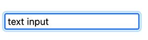
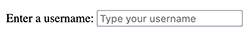
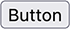
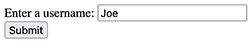
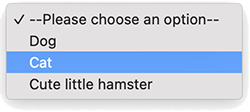
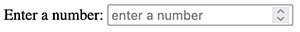

# [FORMS](https://developer.mozilla.org/en-US/docs/Web/HTML/Element/form)
- a `<form>` element represents a document section containing interactive controls for submitting information.   

- the `<form>` element itself is a container that doesn't have any visual impact. It is the thing that group together all of the content which are put inside.

- we fill `<form>` with inputs, checkboxes, buttons, etc. and we group them together with the `<form>`.

- the `<from>` element represents a document section containing  interactive controls for submitting information.

- the `<form>` element dictates where the `<form>` data should go when the form is submitted:   
  when you submit a `<from>` an HTTP request will be sent.  
  We control where the request goes to with the *`action`* attribute, and we control which type of HTTP method should be used with the *`method`* attribute. 

 - <u>**`<form>` attributes**</u>:

    - [`action`](https://developer.mozilla.org/en-US/docs/Web/HTML/Element/form#attr-action) attribute  :specifies **where** the form data should be sent when the `<form>`is submitted.

    - [`method`](https://developer.mozilla.org/en-US/docs/Web/HTML/Element/form#attr-method) attribute : specifies which HTTP method should be used. (GET and POST)   
    
      - eg.: a search form's code looks something like this
        ```
          <form action="https://www.reddit.com/search" method="get">
            <input type="text" placeholder="Search" name="q">
            <button>Search in Reddit</button>
          </form>                                  
        ```

&nbsp;
## The (form) `input elements`:
- **[`<input>`](https://developer.mozilla.org/en-US/docs/Web/HTML/Element/input)** :
  - is used to create a variety of different form controls.
  - there are 20+ possible types of inputs (like date pickers, color picker, password input, text input, checkboxes, etc.)
  - [`<input>` attributes](https://developer.mozilla.org/en-US/docs/Web/HTML/Element/input#attributes):
    - the [<u>***type***</u>](https://developer.mozilla.org/en-US/docs/Web/HTML/Element/input#attr-type) attribute 🚀 is the most important attribute, it is where the magic happens:
    changing type dramatically alters the input's behaviour and appearance.  
    - [placeholder](https://developer.mozilla.org/en-US/docs/Web/HTML/Element/input#htmlattrdefplaceholder) attribute specifies the placeholder text for an `<input>`. It is the text you that shows up before you type anything (while it is empty).
      - eg.: a text input type looks like this:
        ```                                                                                     
         <form action="/whatever">
           <input type="text" placeholder="Type something here!">                      
         </form>
        ```   
                             
 
 &nbsp;

- **[`<label>`](https://developer.mozilla.org/en-US/docs/Web/HTML/Element/label)** : represents a caption for an item in a user interface. 
  - really important in terms of **accessibility**!!! The label element **associates** a direct connection between some `input` or some `form control` and a `text`. The screen reader also reads out when the user is focused on the form input.

  - To associate the `<label>` with an `<input>` element, you need to give the `<input>` an `id` attribute. The `<label>` needs a `for` attribute whose value is the same as the input's `id`.

  - Alternatively, you can nest the `<input>` directly inside the `<label>`, in which case the <u>**for**</u> and id attributes are not needed because the association is implicit.

     - <u>**`<label>` attributes**</u>:
        - [**`for`**](https://developer.mozilla.org/en-US/docs/Web/HTML/Element/label#attr-for) : basically it answers the question of what the `<label>` is for?  
        - The first element in the document with an `id` matching the value of the `for` attribute, that is the labeled control for this label element.  
        - __If you nest the `<input>` inside of the label, you don't need to use the `for` attribute (and the `id`)❗️__ However it is a less common standard (styling is less easy).   
          - eg.: this is a nested `input` in the `<label>`. Shorter, but harder to style because they're implicitly linked. Less common to use it.
              ```
              <label>
                Enter a number:
                <input type="number" placeholder="Enter a number!">               
              </label>
              ```

        <br>
                                                                  
        - **`id`** : <u>**is in the `<input>`!!!**</u> the value (what name we give to the *id*) should be the same of the **for** attribute's value. So we set the *id*'s value to the *for*'s value.💡 
                                                                
            - eg.: the `label`'s `for="username"` need to match with the `input`'s `id="username"`.
              ```
              <form action="/whatever">
                <label for="username">Enter a username:</label>
                <input id="username" type="text" placeholder="Type your username">
              </form>
              ```
                                                                                
 &nbsp;

- **[`<button>`](https://developer.mozilla.org/en-US/docs/Web/HTML/Element/button)**  
A `<button>` represents a clickable button, used to submit forms or anywhere in a document for accessible, standard button functionality.   
Also, `<button>` not necesseraly has to be inside of a form (eg. a "sign up" button, links).     
*(However, if it is inside the `<form>`, as `<button>Submit me!</button>` or `<button type="submit">Submit me!</button>`, it automaitcally submits the form.      
But if you want a button which does not submit the form - but it is inside the form -, you can set the type to button, like:   
`<button type="button">No submit</button>`, it won't submit the form.)*

  - `<button>` has a closing tag `</button>`.
  - the text inside of the `<button></button>` is used to label the button.
  - a `<button>` **inside in a form** has a default behaviour: to submit.

  - <u>**`<button>` attributes**</u>:
    - [**type**](https://developer.mozilla.org/en-US/docs/Web/HTML/Element/button#attr-type) :`<button type="button">`*Button*`</button>` 👉     
   **The `type` over write** the default `submit` attribute when the `<button>` is in a form!!! 
    - *default `<button type="submit">Submit</button>`*  
    (Well, you don't even have to write the `type="submit"` if you want to keep it default.)

    - an other way to make a sumbit button:
        **`<input type="submit">`** **BUT** you can only change the text if you use another `<input>` attribute **`value`**. Eg.:    
                ```
                 <input type="submit" value="Click me!">
                ```
    - [**value**](https://developer.mozilla.org/en-US/docs/Web/HTML/Element/input#htmlattrdefvalue) : The input control's value.  
    When specified in the HTML, this is the initial value, and from than on it can be altered or retrieved at any time using JavaScript to access it.

    - **[name](https://developer.mozilla.org/en-US/docs/Web/HTML/Element/button#attr-name)** : The name of the button, submitted as a pair with the button’s `value` as part of the form data.  
    `name` is a way of referring to the `value` when the data is sent to the server, so it is just a way of referring to the `value` when the data is sent to the server. The server looks for that 
    `name`. *(If the name is `name="user"`), than the server looks for the name "user"*.   
      - `name` is just a *"name"* (ususally very short, like `name="q"`)  
      -  The `<form>` will be labeled under the `name` attribute when it is sent to the server.   
        - eg.: I write my username: Joe, the result will be: file:///hello?username=Joe
          ``` 
           <form action=/hello">                                                           
            <label for="username">Enter a username: </label>
            <input id="username" type="text" placeholder="username" name="username">
            <button type="submit">Submit</button>
           </form> 
          ```
           *`username = Joe`, so that is the name that will be used to send the data to the server, it is a __pair: name ➕ value__.  (value is what you write in the input)*  
           
                                                                      
- [**checkbox**](https://developer.mozilla.org/en-US/docs/Web/HTML/Element/input/checkbox) : `<input type="checkbox">`   
  A check box allowing single values to be selected/deselected.	
    - you can specify if the checkbox is `checked` or  not.   
      eg.:
        ```
        <form action="/anything">
          <input type="checkbox" name="agree_conditions" id="agree" checked>
          <label for="agree">I agree</label>
        </form>
        ```  
         👉                     

- [**radiobutton**](https://developer.mozilla.org/en-US/docs/Web/HTML/Element/input/radio) : `<input type="radio">`   
  The `radiobutton` allowing only one single value to be selected out of multiple choices with the same `name` value.  
  In  a group of `radiobuttons` you can only select one (so they are connected).
    - They are associated by the **same `name`**, so they are pointing to the same thing.

    - `value` attribute selects what to send through when the form was submitted. So which `radiobutton` was selected and sent when clicking on the submit button.   
       eg.: *the `value` is not going to be displayed to a user, it is what is sent through when the form is submitted (which radiobutton was selected).*   

       ```
        <form action="/anything">                                                                                                           
          <label for="xs">Extra small</label>
          <input type="radio" name="size" id="xs" value="xs">
          <label for="s">Small</label>
          <input type="radio" name="size" id="s" value="lol">
          <label for="m">Medium</label>
          <input type="radio" name="size" id="m" value="med">
        </form> 
       ```                                                                                                      
        👉 
                                                            
- [`<select>`](https://developer.mozilla.org/en-US/docs/Web/HTML/Element/select) : 
    ```
      <select name="pets" id="pet-select">
        <option value="">--Please choose an option--</option>
        <option value="dog">Dog</option>
        <option value="cat">Cat</option>
        <option value="hamster">Cute little hamster</option>
    </select>  
    ```
                               

  The [`<select>`] element represents a control that provides a menu of options.  
  It is essentially a dropdown menu   

    - Two elements working together: `<select>` and the `<option>` elements. The `<select>` is the parent it groups together a bunch of `options`.  

    - `<option value="hamster">Cute little hamster</option>` the value attribute will be sent through when it is submitted *(here the `value="hamster"`)*.   
   
    - it can be preselected with the attribute `selected`.
    
<br>
                                                                                                                                                      
<u>[many other `<input>` elements can be found here.](https://developer.mozilla.org/en-US/docs/Web/HTML/Element/input)
So here's a little selection, which might be useful: </u>

- [**range**](https://developer.mozilla.org/en-US/docs/Web/HTML/Element/input/range) : `<input type="range">`   
  - we can control the "min" and "max" values (eg. `min="0" max="100"`)   
   eg.: *the starting value is value="25". Range is between 0 and 100. It goes up by 2.*                                                                 
    ```
    <form action="/anything"> 
     <label for="cheese">Amount</label>
     <input id="fuel" type="range" min="0" max="100" step="2" value="25" name="fuel_level"
    </form>  
    ```                                                                                      
   👉 
                                                                                          

- [**number**](https://developer.mozilla.org/en-US/docs/Web/HTML/Element/input/number) : <input type="number" min="10" max="1000"  placeholder="num">  elements of type number are used to let the user enter a number.   
  eg.:
   ```
     <form action="/anything"> 
      <label>Enter a number:
        <input type="number" placeholder="enter a number" name="num" min="1" max="10" step="2">
      </label>
     </form>                                                                                      
   ```                                                                                          
👉 
                                                                                              
- [**textarea**](https://developer.mozilla.org/en-US/docs/Web/HTML/Element/textarea) : <textarea id="story" name="story" rows="1" cols="40"> This is a textarea...
</textarea> 👉 `<textarea>`  
  - It is a multiline text input. 
  - **❗️It is NOT an input element❗️**   
  
  &nbsp;

  ---
  # [FORM Validations](https://developer.mozilla.org/en-US/docs/Learn/Forms/Form_validation#what_is_form_validation)
  Validation refers to adding constraints or validating user input / user data.  
   *(eg. requiring that some fields can not be empty, or the length of the password)*

  - clients side validation
  - server side validation *(after the submit button the server verifies if the data meets the expectations)*

  ## Basics of the built in validations
  - [required](https://developer.mozilla.org/en-US/docs/Web/HTML/Attributes/required) 👉  HTML attribute  
    Adding the `required` attribute to any input will indicate that the user must specify a value for the input before the owning form can be submitted.

    - we can specify the length of an `<input type=text>` with `minlength="4"` and `maxlength="30"` (+ add `required`).

    - for numeric values length specification use `min` and `max`

  - [pattern](https://developer.mozilla.org/en-US/docs/Web/HTML/Attributes/pattern) 👉 HTML attribute  
  The pattern attribute specifies a regular expression  (regex) the form control's value should match.
    - we can use already built in pattern matching:      
      - [`<inpute type="email" required>`](https://developer.mozilla.org/en-US/docs/Web/HTML/Element/input/email) it asks a valid email *(It is only checking if there is an `@` sign or not, so it's not 100% efficient).*
      - [`<inpute type="url" required>`](https://developer.mozilla.org/en-US/docs/Web/HTML/Element/input/url)  
      it's looking for this pattern: *`urlscheme://restofurl`* *(http or https://somethingelse)*
---
 [👈 go back](https://github.com/Klosmi/html-basics#html-and-css--basics)
